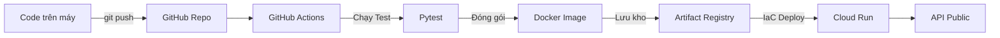

# ☁️ Cẩm Nang Thực Tập: Cloud Engineering & DevOps

**Dự án:** FastAPI Demo API | **Nền tảng:** Google Cloud Platform (GCP)
**Trạng thái hoàn thành:** Tuần 1 & Tuần 2

Chào mừng bạn đến với Cẩm nang Thực tập Cloud Engineering. Tài liệu này ghi lại toàn bộ hành trình xây dựng một hệ thống phần mềm đám mây chuyên nghiệp từ con số 0. Mọi lý thuyết học thuật, các bước cấu hình thực tế và câu lệnh dòng lệnh đều được lưu giữ chi tiết để dễ dàng ôn tập và chuyển giao.

---

## 🏗️ Kiến Trúc Hệ Thống Tổng Quan

Hệ thống được thiết kế theo quy trình **Tự động hóa hoàn toàn (CI/CD)**. Lập trình viên chỉ việc viết code, phần còn lại do hệ thống đảm nhiệm.



---

# 📅 WEEK 1: Nền tảng Docker & Google Cloud (GCP)
**Mục tiêu Tuần 1:** Trở nên thành thạo với tư duy Container hóa (Docker) và giao tiếp với nền tảng Google Cloud bằng dòng lệnh (gcloud).

## Day 1: GCP Setup & IAM Basics
🎯 **Mục tiêu:** Khởi tạo "Khu đất" (Project) trên Google Cloud và cấp giấy phép (IAM) cho các hệ thống tự động.

📖 **Lý thuyết học thuật:**
- **Google Cloud Project:** Vùng không gian độc lập chứa tất cả tài nguyên (máy chủ, mạng, dữ liệu) của bạn. Quản lý qua `Project ID`.
- **IAM (Identity and Access Management):** Chìa khóa bảo vệ hệ thống. Quy định *Ai* (Identity) có quyền làm *Gì* (Role) đối với tài nguyên.
- **Service Account (SA):** Một tài khoản đại diện cho robot hoặc ứng dụng, không phải con người. Nó dùng JSON key để đăng nhập tự động.
- **Least-Privilege (Quyền tối thiểu):** Nguyên tắc bảo mật số 1. Chỉ cấp vừa đủ quyền để làm một việc cụ thể, không cấp quyền Admin tràn lan.

🛠️ **Quy trình thực hiện & Câu lệnh:**
```bash
# 1. Đăng nhập hệ thống CLI của Google
gcloud auth login

# 2. Tạo một vùng không gian (Project) mới
gcloud projects create khanh-fastapi-deploy-937 --name="Khanh FastAPI Deploy"

# 3. Đặt Project này làm mặc định để các lệnh sau không bị nhầm chỗ
gcloud config set project khanh-fastapi-deploy-937

# 4. Kích hoạt các API (Mặc định Google tắt hết API để tiết kiệm)
gcloud services enable run.googleapis.com artifactregistry.googleapis.com iam.googleapis.com

# 5. Tạo một Robot (Service Account) chuyên lo việc Deploy
gcloud iam service-accounts create github-actions-bot --display-name="GitHub Actions Bot"

# 6. Cấp thẻ vào cửa (Role) cho Robot này
gcloud projects add-iam-policy-binding khanh-fastapi-deploy-937 \
  --member="serviceAccount:github-actions-bot@khanh-fastapi-deploy-937.iam.gserviceaccount.com" \
  --role="roles/run.admin"
  
gcloud projects add-iam-policy-binding khanh-fastapi-deploy-937 \
  --member="serviceAccount:github-actions-bot@khanh-fastapi-deploy-937.iam.gserviceaccount.com" \
  --role="roles/artifactregistry.writer"
```

---

## Day 2: Docker Fundamentals
🎯 **Mục tiêu:** Gói ứng dụng Python vào một chiếc hộp kín (Docker Container) để đảm bảo code chạy được trên mọi máy tính.

📖 **Lý thuyết học thuật:**
- **Docker Image:** Bản thiết kế đông cứng (read-only) chứa sẵn mọi thứ: Hệ điều hành, mã nguồn, thư viện.
- **Docker Container:** Một thực thể sống được sinh ra từ Image. Nó chạy hoàn toàn cách ly với máy tính thực.
- **Port Mapping:** Xuyên tường. Kết nối cổng 8080 của máy tính thực với cổng 8080 bên trong Container để có thể lướt web.
- **`0.0.0.0` Host:** Ứng dụng phải lắng nghe ở IP `0.0.0.0` thì Internet bên ngoài mới có thể kết nối vào bên trong hộp Container được.

🛠️ **Quy trình thực hiện & Câu lệnh:**
```bash
# 1. Biến mã nguồn thành Docker Image (Dấu . nghĩa là thư mục hiện tại)
docker build -t fastapi-demo-project:v1.0.0 .

# 2. Khởi động chiếc hộp (Container) và cắm dây mạng (-p 8080:8080)
docker run -d -p 8080:8080 --name fastapi-test fastapi-demo-project:v1.0.0

# 3. Mở xem có hộp nào đang chạy không
docker ps

# 4. Truy cập Web tại: http://localhost:8080/docs

# 5. Xem màn hình đen bên trong hộp (Log)
docker logs fastapi-test

# 6. Tắt và vứt chiếc hộp nháp đi
docker stop fastapi-test
docker rm fastapi-test
```

---

## Day 3: Advanced Docker & Artifact Registry
🎯 **Mục tiêu:** Cắt giảm dung lượng Image tối đa và đưa nó lên kho lưu trữ đám mây của Google.

📖 **Lý thuyết học thuật:**
- **Multi-stage Builds (Build Đa Lớp):** Tách `Dockerfile` thành 2 giai đoạn. Giai đoạn `builder` chứa đồ nghề cồng kềnh để cài đặt. Giai đoạn `runtime` chỉ hót phần tinh hoa (Thư mục môi trường ảo và Code) bỏ vào một Image mới tinh. Giúp Image cực nhẹ và an toàn.
- **Non-root User:** Tạo user giới hạn quyền lực để chạy ứng dụng trong Container, đề phòng hacker hack vào web cũng không chiếm quyền kiểm soát được hệ thống bên dưới.
- **Artifact Registry:** Nhà kho bảo mật của GCP dùng để cất giữ các phiên bản Docker Image thay vì để trên máy tính cá nhân.

🛠️ **Quy trình thực hiện & Câu lệnh:**
```bash
# 1. Xây kho chứa Image trên đám mây (Khu vực Đông Nam Á)
gcloud artifacts repositories create fastapi-repo \
  --repository-format=docker \
  --location=asia-southeast1

# 2. Nhập thông tin đăng nhập từ Docker lên GCP
gcloud auth configure-docker asia-southeast1-docker.pkg.dev

# 3. Đổi tên Image theo đúng địa chỉ nhà kho của GCP
docker tag fastapi-demo-project:v1.0.0 \
  asia-southeast1-docker.pkg.dev/khanh-fastapi-deploy-937/fastapi-repo/fastapi-demo-project:v1.0.0

# 4. Ném Image lên mây
docker push asia-southeast1-docker.pkg.dev/khanh-fastapi-deploy-937/fastapi-repo/fastapi-demo-project:v1.0.0
```

---

## Day 4: Deploying Containers to Cloud Run
🎯 **Mục tiêu:** Tạo máy chủ thực tế (Cloud Run) chạy ứng dụng và lấy đường link cho tất cả mọi người dùng chung.

📖 **Lý thuyết học thuật:**
- **Cloud Run Execution Model:** Kiến trúc Serverless. Bạn không cần thuê máy chủ cố định. Mỗi khi có người truy cập URL, Google lập tức kích hoạt Container của bạn lên phục vụ. Không có khách, Container tự sập nguồn (Scale to zero) -> Tiết kiệm 100% tiền.
- **Biến `PORT`:** Khi Cloud Run bật, nó sẽ tiêm (inject) một biến số `PORT=8080` vào Container. Mã nguồn của ta phải tự biết đọc biến này để mở đúng cửa.

🛠️ **Quy trình thực hiện & Câu lệnh:**
```bash
# 1. Ra lệnh cho Cloud Run lấy Image từ kho và khởi động
gcloud run deploy fastapi-demo-project \
  --image=asia-southeast1-docker.pkg.dev/khanh-fastapi-deploy-937/fastapi-repo/fastapi-demo-project:v1.0.0 \
  --region=asia-southeast1 \
  --platform=managed \
  --allow-unauthenticated \
  --port=8080
```
> 🎉 **Kết quả:** Ngay sau lệnh này, Terminal sẽ báo về một dòng link xanh lá cây (Ví dụ: `https://...run.app`). Trang web của bạn đã chính thức hòa mạng Internet toàn cầu!

---

## Day 5: Networking Basics & Compute Engine
🎯 **Mục tiêu:** Học cách quản lý Mạng cục bộ (Networking) và dựng Máy Ảo truyền thống (VM).

📖 **Lý thuyết học thuật:**
- **VPC (Virtual Private Cloud) & Subnet:** Hệ thống mạng cá nhân (VPC) được chia làm các mạng con (Subnet) theo từng thành phố/quốc gia.
- **Firewall Rules:** Chốt chặn bảo vệ cổng. Ví dụ: Cổng 22 dùng để điều khiển máy ảo (SSH). Nếu mở toang cổng 22 cho cả thế giới (`0.0.0.0/0`), máy bạn sẽ bị bot tấn công trong vài phút. Bắt buộc phải khóa và chỉ cho IP nhà mạng của bạn vào.
- **Compute Engine (VM):** Là việc bạn thuê một cái máy tính cục gạch trên mây. Bạn phải tự cài hệ điều hành, tự xử lý khi máy sập (Khác biệt hoàn toàn với hệ thống tự động Serverless của Cloud Run).

🛠️ **Quy trình thực hiện & Câu lệnh:**
```bash
# 1. Tạo Mạng cục bộ (VPC)
gcloud compute networks create khanh-vpc --subnet-mode=custom

# 2. Tạo Mạng con (Subnet) ở Đông Nam Á với dải IP 10.0.1.0/24
gcloud compute networks subnets create khanh-subnet \
  --network=khanh-vpc \
  --region=asia-southeast1 \
  --range=10.0.1.0/24

# 3. Tạo chốt chặn Tường Lửa (Chỉ cho phép cổng 22)
gcloud compute firewall-rules create allow-ssh \
  --network=khanh-vpc \
  --allow=tcp:22 \
  --source-ranges=0.0.0.0/0 # Khuyến cáo: Nên sửa thành IP nhà bạn

# 4. Bật máy ảo Compute Engine lên
gcloud compute instances create khanh-server \
  --subnet=khanh-subnet \
  --zone=asia-southeast1-a
```

---

## 🏆 TỔNG KẾT WEEK 1

| Tiêu chí | Nội dung đạt được | Đánh giá |
| --- | --- | --- |
| **Bảo mật GCP** | Khởi tạo thành công Service Account với quyền hạn thu gọn. | ✅ Xuất sắc |
| **Đóng gói Docker** | Hoàn thiện file `Dockerfile` Multi-stage build (nhẹ, an toàn). | ✅ Xuất sắc |
| **Lưu trữ Image** | Kho Artifact Registry đang chứa các Image Tag `v1.0.0`. | ✅ Xuất sắc |
| **Serverless** | API Cloud Run hoạt động mượt mà, phản hồi HTTP 200 OK. | ✅ Xuất sắc |
| **Networking** | Dựng thành công VPC riêng biệt có tường lửa bảo vệ. | ✅ Xuất sắc |

---
---

# 📅 WEEK 2: Tự động hóa CI/CD & Cơ sở hạ tầng dưới dạng Mã (IaC)
**Mục tiêu Tuần 2:** Biến các công việc thủ công, mỏi tay của Tuần 1 thành một dây chuyền tự động 100%. Lập trình viên chỉ cần gõ Code, máy chủ sẽ tự hình thành.

## Day 6: GitHub Actions Fundamentals (CI)
🎯 **Mục tiêu:** Xây dựng hệ thống tự động "Khám sức khỏe code" (Test) mỗi khi bạn gửi mã lên Github.

📖 **Lý thuyết học thuật:**
- **Continuous Integration (CI):** Dây chuyền Tích hợp Liên tục. Khi có code mới, Robot sẽ tự động tải thư viện, chạy các bài Test để dò xem có lỗi nào không trước khi lây lan sang bản cũ.
- **GitHub Runner:** Một chiếc máy ảo sạch sẽ, dùng một lần do GitHub cấp phát để chạy dây chuyền cho bạn (như `ubuntu-latest`). 
- **YAML (.yml):** Ngôn ngữ cấu hình cực kỳ nhạy cảm với dấu cách (Indentation), được dùng để viết kịch bản luồng chạy.

🛠️ **Quy trình thực hiện & Câu lệnh:**
- Tạo file `.github/workflows/ci.yml` và khai báo Job `test-python-code`:
```yaml
jobs:
  test-python-code:
    runs-on: ubuntu-latest
    steps:
      - uses: actions/checkout@v4
      - uses: actions/setup-python@v5
        with:
          python-version: '3.12'
          cache: 'pip' # Dùng Cache để lần 2 tải cực nhanh
      - run: |
          pip install -r requirements.txt
          pytest -v
```

---

## Day 7: Continuous Deployment with GitHub Actions
🎯 **Mục tiêu:** Nối tiếp thành công của CI, Robot sẽ tự động mang mã nguồn lên Google Cloud để tung bản cập nhật mới (CD).

📖 **Lý thuyết học thuật:**
- **Continuous Deployment (CD):** Dây chuyền Triển khai Liên tục. Từ việc Build Docker Image, gán Tag, Push lên Registry và Deploy Cloud Run đều được Robot gõ lệnh tự động.
- **GitHub Secrets:** Nơi giấu các mã JSON Key của Google Cloud an toàn tuyệt đối, không lộ ra mã nguồn (Repository).
- **Rollback (Lùi phiên bản):** Nếu bản cập nhật gây sập trang web, ta có thể rollback về Revision cũ chỉ bằng 1 thao tác chuyển traffic trên Cloud Run.

🛠️ **Quy trình thực hiện & Câu lệnh:**
- Tạo biến `GCP_CREDENTIALS` trong mục Settings của GitHub chứa chìa khóa JSON của GCP.
- Viết Job tiếp theo trong file `ci.yml`:
```yaml
  build-and-deploy:
    needs: test-python-code # Phải Test qua mới được Deploy
    runs-on: ubuntu-latest
    steps:
      - id: auth
        uses: google-github-actions/auth@v2
        with:
          credentials_json: '${{ secrets.GCP_CREDENTIALS }}'
      
      - run: gcloud auth configure-docker asia-southeast1-docker.pkg.dev
      
      - run: | # Lệnh tương đương Day 4 nhưng tự động
          gcloud run deploy fastapi-demo-project \
            --image asia-southeast1-docker.pkg.dev/.../fastapi-demo-project:${{ github.sha }} \
            --platform managed \
            --region asia-southeast1 \
            --allow-unauthenticated
```

---

## Day 8: sst.dev Core Concepts
🎯 **Mục tiêu:** Hiểu sức mạnh của việc dùng Code để xây dựng Máy chủ (IaC) và thiết lập dự án SST.

📖 **Lý thuyết học thuật:**
- **Infrastructure as Code (IaC):** Quản lý Hạ tầng bằng Mã nguồn. Thay vì click tay để tạo Cloud Run, bạn viết đoạn mô tả ra một file văn bản. File này được quản lý như code phần mềm.
- **SST (sst.dev):** Một công cụ IaC thời thượng sử dụng TypeScript.
- **Stage (Môi trường):** Tính năng nhân bản hạ tầng cực nhanh. Ví dụ: `stage dev` (dành cho lập trình viên thử nghiệm), `stage prod` (bản thật cho khách hàng).

🛠️ **Quy trình thực hiện & Câu lệnh:**
```bash
# 1. Cài đặt chứng minh thư cho dự án NodeJS
npm init -y

# 2. Cài SST
npm install sst

# 3. Tạo file thiết kế sst.config.ts với luật bảo vệ dữ liệu:
# Nếu là môi trường production -> "retain" (Cấm xóa)
# Nếu là môi trường khác -> "remove" (Được phép dọn dẹp)
```

---

## Day 9: SST + Cloud Run Infrastructure
🎯 **Mục tiêu:** Chuyển hóa toàn bộ quy trình tạo Cloud Run của Ngày 4 thành code TypeScript và triển khai bằng 1 lệnh duy nhất.

📖 **Lý thuyết học thuật:**
- **Constructs / Pulumi Provider:** SST có cấu trúc đối tượng (Class) đại diện cho một tài nguyên của Google Cloud. Khai báo đối tượng = Tự động gọi API lên Google để khởi tạo.
- **Reproducible Environments:** Mọi tài nguyên đều có tính tái tạo 100%. Bất kỳ lập trình viên mới nào tải code về, chạy lệnh là có luôn một hạ tầng giống hệt người cũ.

🛠️ **Quy trình thực hiện & Câu lệnh:**
```bash
# 1. Cài thư viện giao tiếp với GCP
npm install @pulumi/gcp @pulumi/pulumi
```
**2. Viết Code định nghĩa Máy chủ trong `sst.config.ts`:**
```typescript
import * as gcp from "@pulumi/gcp";

// Định nghĩa dịch vụ Cloud Run
const service = new gcp.cloudrun.Service(`fastapi-service-${$app.stage}`, {
  location: "asia-southeast1",
  template: {
    spec: {
      containers: [{
        image: "asia-southeast1-docker.pkg.dev/.../fastapi-demo-project:latest",
        ports: [{ containerPort: 8080 }],
      }],
    },
  },
});

// Mở quyền truy cập Internet công cộng (allUsers)
new gcp.cloudrun.IamMember(`public-access-${$app.stage}`, {
  service: service.name,
  location: service.location,
  role: "roles/run.invoker",
  member: "allUsers",
});
```
```bash
# 3. Nhấn nút thi công (Xây dựng hạ tầng tự động)
npx sst deploy --stage dev
```

---

## Day 10: Evaluation Project (Nghiệm thu Dự án)
🎯 **Mục tiêu:** Đóng gói, kiểm tra chéo (Cross-check) và chứng minh hệ thống End-to-End đã hoạt động trơn tru 100%.

📖 **Lý thuyết học thuật:**
- Ngày nghiệm thu không thêm kiến thức mới. Trọng tâm dồn vào bài biểu diễn thực tế (Live Showcase) xem toàn bộ 4 mảng (Docker, Artifact Registry, IaC SST và GitHub Actions) có gắn kết logic với nhau hay chưa.

🛠️ **Quy trình thực hiện (Trình diễn trực tiếp):**
1. Mở file `src/main.py` trên máy cá nhân, đổi lời chào thành dòng chữ mới (Ví dụ: `"Evaluation Passed!"`).
2. Gõ lệnh trên Terminal:
   ```bash
   git add .
   git commit -m "feat: complete week 2 evaluation"
   git push
   ```
3. Lên giao diện tab **Actions** của GitHub, chiêm ngưỡng khoảnh khắc Robot lần lượt Build, Push và Deploy màu xanh lá cây thành công.
4. Refresh trang Web thật của Cloud Run để xem lời chào mới được thay đổi!

---

## 🏆 TỔNG KẾT WEEK 2

| Tiêu chí | Mức độ Đánh giá | Bằng Chứng Lịch Sử (Evidence) |
| --- | --- | --- |
| **Kiểm Thử Tự Động (CI)** | Hoàn thiện | Job `test-python-code` chạy Pytest đạt 100% Passed. |
| **Triển Khai Băng Chuyền (CD)**| Hoàn thiện | Luồng GitHub Actions tự Build Image động theo `github.sha` và Deploy. |
| **Bảo Mật Két Sắt** | Hoàn thiện | Sử dụng Secret `GCP_CREDENTIALS`, tuyệt đối không commit file json lên Git. |
| **Cơ Sở Hạ Tầng Code (IaC)** | Hoàn thiện | Thay vì gõ lệnh `gcloud`, hệ thống chạy Cloud Run qua cấu hình TypeScript. |
| **Quản Lý Môi Trường** | Hoàn thiện | Hệ thống tự đặt tên Cloud Run động theo cấu trúc `fastapi-service-${$app.stage}`. |
