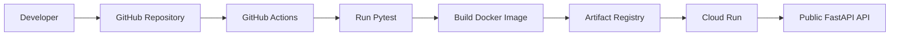
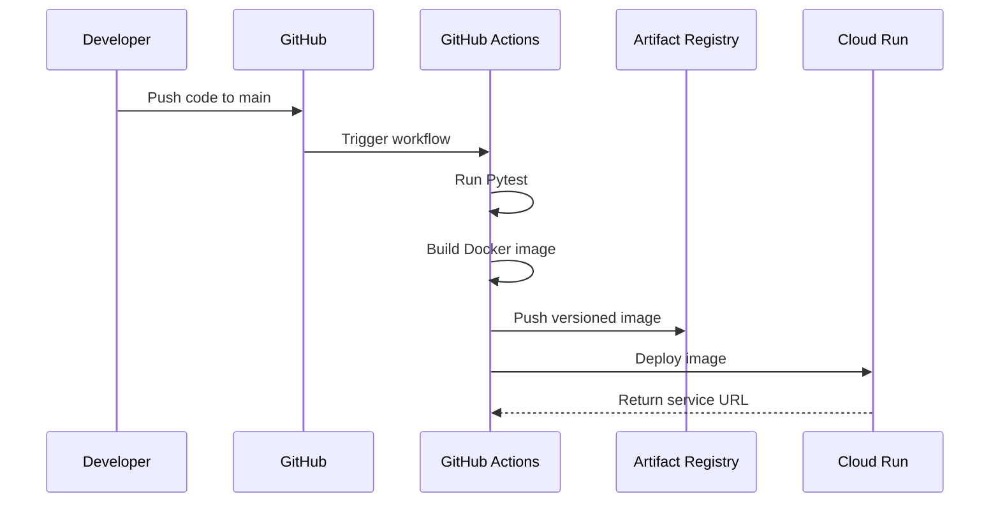

# Cloud Engineering & Deployment Repository

## 1. Project Overview

Dự án này được xây dựng với mục tiêu học tập và thực hành các khái niệm nền tảng về Cloud Engineering, đặc biệt tập trung vào quá trình đóng gói, tự động hóa và triển khai phần mềm lên đám mây. Thông qua việc phát triển một ứng dụng mẫu, dự án đi sâu vào cách quản lý cơ sở hạ tầng hiện đại thay vì chỉ viết code.

Ứng dụng mẫu là một **FastAPI Demo API**. Đây là một REST API cơ bản xử lý danh sách sản phẩm mẫu. Cần lưu ý rằng:
- Ứng dụng **không sử dụng cơ sở dữ liệu thật** (dữ liệu chỉ lưu tạm trong bộ nhớ và sẽ bị xóa khi khởi động lại).
- Ứng dụng **không có giao diện người dùng (frontend)**, việc giao tiếp hoàn toàn qua các endpoint API hoặc tài liệu Swagger UI.
- Dự án này tập trung vào khía cạnh vận hành (Operations/DevOps) thay vì logic nghiệp vụ phần mềm.

### Các công nghệ sử dụng

| Technology | Purpose |
| --- | --- |
| Python | Ngôn ngữ phát triển backend |
| FastAPI | Xây dựng REST API |
| Pytest | Kiểm thử tự động (Automated testing) |
| Docker | Đóng gói ứng dụng thành container |
| Artifact Registry | Lưu trữ và quản lý Docker Image trên đám mây |
| Cloud Run | Chạy container theo mô hình Serverless |
| Compute Engine | Thực hành kiến thức cơ bản về máy ảo (Virtual Machine) |
| GitHub Actions | Triển khai hệ thống CI/CD |
| SST | Quản lý cơ sở hạ tầng bằng code (Infrastructure as Code) |

---

## 2. System Architecture

Hệ thống được thiết kế theo mô hình tích hợp và triển khai liên tục (CI/CD). Mọi sự thay đổi về mã nguồn đều được kiểm duyệt thông qua pipeline trước khi đến tay người dùng.

```text
Developer
→ GitHub Repository
→ GitHub Actions
→ Pytest
→ Docker Build
→ Artifact Registry
→ Cloud Run
→ Public API
```



**Giải thích kiến trúc:**
1. **Developer**: Lập trình viên viết mã nguồn và đẩy (push) lên GitHub.
2. **GitHub Actions**: Hệ thống CI/CD bắt được sự kiện push và tự động khởi chạy quy trình (workflow).
3. **Pytest**: Bước đầu tiên trong quy trình là chạy kiểm thử tự động để đảm bảo mã nguồn mới không làm hỏng chức năng cũ.
4. **Docker Build**: Nếu kiểm thử thành công, mã nguồn được đóng gói thành Docker Image.
5. **Artifact Registry**: Docker Image sau đó được đẩy (push) lên kho lưu trữ riêng trên Google Cloud.
6. **Cloud Run**: Máy chủ Serverless tự động kéo (pull) Image mới nhất từ Artifact Registry và cập nhật phiên bản (revision) mới.
7. **Public API**: Người dùng cuối có thể lập tức truy cập ứng dụng thông qua URL công khai.

---

# WEEK 1: DOCKER AND GCP FOUNDATIONS

## Day 1: GCP Setup and IAM Basics

### Nội dung lý thuyết
- **Google Cloud Project**: Là một vùng cách ly chứa toàn bộ tài nguyên (resources) của bạn trên Google Cloud.
- **Project ID, Project Name, Project Number**: 
  - *Project Name*: Tên hiển thị (có thể thay đổi).
  - *Project ID*: Định danh duy nhất toàn cầu do bạn chọn (hoặc Google cấp), dùng trong các lệnh CLI.
  - *Project Number*: Số định danh nội bộ duy nhất do hệ thống tự sinh ra.
- **Region và Zone**: Region là một khu vực địa lý lớn (ví dụ: châu Á), còn Zone là một trung tâm dữ liệu cụ thể bên trong khu vực đó. Phân bổ tài nguyên theo Zone giúp dự phòng sự cố.
- **API**: Trên Google Cloud, mọi dịch vụ mặc định đều bị tắt. Bạn phải bật (enable) API của dịch vụ đó trước khi sử dụng.
- **IAM (Identity and Access Management)**: Hệ thống quản lý danh tính và quyền hạn truy cập tài nguyên.
- **User Account vs Service Account**: User Account dành cho con người (yêu cầu mật khẩu, 2FA), Service Account dành cho máy móc, phần mềm tự động hóa (sử dụng JSON key hoặc Workload Identity).
- **IAM Role**: Tập hợp các quyền hạn (permissions) được gán cho một tài khoản.
- **Least Privilege**: Nguyên tắc bảo mật tối thượng – chỉ cấp đúng và đủ những quyền cần thiết để thực hiện công việc, không cấp dư thừa.
- **Budget Alert**: Chỉ đóng vai trò cảnh báo qua email khi chi phí vượt ngưỡng, hệ thống sẽ **không** tự động ngắt dịch vụ để tránh làm sập dự án của khách hàng.
- **Google Cloud CLI (`gcloud`)**: Công cụ dòng lệnh để tương tác với Google Cloud mà không cần sử dụng giao diện web.

### Các bước thực hiện

1. Đăng nhập Google Cloud CLI:
   ```bash
   gcloud auth login
   ```
2. Tạo Google Cloud Project:
   ```bash
   gcloud projects create khanh-fastapi-deploy-937 --name="Khanh FastAPI Deploy"
   ```
3. Đặt project làm mặc định cho các lệnh tiếp theo:
   ```bash
   gcloud config set project khanh-fastapi-deploy-937
   ```
4. Kiểm tra project hiện tại:
   ```bash
   gcloud config get-value project
   ```
5. Bật các API cần thiết:
   ```bash
   gcloud services enable run.googleapis.com
   gcloud services enable artifactregistry.googleapis.com
   gcloud services enable iam.googleapis.com
   ```
6. Tạo Service Account để phục vụ GitHub Actions triển khai tự động:
   ```bash
   gcloud iam service-accounts create github-actions-bot --display-name="GitHub Actions Bot"
   ```
7. Cấp IAM Roles cần thiết cho Service Account:
   ```bash
   gcloud projects add-iam-policy-binding khanh-fastapi-deploy-937 \
     --member="serviceAccount:github-actions-bot@khanh-fastapi-deploy-937.iam.gserviceaccount.com" \
     --role="roles/run.admin"

   gcloud projects add-iam-policy-binding khanh-fastapi-deploy-937 \
     --member="serviceAccount:github-actions-bot@khanh-fastapi-deploy-937.iam.gserviceaccount.com" \
     --role="roles/artifactregistry.writer"

   gcloud projects add-iam-policy-binding khanh-fastapi-deploy-937 \
     --member="serviceAccount:github-actions-bot@khanh-fastapi-deploy-937.iam.gserviceaccount.com" \
     --role="roles/iam.serviceAccountUser"
   ```

### Luồng hoạt động

```text
Người dùng đăng nhập gcloud
→ gcloud nhận thông tin xác thực
→ Chọn Google Cloud Project
→ Bật API
→ Tạo Service Account
→ Cấp IAM Roles
→ Service Account có quyền triển khai tài nguyên
```

### Kết quả đầu ra
- Google Cloud Project đã hoạt động và được chọn làm mặc định.
- Cloud Run, Artifact Registry, và IAM API đã được bật.
- Service Account `github-actions-bot` đã được tạo và cấp đủ quyền.
- Môi trường đã sẵn sàng cho Docker và ứng dụng.

### Lỗi thường gặp
- **Sai project đang hoạt động**: Lệnh chạy trên project không có quyền thanh toán, dẫn đến lỗi tạo tài nguyên. Giải quyết: dùng `gcloud config set project`.
- **API chưa được bật**: Bị từ chối khi tạo tài nguyên do chưa gọi lệnh `gcloud services enable`.
- **Không đủ IAM Permission**: User hiện tại không phải Owner hoặc Editor, không thể cấp quyền cho người khác.
- **Service Account không có quyền**: Cấu hình sai email của Service Account khi chạy lệnh bind role.

---

## Day 2: Docker Fundamentals

### Nội dung lý thuyết
- **Docker Image**: Là một khuôn mẫu đóng gói (package) chứa mã nguồn, thư viện, và môi trường chạy. Nó ở dạng chỉ đọc (read-only).
- **Docker Container**: Là một phiên bản (instance) đang chạy của một Docker Image.
- **Khác biệt**: Image giống như đĩa CD cài đặt hệ điều hành, Container là hệ điều hành đang chạy trên máy tính.
- **Docker Layer**: Mỗi dòng lệnh trong Dockerfile tạo ra một lớp (layer). Khi Image được build lại, Docker chỉ build những layer bị thay đổi, giúp tăng tốc độ.
- **Docker Cache**: Tính năng tái sử dụng lại các layer chưa thay đổi từ lần build trước.
- **Dockerfile**: File cấu hình chứa chuỗi lệnh để tự động tạo ra Docker Image.
- **`.dockerignore`**: Giống `.gitignore`, dùng để loại bỏ các file không cần thiết (như `.env`, `.git`, `__pycache__`) khỏi Docker Image để tối ưu dung lượng và bảo mật.
- **Port mapping**: Kết nối port trên máy tính thật (Host) vào port bên trong Container.
- **Lắng nghe tại `0.0.0.0`**: Mặc định FastAPI chạy ở `127.0.0.1` (localhost), chỉ cho phép kết nối bên trong nội bộ container. Cần đặt host thành `0.0.0.0` để cho phép các yêu cầu (request) từ bên ngoài Internet đi vào container.

### Cấu trúc Dockerfile (Multi-stage Build)

Trong dự án này, Dockerfile được thiết kế cực kỳ tối ưu theo mô hình 2 giai đoạn (Multi-stage build):
- `FROM python:3.11-slim AS builder`: Dùng Python base image mỏng gọn, đặt tên là `builder`.
- `ENV`: Cấu hình biến môi trường không sinh ra file rác (`.pyc`) và in log ra console ngay lập tức.
- `WORKDIR /app`: Đặt thư mục làm việc mặc định bên trong container.
- `COPY requirements.txt .`: Sao chép file danh sách thư viện vào container. Cố tình copy riêng file này trước để tận dụng Docker Cache cho quá trình cài đặt.
- `RUN python -m venv ...`: Tạo môi trường ảo riêng biệt và cài đặt thư viện vào đó.
- `FROM python:3.11-slim AS runtime`: Bắt đầu giai đoạn 2 - môi trường chạy thật. Giai đoạn này chỉ sao chép lại thư mục `venv` từ giai đoạn `builder` sang.
- `USER appuser`: Chỉ định ứng dụng chạy bằng user không có quyền quản trị (non-root) để đảm bảo bảo mật.
- `EXPOSE 8080`: Khai báo với hệ thống rằng container sẽ lắng nghe ở port 8080.
- `CMD`: Lệnh khởi động Uvicorn server để chạy FastAPI.

### Các bước thực hiện

1. Viết code ứng dụng FastAPI.
2. Tạo file `requirements.txt`.
3. Tạo file cấu hình `Dockerfile`.
4. Tạo `.dockerignore` để lọc các file không cần thiết như `tests/`, `.venv/`.
5. Build Docker Image:
   ```bash
   docker build -t fastapi-demo-project:v1.0.0 .
   ```
6. Chạy Docker Container ở chế độ ngầm (`-d`):
   ```bash
   docker run -d -p 8080:8080 --name fastapi-test fastapi-demo-project:v1.0.0
   ```
7. Kiểm tra container đang chạy:
   ```bash
   docker ps
   ```
8. Xem log lỗi/hoạt động:
   ```bash
   docker logs fastapi-test
   ```
9. Dừng và dọn dẹp:
   ```bash
   docker stop fastapi-test
   docker rm fastapi-test
   ```

### Luồng hoạt động
```text
Source Code
→ Dockerfile
→ docker build
→ Docker Image
→ docker run
→ Docker Container
→ Uvicorn
→ FastAPI API
```

### Kết quả đầu ra
Ứng dụng có thể truy cập nội bộ trên máy tính lập trình tại:
- Trang chủ: `http://localhost:8080`
- Trạng thái: `http://localhost:8080/health`
- Tài liệu API (Swagger UI): `http://localhost:8080/docs`

### Lỗi thường gặp
- **Sai port mapping**: Gõ nhầm thành `-p 80:8080` nhưng truy cập ở `8080` dẫn đến lỗi không kết nối được.
- **Container đã tồn tại**: Báo lỗi conflict do tên `fastapi-test` đã được dùng. Xử lý bằng cách xóa container cũ trước khi chạy mới.
- **Sai đường dẫn file**: Uvicorn báo lỗi không tìm thấy `src.main:app` do sai thư mục làm việc (`WORKDIR`).
- **Container tự dừng**: Code lỗi, container khởi động xong crash ngay lập tức. Dùng lệnh `docker logs` để truy vết.

---

## Day 3: Advanced Docker and Artifact Registry

### Nội dung lý thuyết
- **Multi-stage build**: Tách quá trình build thành nhiều giai đoạn. Giai đoạn 1 chứa các công cụ biên dịch nặng nề. Giai đoạn 2 chỉ lấy các file thành phẩm (artifacts) từ giai đoạn 1 mang sang. Giúp Image cuối cùng nhỏ gọn, an toàn hơn.
- **Chạy container bằng non-root user**: Nếu container bị hacker chiếm quyền điều khiển, quyền cao nhất hacker có chỉ là một user giới hạn, không phải `root`, từ đó không thể phá hoại máy chủ vật lý bên dưới.
- **Image Tag**: Nhãn phiên bản (ví dụ: `v1.0.0`) gắn vào Image để phân biệt sự thay đổi.
- **Semantic Versioning**: Quy tắc đánh số phiên bản quốc tế `[Major].[Minor].[Patch]` (ví dụ: `v1.2.3`).
- **Artifact Registry**: Hệ sinh thái lưu trữ tập trung của Google Cloud, thay thế cho Docker Hub. Nó an toàn, riêng tư và tích hợp trực tiếp vào mạng lưới GCP.

### Các bước thực hiện

1. Tạo một kho chứa Docker (Repository) trên Artifact Registry:
   ```bash
   gcloud artifacts repositories create fastapi-repo \
     --repository-format=docker \
     --location=asia-southeast1 \
     --description="Kho chua Docker Image cua FastAPI Demo"
   ```
2. Cấu hình Docker trên máy cá nhân để có thể kết nối với Artifact Registry:
   ```bash
   gcloud auth configure-docker asia-southeast1-docker.pkg.dev
   ```
3. Gắn tag cho Image theo chuẩn đường dẫn của GCP:
   ```bash
   docker tag fastapi-demo-project:v1.0.0 \
   asia-southeast1-docker.pkg.dev/khanh-fastapi-deploy-937/fastapi-demo/fastapi-demo-project:v1.0.0
   ```
   *(Lưu ý: Thay thế `fastapi-demo` thành `fastapi-repo` theo tên thực tế đã tạo).*
4. Đẩy (push) Image lên đám mây:
   ```bash
   docker push asia-southeast1-docker.pkg.dev/khanh-fastapi-deploy-937/fastapi-demo/fastapi-demo-project:v1.0.0
   ```

### Luồng hoạt động
```text
Local Docker Image
→ Docker Tag
→ Google Cloud Authentication
→ Docker Push
→ Artifact Registry
→ Versioned Docker Image
```

### Chiến lược version
- Không nên chỉ sử dụng tag `latest` trong môi trường sản phẩm (production). Việc sử dụng `latest` khiến hệ thống không biết chính xác phiên bản nào đang chạy và gây rủi ro lớn khi rollback. 
- Hãy đánh số cụ thể như `v1.0.0`, `v1.1.0`.

---

## Day 4: Deploying Containers to Cloud Run

### Nội dung lý thuyết
- **Cloud Run**: Dịch vụ Serverless của Google Cloud dành riêng cho việc chạy Container. Bạn chỉ trả tiền khi có người truy cập.
- **Revision (Bản sửa đổi)**: Mỗi lần deploy lên Cloud Run sẽ sinh ra một phiên bản cố định gọi là Revision. Bạn có thể phân chia traffic giữa nhiều Revision.
- **Service**: Tập hợp các Revision. Một dịch vụ có 1 URL cố định.
- **Auto Scaling**: Tự động tăng số lượng container khi lưu lượng truy cập cao.
- **Scale to zero**: Hạ số lượng container xuống 0 khi không có ai truy cập để tiết kiệm 100% chi phí.
- **Biến môi trường `PORT`**: Cloud Run yêu cầu web server bên trong container phải lắng nghe đúng ở cổng do nó quy định thông qua biến môi trường `PORT`. Hệ thống của chúng ta tự động lấy biến này.
- **Khác biệt Compute Engine**: Compute Engine là máy ảo cố định (bạn tự cài HĐH, mở port). Cloud Run là hệ thống quản lý Container toàn diện, tự động xử lý mạng, DNS, chứng chỉ HTTPS.

### Các bước thực hiện

1. Lấy Image từ Artifact Registry.
2. Dùng lệnh `gcloud run deploy` để khởi tạo Cloud Run service. Mở quyền truy cập công cộng.
   ```bash
   gcloud run deploy fastapi-demo-project \
     --image=asia-southeast1-docker.pkg.dev/khanh-fastapi-deploy-937/fastapi-demo/fastapi-demo-project:v1.0.0 \
     --region=asia-southeast1 \
     --platform=managed \
     --allow-unauthenticated \
     --port=8080
   ```

### Luồng hoạt động
```text
Artifact Registry
→ Cloud Run Deploy
→ Cloud Run Revision
→ Container Startup
→ Uvicorn
→ FastAPI
→ Public HTTPS URL
```

### Kết quả
URL ứng dụng đã triển khai thành công trên môi trường Internet:
```text
https://fastapi-demo-project-990324417574.asia-southeast1.run.app
```

**Các endpoint kiểm tra:**
- `/`
- `/health`
- `/docs`
- `/api/products`

### Lỗi thường gặp
- **Container không lắng nghe đúng `PORT`**: Lỗi cực kỳ phổ biến khi ứng dụng cố chấp chạy ở port 8000 trong khi Cloud Run yêu cầu 8080.
- **Container khởi động thất bại**: Code lỗi hoặc thiếu biến môi trường, Container bị crash trước khi báo cáo trạng thái `Healthy`.
- **Không bật quyền public**: Quên cờ `--allow-unauthenticated` khiến dịch vụ trả về lỗi HTTP 403 Forbidden khi người dùng truy cập.

---

## Day 5: Networking Basics and Compute Engine

### Nội dung lý thuyết
- **VPC (Virtual Private Cloud)**: Mạng cục bộ ảo độc lập trên đám mây.
- **Subnet**: Chia nhỏ VPC thành các khối IP theo khu vực địa lý (Region).
- **CIDR**: Cách biểu diễn dải địa chỉ IP (ví dụ: `10.0.1.0/24`).
- **Firewall Rule**: Quy tắc tường lửa kiểm soát luồng dữ liệu (Cho phép/Từ chối).
- **Ingress và Egress**: Ingress là dữ liệu đi vào máy chủ. Egress là dữ liệu đi ra ngoài Internet.
- **Internal IP vs External IP**: Internal là IP mạng LAN ảo, không thể truy cập từ bên ngoài. External là IP công cộng.
- **Compute Engine (VM)**: Máy ảo (IaaS - Infrastructure as a Service) cung cấp quyền điều khiển gốc (root), bạn phải tự quản trị mọi thứ.

### Các bước thực hiện (Tham khảo)

*Bài học này mang tính chất rèn luyện tư duy hạ tầng mạng.*
1. Tạo VPC custom.
2. Tạo Subnet với dải IP `10.0.1.0/24`.
3. Mở Firewall Rule cho Ingress cổng `tcp:22` (SSH).
4. Khởi tạo VM Compute Engine thuộc Subnet trên.
5. SSH vào hệ thống để thao tác:
   ```bash
   whoami
   hostname
   pwd
   exit
   ```

### Luồng kết nối
```text
Máy tính cá nhân
→ Internet
→ External IP của VM
→ Firewall Rule tcp:22
→ SSH Server
→ Compute Engine VM
```

### Lưu ý bảo mật
**Tuyệt đối không mở port 22 cho `0.0.0.0/0` (Toàn bộ Internet)**. Các bot quét tự động sẽ phát hiện ra máy chủ của bạn trong vài phút và liên tục dò mật khẩu (Brute-force). Nếu bắt buộc, chỉ cấu hình tường lửa cho IP nhà mạng hiện tại của bạn (`IP_CUA_BAN/32`) hoặc sử dụng IAP (Identity-Aware Proxy).

---

# WEEK 2: GITHUB ACTIONS CI/CD AND SST INFRASTRUCTURE AS CODE

## Day 6: GitHub Actions Fundamentals – Continuous Integration

### Nội dung lý thuyết
- **CI (Continuous Integration)**: Liên tục tích hợp mã nguồn. Mọi thay đổi đều được hệ thống kéo về, cài đặt và chạy thử nghiệm (testing) một cách tự động.
- **CD (Continuous Deployment)**: Liên tục triển khai mã nguồn đã vượt qua bài test lên máy chủ thật.
- **Workflow**: Một kịch bản chạy tự động (viết bằng ngôn ngữ YAML).
- **Trigger**: Biến cố kích hoạt workflow (ví dụ: khi có lệnh `push` hoặc `pull_request`).
- **Job**: Tập hợp các bước (steps) chạy trong cùng một môi trường máy ảo độc lập.
- **Runner**: Máy ảo (server) do GitHub cung cấp (như `ubuntu-latest`) dùng để thực thi Job.
- **GitHub Secret**: Nơi lưu trữ thông tin nhạy cảm được mã hóa (Mật khẩu, JSON Key). Mọi log ghi ra chứa Secret đều bị thay thế bằng dấu `***`.

### Phân tích Workflow thực tế (`.github/workflows/ci.yml`)

1. **Trigger**: Kích hoạt khi có sự kiện push vào nhánh `main`.
2. **Job 1 (test-python-code)**: 
   - Sử dụng action `checkout` để tải mã nguồn.
   - Sử dụng action `setup-python` để cài đặt Python 3.12, kích hoạt bộ nhớ đệm (`cache: 'pip'`) để tăng tốc cài đặt.
   - Cài đặt thư viện qua `pip install -r requirements.txt`.
   - Chạy kiểm thử tự động `pytest -v`.

### Luồng CI
```text
Developer git push
→ GitHub nhận commit
→ Workflow được kích hoạt
→ GitHub Runner khởi tạo
→ Checkout source code
→ Setup Python
→ Install dependencies
→ Run Pytest
→ CI Passed hoặc Failed (Gửi thông báo)
```

### Lỗi thường gặp
- **Lỗi YAML Indentation**: File YAML rất nhạy cảm với khoảng trắng. Thụt đầu dòng sai sẽ khiến file cấu hình bị vô hiệu hóa.
- **Pytest thất bại**: Lỗi trong mã nguồn mới hoặc thiếu thư viện. Workflow sẽ lập tức bị chặn lại (Fail) và không cho phép tiến tới bước Deploy.

---

## Day 7: Continuous Deployment with GitHub Actions

### Nội dung lý thuyết
- **Build & Push**: Quá trình tự động chạy `docker build` và đẩy lên kho.
- **Service Account JSON Key**: Chìa khóa đặc biệt chứa quyền quản trị hệ thống Cloud Run.
- **Rollback**: Tính năng "lùi lại" hệ thống về phiên bản cũ an toàn trước đó khi xảy ra sự cố trầm trọng trên Cloud Run.

### Cấu trúc GitHub Secret
- Khai báo một secret tên `GCP_CREDENTIALS` trên kho lưu trữ (Settings > Secrets and variables > Actions).
- Copy nội dung file `gcp-key.json` dán vào ô Value.
- **Nguyên tắc sống còn**: Không bao giờ commit file `gcp-key.json` vào mã nguồn vì hacker có thể chiếm quyền sử dụng thẻ tín dụng của tài khoản đám mây. Luôn kiểm tra `.gitignore`.

### Phân tích workflow CD (Tiếp nối Job 1)

Job 2 `build-and-deploy` được cấu hình phụ thuộc vào Job 1 (`needs: test-python-code`).
1. **Xác thực GCP**: Sử dụng action `google-github-actions/auth@v2` và secret `GCP_CREDENTIALS` để đăng nhập.
2. **Cấu hình Docker**: Xác thực Docker daemon trên GitHub Runner với máy chủ Artifact Registry.
3. **Build & Push**: Sử dụng công cụ Buildx của Docker để build và push image. Thẻ phiên bản được gán động tự động theo mã commit (`${{ github.sha }}`).
4. **Deploy**: Chạy lệnh `gcloud run deploy` để tự động cập nhật phiên bản ứng dụng mới.

### Luồng CI/CD


### Rollback
Có 2 phương pháp rollback chính:
1. Quay ngược lại (Revert) commit cũ trên Git và đẩy lên lại để Pipeline chạy luồng build cũ.
2. Vào màn hình quản trị của Google Cloud Run, chuyển đổi 100% Traffic (Lưu lượng mạng) về một Revision cũ ổn định trước đó.

---

## Day 8: SST Core Concepts

### Nội dung lý thuyết
- **Infrastructure as Code (IaC)**: Quản lý hạ tầng đám mây thông qua các tệp mã nguồn (Code) thay vì thao tác cấu hình thủ công trên giao diện web.
- **SST Project**: SST là framework chuyên dụng để xây dựng hạ tầng, hỗ trợ cả AWS, Cloudflare và GCP (thông qua Pulumi).
- **Stage (Môi trường)**: Tính năng nhân bản hệ thống. Hạ tầng có thể được cấu hình để hoạt động khác nhau tùy thuộc vào Stage được chỉ định.

### Trạng thái thực tế
**Status: Completed**
- File `package.json` đã được tạo để thiết lập phụ thuộc SST.
- File `sst.config.ts` đã được thiết lập.

### Environment Strategy
SST cho phép dễ dàng tái hiện kiến trúc trên nhiều cấp độ khác nhau.

| Stage | Purpose |
| --- | --- |
| dev | Phát triển và kiểm thử trên máy tính lập trình viên. Dễ dàng xóa bỏ. |
| staging | Môi trường trung gian, sao chép y hệt thực tế để QA kiểm thử trước ngày ra mắt. |
| prod | Môi trường chính thức cho khách hàng. Chế độ bảo vệ dữ liệu cực kỳ khắt khe. |

*(Sự bảo vệ này được cấu hình thông qua cờ `removal: input?.stage === "production" ? "retain" : "remove"` trong cấu hình).*

---

## Day 9: SST and Cloud Run Infrastructure

### Nội dung lý thuyết
- **Mapping Cloud Run qua Code**: Thay thế lệnh dòng lệnh (CLI) bằng các định nghĩa đối tượng TypeScript.
- **Reproducible deployment**: Quá trình tạo máy chủ được lưu lại chi tiết trong file code. Bất kỳ kỹ sư nào tải mã nguồn về cũng có thể tạo ra hệ thống giống hệt một cách tự động.

### Trạng thái thực tế
**Status: Completed**
Trong file `sst.config.ts`, dự án đã ứng dụng thư viện `@pulumi/gcp` để khai báo các tài nguyên.

**Chi tiết Cấu hình:**
- **Cloud Run Service**: Tự động triển khai Docker Image mới nhất từ Artifact Registry, cấu hình cổng lắng nghe 8080.
- **IAM Member**: Cấu hình tự động quyền truy cập `roles/run.invoker` cho `allUsers` (Mở công khai trang web).
- **Outputs**: Hệ thống SST trả về (export) URL của dịch vụ sau khi tạo xong thành công.

---

## Day 10: Evaluation Project

### Bảng Đánh Giá Mức Độ Hoàn Thành (Evaluation Requirement)

| Evaluation Requirement | Evidence | Status |
| --- | --- | --- |
| Dockerized application | File `Dockerfile` (Multi-stage) và `.dockerignore` | Completed |
| Image stored in Artifact Registry | Kho `fastapi-repo` trên Google Cloud | Completed |
| GitHub Actions build pipeline | Tồn tại Job `test-python-code` trong `ci.yml` | Completed |
| GitHub Actions deploy pipeline | Tồn tại Job `build-and-deploy` trong `ci.yml` | Completed |
| Cloud Run deployment | URL công khai của dịch vụ Cloud Run | Completed |
| Infrastructure defined using SST | Tồn tại `sst.config.ts` với tài nguyên GCP | Completed |

---

# API DOCUMENTATION

| Method | Endpoint | Description |
| --- | --- | --- |
| GET | `/` | Chào mừng & kiểm tra kết nối API cơ bản |
| GET | `/health` | Kiểm tra trạng thái sức khỏe dịch vụ (Health check) |
| GET | `/api/products` | Trả về danh sách tất cả các sản phẩm |
| GET | `/api/products/{product_id}` | Lấy chi tiết thông tin của một sản phẩm |
| POST | `/api/products` | Thêm mới một sản phẩm vào danh sách |
| PUT | `/api/products/{product_id}` | Cập nhật thông tin một sản phẩm |
| DELETE | `/api/products/{product_id}` | Xóa một sản phẩm khỏi danh sách |

---

# LOCAL DEVELOPMENT

Tạo môi trường ảo (Virtual Environment):
```bash
python -m venv .venv
```

Kích hoạt trên Windows PowerShell:
```powershell
.\.venv\Scripts\Activate.ps1
```

Cài đặt thư viện:
```bash
pip install -r requirements.txt
```

Khởi động ứng dụng (chế độ tự cập nhật lại khi sửa code):
```bash
uvicorn src.main:app --reload
```

Chạy kiểm thử:
```bash
pytest -v
```

---

# DOCKER COMMANDS

Đóng gói ứng dụng:
```bash
docker build -t fastapi-demo-project:v1.0.0 .
```

Chạy container:
```bash
docker run -d -p 8080:8080 --name fastapi-test fastapi-demo-project:v1.0.0
```

Kiểm tra và giám sát:
```bash
docker ps
docker logs fastapi-test
```

---

# TROUBLESHOOTING

| Problem | Cause | Resolution |
| --- | --- | --- |
| Container not found | Container chưa được tạo hoặc đã chết lập tức | Chạy lại `docker run`, kiểm tra code |
| Port already in use | Cổng mạng đã bị container hoặc ứng dụng khác chiếm giữ | Đổi port máy chủ hoặc `docker rm -f <container_cu>` |
| Permission denied | Service Account thiếu quyền quản trị IAM | Cấp đúng Role trên Google Cloud IAM Policy |
| Workflow failed | Sai cấu trúc YAML, test lỗi hoặc thiếu Secret | Bấm vào chi tiết job trên GitHub Actions để tra log |
| Cloud Run startup failed | Web Server không đọc được cổng hoặc bị lỗi code | Đảm bảo Uvicorn chạy trên `0.0.0.0:$PORT` |
| Docker push denied | Docker daemon chưa đăng nhập GCP | Chạy `gcloud auth configure-docker` |
| SSH connection failed | Tường lửa chưa mở cổng 22 cho địa chỉ IP mạng LAN | Kiểm tra và thêm VPC Firewall rule |

---

# SECURITY CONSIDERATIONS

- Không bao giờ commit file `gcp-key.json` chứa mật khẩu lên kho Git.
- Mọi biến nhạy cảm hoặc mật khẩu phải được lưu qua file `.env` và liệt kê trong `.gitignore`.
- Tuyệt đối không đưa thông tin Secret (Ví dụ: token) vào nội dung file `README.md`.
- Hạn chế vĩnh viễn việc mở port 22 đối với `0.0.0.0/0`.
- Sử dụng mô hình `USER appuser` trong Dockerfile (không chạy dưới danh nghĩa root user).
- Áp dụng triệt để nguyên tắc truy cập ít nhất (Least Privilege IAM).
- Cài đặt Budget Alert phòng ngừa việc chi phí đám mây vượt định mức (do sơ ý rò rỉ mã nguồn/mật khẩu).
- *Thực tiễn tốt nhất (Best Practice) cho môi trường thực tế*: Thay thế việc lưu JSON key bằng Workload Identity Federation (tuyến tính an toàn hơn vì GitHub Actions đàm phán mã truy cập với GCP mà không cần lưu khóa riêng).

---

# POSTMORTEM

## Issues Faced and Resolutions

**Vấn đề 1: Lỗi Cấu hình Mạng trong Cloud Run (Startup Failed)**
1. **Hiện tượng**: Lần đầu đưa lên Cloud Run, ứng dụng lập tức trả lỗi, Container không lên mạng được dù trên máy tính (local) hoạt động trơn tru.
2. **Nguyên nhân**: FastAPI mặc định khởi động ứng dụng trên `127.0.0.1:8000`, trong khi đó môi trường đám mây bắt buộc phải trỏ đường dẫn ra môi trường mạng diện rộng `0.0.0.0` và cổng do biến môi trường quy định.
3. **Cách kiểm tra**: Mở tab Logs của Cloud Run, quan sát thông báo lỗi báo ứng dụng chưa lắng nghe cổng.
4. **Cách xử lý**: Cập nhật file `Dockerfile`, cấu hình biến `ENV PORT=8080`, đổi lệnh gọi thành `CMD ["uvicorn", "src.main:app", "--host", "0.0.0.0", "--port", "8080"]`.
5. **Bài học rút ra**: Luôn chuẩn bị mã nguồn thích nghi với biến môi trường của môi trường đám mây.

**Vấn đề 2: Lỗi Pipeline Xác thực (Authentication Failure)**
1. **Hiện tượng**: GitHub Actions Job Build & Deploy thất bại ngay từ bước đẩy (push) lên Artifact Registry với thông báo `Unauthorized`.
2. **Nguyên nhân**: Thiếu cấu hình xác thực Github Actions Bot Secret, hoặc cấu hình sai tên biến Secret.
3. **Cách kiểm tra**: Đọc nhật ký GitHub Actions bước `Docker Auth` / `Google Auth`.
4. **Cách xử lý**: Khởi tạo lại một cặp chìa khóa (JSON key) mới cẩn thận, sao chép toàn bộ không thiếu một dấu cách vào hệ thống GitHub Secrets với đúng định danh `GCP_CREDENTIALS`.
5. **Bài học rút ra**: Việc tương tác giữa hệ thống nội bộ của công cụ này sang nền tảng khác luôn yêu cầu cơ chế kiểm soát ủy quyền mạnh mẽ và chính xác.

---

# PROJECT RESULTS

Dự án này đã hình thành nên một luồng triển khai hoàn chỉnh (End-to-End Pipeline):

```text
FastAPI source code
→ Automated tests
→ Docker Image
→ Artifact Registry
→ Cloud Run
→ Public REST API
→ GitHub Actions CI/CD
→ SST Infrastructure as Code
```

*SST Status*: Cấu trúc Infrastructure as Code qua `sst.config.ts` đã được thiết lập (**Completed**), đưa dự án trở thành một kiến trúc Cloud Native đúng nghĩa với đầy đủ phẩm chất và tiêu chuẩn của một Kỹ sư Đám mây.
