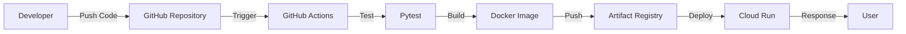

# FastAPI Demo API

Dự án demo FastAPI triển khai luồng CI/CD lên Google Cloud Run sử dụng Docker, GitHub Actions và SST.

## 1. Giới thiệu tổng quan

- Dự án cung cấp REST API cơ bản quản lý danh sách sản phẩm mẫu.
- Áp dụng các khái niệm Cloud Engineering: Containerization, CI/CD, Infrastructure as Code.

## 2. Phạm vi và giới hạn

- **Trong phạm vi:** Luồng CI/CD, Dockerfile multi-stage, SST config cho Cloud Run, cấu hình mạng VPC cơ bản.
- **Ngoài phạm vi:** Database thật (hiện dùng in-memory data), giao diện frontend.
- **Giới hạn:** Dữ liệu sẽ mất khi container khởi động lại.

## 3. Kiến trúc hệ thống và luồng hoạt động



## 4. Lý thuyết cốt lõi và thuật ngữ

| Thuật ngữ | Giải thích ngắn gọn | Vai trò trong dự án |
| --- | --- | --- |
| **Docker Image** | Bản thiết kế tĩnh chứa mã nguồn và môi trường. | Đóng gói FastAPI API. |
| **Cloud Run** | Máy chủ Serverless tự động mở rộng. | Môi trường chạy chính của API. |
| **Artifact Registry**| Kho lưu trữ private của GCP. | Nơi cất giữ Docker Image đã build. |
| **GitHub Actions** | Hệ thống CI/CD tự động. | Chạy test và deploy code. |
| **SST (IaC)** | Infrastructure as Code. | Khai báo tài nguyên Cloud Run bằng code TypeScript. |

## 5. Technology Stack

| Công nghệ/Thư viện | Phiên bản | Vai trò | Nguồn xác định |
| --- | --- | --- | --- |
| Python | 3.12 | Môi trường chạy | CI/CD config |
| FastAPI | >=0.115.0 | Web framework | requirements.txt |
| Uvicorn | >=0.30.0 | ASGI Server | requirements.txt |
| Pytest | >=8.0.0 | Công cụ kiểm thử | requirements.txt |
| Docker | [CẦN BỔ SUNG: phiên bản] | Containerization | Dockerfile |
| SST | [CẦN BỔ SUNG: phiên bản] | IaC Framework | sst.config.ts |

## 6. Cấu trúc thư mục

```text
.
├── .github/
│   └── workflows/
│       └── ci.yml
├── src/
│   ├── main.py
│   └── products/
│       └── router.py
├── tests/
├── .dockerignore
├── .gitignore
├── Dockerfile
├── requirements.txt
└── sst.config.ts
```

| File/Thư mục | Chức năng |
| --- | --- |
| `ci.yml` | Cấu hình luồng GitHub Actions. |
| `src/main.py` | Entry point của FastAPI. |
| `Dockerfile` | Khai báo các bước build container. |
| `sst.config.ts`| Cấu hình IaC triển khai Cloud Run. |

## 7. Yêu cầu hệ thống

| Công cụ | Phiên bản | Bắt buộc | Cách kiểm tra |
| --- | --- | --- | --- |
| Python | 3.11 | Có | `python --version` |
| Docker | [CẦN BỔ SUNG: phiên bản] | Có | `docker --version` |
| Gcloud CLI | [CẦN BỔ SUNG: phiên bản] | Có | `gcloud --version` |

## 8. Biến môi trường và cấu hình

| Biến | Bắt buộc | Mô tả | Giá trị mẫu an toàn |
| --- | --- | --- | --- |
| `PORT` | Không | Cổng lắng nghe của container | `8080` |
| `GCP_CREDENTIALS`| Có (CI/CD)| Service Account JSON key | `<YOUR_SERVICE_ACCOUNT_JSON>` |

- **Nhắc rõ:** Không chia sẻ file credential công khai. Không hard-code secret.

## 9. Cài đặt và chạy cục bộ

**Bước 1: Cài đặt dependencies**
Mục đích: Chuẩn bị môi trường ảo và thư viện.
Điều kiện trước khi thực hiện:
- Python đã được cài đặt.
Thực hiện tại:
- Terminal: Bash hoặc PowerShell.
- Thư mục: Thư mục gốc của dự án.
Câu lệnh:
```bash
python -m venv .venv
source .venv/bin/activate
pip install -r requirements.txt
```
Giải thích:
- Tạo môi trường ảo riêng biệt và cài đặt các thư viện phụ thuộc.
Kết quả mong đợi:
Thư mục `.venv` xuất hiện, quá trình tải không báo lỗi.
Khả năng chạy lại:
Có thể chạy lại (Lũy đẳng).

**Bước 2: Khởi động ứng dụng**
Mục đích: Chạy server ở chế độ development.
Thực hiện tại:
- Terminal: Bash hoặc PowerShell.
- Thư mục: Thư mục gốc của dự án.
Câu lệnh:
```bash
uvicorn src.main:app --reload
```
Giải thích:
- Khởi động Uvicorn server, trỏ tới file `src/main.py`.
Kết quả mong đợi:
Terminal in ra dòng chữ báo ứng dụng đang lắng nghe trên `http://127.0.0.1:8000`.
Khả năng chạy lại:
Chỉ chạy 1 instance tại 1 thời điểm.

## 10. Docker

**Bước 1: Build Image**
Mục đích: Đóng gói mã nguồn thành Docker Image.
Thực hiện tại:
- Terminal: Bash hoặc PowerShell.
- Thư mục: Thư mục gốc.
- File liên quan: `Dockerfile`.
Câu lệnh:
```bash
docker build -t fastapi-demo-project:v1.0.0 .
```
Giải thích:
- Build image và gắn tag `v1.0.0`.
Kết quả mong đợi:
Terminal báo build thành công.

**Bước 2: Chạy Container**
Mục đích: Khởi chạy ứng dụng từ Image.
Thực hiện tại:
- Terminal: Bash hoặc PowerShell.
Câu lệnh:
```bash
docker run -d -p 8080:8080 --name fastapi-test fastapi-demo-project:v1.0.0
```
Giải thích:
- Map cổng 8080 của máy thật vào 8080 của container. Chạy dưới nền (`-d`).
Kết quả mong đợi:
Container chạy ngầm, truy cập được `http://localhost:8080`.
Khả năng chạy lại:
Không lũy đẳng. Sẽ báo lỗi conflict tên nếu chạy lại mà chưa xóa container cũ.

## 11. CI/CD

- **Trigger:** Push nhánh `main`.
- **Job:** `test-python-code` và `build-and-deploy`.
- **Authentication:** `google-github-actions/auth@v2` sử dụng secret `GCP_CREDENTIALS`.
- **Build:** `docker/build-push-action@v5`.
- **Test:** `pytest -v`.
- **Push Image:** Đẩy lên Artifact Registry vùng `asia-southeast1`.
- **Deployment:** `gcloud run deploy`.
- **Điều kiện thất bại:** Pytest fail hoặc không có secret quyền hợp lệ.
- **Secret được yêu cầu:** `GCP_CREDENTIALS`.

## 12. Deployment Runbook

**Bước 1: Triển khai hạ tầng bằng SST**
Mục đích: Tạo cấu trúc Cloud Run tự động qua code.
Điều kiện trước khi thực hiện:
- Cài Node.js, cài các package (`npm install`).
Thực hiện tại:
- Terminal: Bash hoặc PowerShell.
- Thư mục: Thư mục gốc.
Câu lệnh:
```bash
npx sst deploy --stage dev
```
Giải thích:
- Triển khai toàn bộ thiết kế trong `sst.config.ts` lên môi trường dev.
Kết quả mong đợi:
Tạo thành công Cloud Run và xuất URL kết quả.

## 13. Đầu vào và đầu ra

| Method | Endpoint | Chức năng | Authentication |
| --- | --- | --- | --- |
| GET | `/` | Kiểm tra API | Không |
| GET | `/health` | Trạng thái sức khỏe | Không |
| GET | `/api/products` | Lấy danh sách sản phẩm | Không |
| POST | `/api/products` | Tạo sản phẩm mới | Không |
| GET | `/api/products/{id}`| Lấy chi tiết sản phẩm | Không |
| PUT | `/api/products/{id}`| Cập nhật sản phẩm | Không |
| DELETE| `/api/products/{id}`| Xóa sản phẩm | Không |

## 14. Kiểm thử và xác thực

**Bước 1: Chạy Unit Test**
Mục đích: Đảm bảo code hoạt động đúng logic.
Thực hiện tại:
- Terminal: Bash hoặc PowerShell.
Câu lệnh:
```bash
pytest -v
```
Giải thích:
- Chạy hệ thống Pytest kiểm tra toàn bộ file trong thư mục `tests/`.
Kết quả mong đợi:
Kết quả in ra trạng thái PASSED màu xanh.

## 15. Troubleshooting

**Lỗi: Cổng bị chiếm dụng (Port already in use)**
- **Biểu hiện:** Báo lỗi `address already in use` hoặc `Bind for 0.0.0.0:8080 failed`.
- **Nguyên nhân có thể:** Container cũ tên `fastapi-test` vẫn đang chạy ngầm hoặc port 8080 bị ứng dụng khác chiếm.
- **Cách kiểm tra:**
  ```bash
  docker ps
  ```
- **Cách khắc phục:**
  ```bash
  docker stop fastapi-test
  docker rm fastapi-test
  ```
- **Cách xác nhận:** Chạy lại lệnh khởi tạo Docker Container không còn lỗi.

## 16. Giới hạn hiện tại

- Chức năng chưa hoàn thành: Triển khai Database vĩnh viễn (hiện tại mất dữ liệu khi restart container).
- Hạn chế production: Chưa phân quyền IAM chặt chẽ dạng runtime service account.

[CẦN BỔ SUNG: lịch sử phiên bản hoặc changelog]
