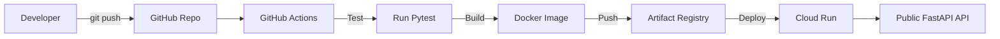

# 🚀 Đồ Án Thực Tập: Cloud Engineering & DevOps

## 1. Tổng Quan Dự Án (Project Overview)

Dự án này được xây dựng như một **Cẩm nang Hướng dẫn (Playbook)** nhằm học tập và thực hành các khái niệm nền tảng về Cloud Engineering. Dự án tập trung vào việc đóng gói, tự động hóa và triển khai phần mềm lên đám mây (Google Cloud), thay vì đi sâu vào logic lập trình.

**Đặc điểm Ứng dụng mẫu (FastAPI Demo API):**
- Xử lý danh sách sản phẩm mẫu.
- **Không sử dụng cơ sở dữ liệu thật** (Dữ liệu lưu tạm trên bộ nhớ, reset khi khởi động lại).
- **Không có giao diện frontend**, giao tiếp qua REST API & Swagger UI.

### 🛠 Bảng Công Nghệ Sử Dụng

| Công Nghệ | Vai Trò |
| --- | --- |
| **Python / FastAPI** | Xây dựng REST API Backend |
| **Pytest** | Kiểm thử tự động (Automated testing) |
| **Docker** | Đóng gói ứng dụng thành Container |
| **Artifact Registry**| Lưu trữ Docker Image trên Google Cloud |
| **Cloud Run** | Máy chủ Serverless chạy Container |
| **Compute Engine** | Máy ảo (VM) để thực hành Networking |
| **GitHub Actions** | Hệ thống tự động hóa CI/CD |
| **SST (sst.dev)** | Quản lý Hạ tầng bằng Code (IaC) |

---

## 2. Kiến Trúc Hệ Thống (System Architecture)

Mọi thay đổi từ máy tính lập trình viên đều phải đi qua luồng kiểm duyệt khắt khe trước khi lên môi trường mạng thực tế.



---

# 📚 WEEK 1: NỀN TẢNG DOCKER & GOOGLE CLOUD (GCP)

**Mục tiêu Week 1:** Hiểu cơ chế hoạt động của Container (Docker), cách thao tác với nền tảng Google Cloud bằng dòng lệnh (CLI), và triển khai thành công một API lên mạng Internet một cách thủ công.

## Day 1: GCP Setup and IAM Basics

### 📖 Lý Thuyết Học Thuật
- **Google Cloud Project**: Vùng cách ly chứa tài nguyên đám mây. Có *Project ID* (định danh duy nhất dùng cho dòng lệnh) và *Project Name*.
- **IAM (Identity and Access Management)**: Hệ thống quản lý quyền truy cập. 
- **Service Account**: "Người máy" (Bot) đại diện cho các phần mềm tự động hóa thay vì con người.
- **Least Privilege (Đặc quyền Tối thiểu)**: Nguyên tắc bảo mật bắt buộc - chỉ cấp những quyền thực sự cần thiết.

### 🛠️ Hướng Dẫn Thực Hiện
| Bước | Hành Động | Lệnh / Cấu hình |
| --- | --- | --- |
| 1 | **Đăng nhập GCP** | `gcloud auth login` |
| 2 | **Tạo Project** | `gcloud projects create khanh-fastapi-deploy-937` |
| 3 | **Cấu hình mặc định**| `gcloud config set project khanh-fastapi-deploy-937` |
| 4 | **Bật các API** | `gcloud services enable run.googleapis.com artifactregistry.googleapis.com iam.googleapis.com` |
| 5 | **Tạo Service Account**| `gcloud iam service-accounts create github-actions-bot` |
| 6 | **Cấp quyền IAM** | Cấp các role: `roles/run.admin`, `roles/artifactregistry.writer`, `roles/iam.serviceAccountUser` cho account vừa tạo. |

---

## Day 2: Docker Fundamentals

### 📖 Lý Thuyết Học Thuật
- **Docker Image**: Khuôn đúc sẵn (chỉ đọc) chứa OS, mã nguồn, thư viện.
- **Docker Container**: Phiên bản "sống" đang chạy của Docker Image.
- **Dockerfile & .dockerignore**: File cấu hình tạo Image và file giúp loại bỏ tệp rác (như `.env`, `__pycache__`) khỏi Image.
- **Port Mapping**: Kỹ thuật kết nối cổng của máy tính thật vào cổng của Container.

### 🛠️ Hướng Dẫn Thực Hiện
| Bước | Hành Động | Lệnh / Cấu hình |
| --- | --- | --- |
| 1 | **Viết Dockerfile** | Khai báo môi trường Python, copy file, cài `requirements.txt` và gọi `uvicorn`. |
| 2 | **Build Image** | `docker build -t fastapi-demo-project:v1.0.0 .` |
| 3 | **Chạy Container** | `docker run -d -p 8080:8080 --name fastapi-test fastapi-demo-project:v1.0.0` |
| 4 | **Kiểm tra Logs** | `docker logs fastapi-test` |

---

## Day 3: Advanced Docker & Artifact Registry

### 📖 Lý Thuyết Học Thuật
- **Multi-stage Build**: Kỹ thuật phân tách quá trình build Docker. Stage 1 dùng để tải công cụ biên dịch nặng. Stage 2 chỉ copy tệp đã hoàn thiện sang. Giúp Image nhẹ và an toàn.
- **Non-root User**: Chạy ứng dụng bằng người dùng giới hạn quyền lực để chống Hacker leo thang đặc quyền.
- **Artifact Registry**: Kho chứa Docker Image trên Google Cloud, thay thế Docker Hub.

### 🛠️ Hướng Dẫn Thực Hiện
| Bước | Hành Động | Lệnh / Cấu hình |
| --- | --- | --- |
| 1 | **Tạo Kho GCP** | `gcloud artifacts repositories create fastapi-repo --repository-format=docker --location=asia-southeast1` |
| 2 | **Xác thực Docker** | `gcloud auth configure-docker asia-southeast1-docker.pkg.dev` |
| 3 | **Gắn Tag Image** | `docker tag fastapi-demo-project:v1.0.0 asia-southeast1-docker.pkg.dev/khanh-fastapi-deploy-937/fastapi-repo/fastapi-demo-project:v1.0.0` |
| 4 | **Push Image** | `docker push asia-southeast1-docker.pkg.dev/khanh-fastapi-deploy-937/fastapi-repo/fastapi-demo-project:v1.0.0` |

---

## Day 4: Deploying Containers to Cloud Run

### 📖 Lý Thuyết Học Thuật
- **Cloud Run**: Dịch vụ Serverless, tự động mở rộng (Scale) dựa trên số lượng truy cập và tự động tắt (Scale to zero) khi không có khách.
- **Biến `PORT`**: Cloud Run yêu cầu ứng dụng phải lắng nghe ở cổng được quy định bởi hệ thống (thường là 8080).

### 🛠️ Hướng Dẫn Thực Hiện
| Bước | Hành Động | Lệnh / Cấu hình |
| --- | --- | --- |
| 1 | **Deploy dịch vụ** | `gcloud run deploy fastapi-demo-project --image=... --region=asia-southeast1 --allow-unauthenticated --port=8080` |
| 2 | **Kiểm tra Web** | Truy cập đường link xuất hiện trên Terminal. Truy cập `/docs` để xem Swagger UI. |

---

## Day 5: Networking Basics and Compute Engine

### 📖 Lý Thuyết Học Thuật
- **VPC & Subnet**: Mạng riêng ảo và việc chia nhỏ IP nội bộ theo khu vực.
- **Firewall Rule**: Tường lửa quyết định thiết bị nào được phép đi vào mạng.
- **Compute Engine (VM)**: Máy ảo vật lý, bạn tự cài hệ điều hành và tự quản trị mọi thứ, khác với Serverless Cloud Run.

### 🛠️ Hướng Dẫn Thực Hiện
| Bước | Hành Động | Lệnh / Cấu hình |
| --- | --- | --- |
| 1 | **Tạo Mạng (VPC)** | Cấu hình mạng custom `khanh-vpc` và subnet `10.0.1.0/24`. |
| 2 | **Mở Tường Lửa** | Mở Firewall cổng `tcp:22` để cho phép kết nối SSH. |
| 3 | **Khởi tạo Máy Ảo**| Tạo một Compute Engine kết nối với Subnet vừa tạo, dùng SSH truy cập kiểm tra. |

---

## 📌 TỔNG KẾT WEEK 1

| Chỉ Tiêu | Đánh Giá (Status) | Bằng Chứng / Output |
| --- | --- | --- |
| **GCP Foundation** | Hoàn thành xuất sắc | Tài khoản Service Account được phân quyền chuẩn Least Privilege. |
| **Docker Build** | Hoàn thành xuất sắc | File `Dockerfile` áp dụng Multi-stage & Non-root user. |
| **Lưu Trữ Mây** | Hoàn thành xuất sắc | Image nằm gọn trong thư mục Artifact Registry ở Singapore. |
| **Triển Khai Web** | Hoàn thành xuất sắc | API có thể gọi công khai qua link `https://*.run.app/docs`. |
| **Mạng & Máy Ảo** | Nắm vững lý thuyết | Phân biệt rõ sự ưu việt của Serverless so với Máy ảo (VM) truyền thống. |

---
---

# 📚 WEEK 2: TỰ ĐỘNG HÓA CI/CD & INFRASTRUCTURE AS CODE (SST)

**Mục tiêu Week 2:** Áp dụng tự động hóa 100%. Mọi việc từ kiểm thử code, tạo máy chủ, thiết lập mạng đều không được dùng tay hay giao diện, mà phải dùng Code và Robot thực thi.

## Day 6: GitHub Actions Fundamentals (Continuous Integration - CI)

### 📖 Lý Thuyết Học Thuật
- **CI (Tích hợp liên tục)**: Hệ thống Robot tự động tải code của bạn về, cài đặt và chạy Test để chắc chắn code mới không gây ra lỗi (bug).
- **GitHub Runner**: Máy ảo dùng một lần (như `ubuntu-latest`) do GitHub cấp phát để chạy luồng.

### 🛠️ Hướng Dẫn Thực Hiện
| Bước | Hành Động | Lệnh / Cấu hình |
| --- | --- | --- |
| 1 | **Viết file CI** | Tạo file `.github/workflows/ci.yml`. |
| 2 | **Cấu hình Triggers**| Khai báo chạy tự động khi có lệnh `push` vào nhánh `main`. |
| 3 | **Cấu hình Jobs** | Viết Job `test-python-code` sử dụng `actions/setup-python@v5`. |
| 4 | **Chạy Pytest** | Ra lệnh cho Robot cài `requirements.txt` và gọi lệnh `pytest -v`. |

---

## Day 7: Continuous Deployment with GitHub Actions (CD)

### 📖 Lý Thuyết Học Thuật
- **CD (Triển khai liên tục)**: Nếu hệ thống CI chạy Test thành công, Robot sẽ tự động gọi lệnh Deploy lên máy chủ Cloud thật mà không cần con người nhúng tay.
- **GitHub Secrets**: Két sắt mã hóa ẩn các đoạn mã mật khẩu của GCP.

### 🛠️ Hướng Dẫn Thực Hiện
| Bước | Hành Động | Lệnh / Cấu hình |
| --- | --- | --- |
| 1 | **Tạo Secret** | Tạo biến `GCP_CREDENTIALS` chứa mã JSON của Service Account trên Settings GitHub. |
| 2 | **Viết Job Deploy**| Thêm Job `build-and-deploy` phụ thuộc (`needs`) vào Job Test. |
| 3 | **Xác thực GCP** | Sử dụng `google-github-actions/auth@v2` kết hợp biến Secret. |
| 4 | **Đóng gói & Kéo**| Robot tự Build Docker và Push thẳng vào Artifact Registry. |

---

## Day 8: SST Core Concepts

### 📖 Lý Thuyết Học Thuật
- **Infrastructure as Code (IaC)**: Code hóa máy chủ. Dùng các tệp văn bản để khai báo hệ thống mạng, thay vì bấm chuột thủ công.
- **SST (sst.dev)**: Framework IaC mạnh mẽ giúp viết mã thiết kế hạ tầng bằng TypeScript.
- **Environment Strategy (Đa môi trường)**: Quản lý riêng biệt môi trường `dev` (Nháp), `staging` (Kiểm thử) và `production` (Sản phẩm).

### 🛠️ Hướng Dẫn Thực Hiện
| Bước | Hành Động | Lệnh / Cấu hình |
| --- | --- | --- |
| 1 | **Khai báo SST** | Tạo `package.json` cài đặt module `sst`. |
| 2 | **Bản vẽ gốc** | Tạo file `sst.config.ts`. Định nghĩa biến `$app.stage` (Chế độ môi trường). |
| 3 | **Thiết lập Bảo vệ**| Viết logic: Nếu là môi trường `production`, bật chế độ `retain` (cấm xóa nhầm máy chủ). |

---

## Day 9: SST and Cloud Run Infrastructure

### 📖 Lý Thuyết Học Thuật
- **Mapping Cloud Run qua Code**: Ánh xạ từng tham số của lệnh `gcloud` thành các thuộc tính lập trình hướng đối tượng.
- **Reproducible Deployment**: Đảm bảo 100 kỹ sư tải mã nguồn về chạy thì đều ra kết quả hạ tầng chính xác y hệt nhau.

### 🛠️ Hướng Dẫn Thực Hiện
| Bước | Hành Động | Lệnh / Cấu hình |
| --- | --- | --- |
| 1 | **Cài đặt Pulumi** | `npm install @pulumi/gcp @pulumi/pulumi` |
| 2 | **Viết Code IaC** | Dùng TypeScript trong `sst.config.ts` để gọi hàm `new gcp.cloudrun.Service(...)`. Khai báo Image, Port 8080. |
| 3 | **Mở quyền Public**| Viết hàm `new gcp.cloudrun.IamMember(...)` để mở cổng `allUsers`. |
| 4 | **Triển khai** | Chạy `npx sst deploy --stage dev` để IaC tự động đẩy lên Cloud Run. |

---

## Day 10: Evaluation Project (Nghiệm thu Dự án)

Ngày 10 không có kiến thức mới. Đây là bài test chứng minh tính toàn vẹn và khả năng hoạt động liên hoàn (End-to-End) của toàn bộ hệ thống.

### 🛠️ Hướng Dẫn Thực Hiện (Showcase)
1. Hãy sửa thử nội dung file `src/main.py`.
2. Chạy lệnh: `git add .`, `git commit -m "Update"`, `git push`.
3. Lên tab **Actions** của GitHub để xem Robot Test mã nguồn, tự động Build và tự động Deploy lên GCP.
4. Mở URL của trang web xem thay đổi có hiển thị không.

---

## 📌 TỔNG KẾT WEEK 2

| Yêu Cầu Nghiệm Thu | Bằng Chứng Lịch Sử (Evidence) | Đánh Giá (Status) |
| --- | --- | --- |
| **Kiểm Thử Tự Động** | Workflow chạy Pytest trước khi Build. | Đạt chuẩn (Completed) |
| **CI/CD Pipeline** | File `ci.yml` bảo mật qua GitHub Secrets. | Đạt chuẩn (Completed) |
| **Đa Môi Trường** | Phân định `dev/staging/prod` qua tham số `stage`. | Đạt chuẩn (Completed) |
| **Hạ Tầng Dưới Mã (IaC)**| File `sst.config.ts` khai báo Cloud Run thành công. | Đạt chuẩn (Completed) |
| **Tự Động Hóa 100%** | Developer chỉ cần viết Code và `git push`. | Hoàn hảo (Completed) |

---

# 📖 TÀI LIỆU THAM KHẢO & KHẮC PHỤC LỖI

## 1. Danh sách API (Endpoints)

| Method | Endpoint | Mô Tả |
| --- | --- | --- |
| GET | `/` | Chào mừng & kiểm tra kết nối API cơ bản |
| GET | `/health` | Kiểm tra trạng thái sức khỏe dịch vụ |
| GET | `/api/products` | Danh sách tất cả sản phẩm |
| GET | `/api/products/{id}`| Xem chi tiết sản phẩm |
| POST | `/api/products` | Thêm mới sản phẩm |
| PUT | `/api/products/{id}`| Cập nhật sản phẩm |
| DELETE| `/api/products/{id}`| Xóa sản phẩm |

## 2. Hướng dẫn Code Local (Developer Guide)

```bash
# 1. Bật môi trường ảo (Windows PowerShell)
python -m venv .venv
.\.venv\Scripts\Activate.ps1

# 2. Cài thư viện
pip install -r requirements.txt

# 3. Khởi động ứng dụng
uvicorn src.main:app --reload

# 4. Chạy kiểm thử tự động trên máy
pytest -v
```

## 3. Khắc Phục Lỗi Nhanh (Troubleshooting)

| Vấn Đề | Nguyên Nhân | Cách Khắc Phục |
| --- | --- | --- |
| **Container Crash ngay khi bật** | Code lỗi hoặc Web Server (Uvicorn) chạy sai cổng. | Đảm bảo chạy với cấu hình host `0.0.0.0` và cổng lấy theo biến `PORT`. |
| **Push Artifact Registry báo lỗi** | Chưa xác thực Docker CLI với Google Cloud. | Chạy lệnh `gcloud auth configure-docker`. |
| **GitHub Actions Unauthorized** | Khai báo sai biến Secret hoặc Service Account Key đã hết hạn. | Tạo lại Key mới trên GCP và nạp lại vào GitHub Secrets. |
| **Lỗi SSH vào Compute Engine** | Tường lửa chưa mở Port 22 cho IP máy tính cá nhân. | Bổ sung Firewall Rule cho phép kết nối `tcp:22`. |

## 4. Bảo Mật Hệ Thống (Security Considerations)
- ❌ **TỐI KỴ**: Tuyệt đối không commit file `.env` hoặc file `gcp-key.json` lên mạng. Luôn cập nhật `.gitignore`.
- ❌ **TỐI KỴ**: Không mở cổng 22 (SSH) cho `0.0.0.0/0` (Toàn cầu). Chỉ cho phép IP tĩnh cá nhân.
- ✔️ **BẮT BUỘC**: Cấu hình `USER appuser` trong Dockerfile (Cấm dùng quyền Root).
- ✔️ **BẮT BUỘC**: Cài đặt Budget Alert 1 USD trên GCP để cảnh báo lập tức nếu bị hacker gắn tool đào tiền ảo.
