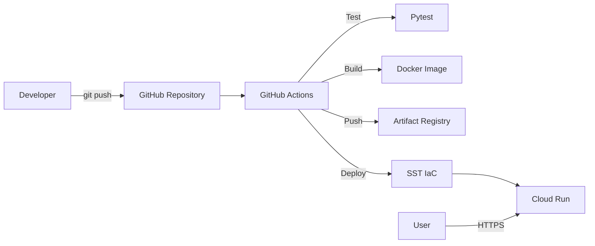

# FastAPI Demo API

**Mô tả ngắn:** Dự án triển khai FastAPI lên Google Cloud Run bằng Docker, GitHub Actions và SST.
**Phiên bản:** 1.0.0
**Trạng thái:** Hoàn thành Tuần 1 và Tuần 2
**Môi trường:** Development / Production
**Maintainer:** Khanh
**Repository:** ProjectDeploy
**Ngày cập nhật:** 24/06/2026

## 1. Giới thiệu tổng quan
Dự án cung cấp một RESTful API quản lý sản phẩm mẫu.
Mục tiêu chính là thực hành quy trình DevOps: đóng gói ứng dụng (Docker), tự động hóa CI/CD (GitHub Actions) và triển khai hạ tầng dưới dạng mã (IaC - SST) lên nền tảng Google Cloud.

## 2. Phạm vi và giới hạn
- **Nội dung thuộc phạm vi:** Đóng gói Docker, GitHub Actions CI/CD, cấu hình SST deploy lên Cloud Run, tạo mạng VPC cơ bản.
- **Nội dung ngoài phạm vi:** Cấu hình DNS domain tùy chỉnh, load balancer nâng cao.
- **Chức năng chưa hoàn thành:** [CẦN BỔ SUNG: chức năng còn thiếu]
- **Nội dung chưa được kiểm thử:** Tải trọng cao (Load testing).
- **Giới hạn development:** Dữ liệu lưu trong bộ nhớ (In-memory), sẽ mất khi container khởi động lại.
- **Giới hạn production:** Chưa kết nối cơ sở dữ liệu thực (PostgreSQL/MySQL).

## 3. Kiến trúc hệ thống và luồng hoạt động


**Luồng xử lý chính:**
1. Developer đẩy mã nguồn lên GitHub nhánh `main`.
2. GitHub Actions kích hoạt workflow CI/CD.
3. Chạy kiểm thử tự động với Pytest.
4. Đóng gói mã nguồn thành Docker image.
5. Đẩy image lên Artifact Registry.
6. SST đọc cấu hình hạ tầng và gọi API GCP để cập nhật dịch vụ Cloud Run.

| Thành phần | Trách nhiệm | Đầu vào | Đầu ra |
|---|---|---|---|
| GitHub Actions | Tự động hóa quá trình test, build và deploy. | Mã nguồn, Commit trigger | Docker Image, Lệnh Deploy |
| Artifact Registry | Lưu trữ các phiên bản Docker image. | Docker Image | Image URL cho Cloud Run |
| Cloud Run | Chạy ứng dụng web serverless. | Docker Image, Biến môi trường | HTTPS Endpoint |
| SST | Quản lý vòng đời tài nguyên GCP. | sst.config.ts | Dịch vụ trên GCP |

## 4. Lý thuyết cốt lõi và thuật ngữ

| Thuật ngữ | Giải thích ngắn gọn | Vai trò trong dự án |
|---|---|---|
| **Docker Image** | Gói phần mềm bất biến chứa mã nguồn + môi trường chạy | Đảm bảo ứng dụng chạy đồng nhất từ máy local đến Cloud Run |
| **Docker Container** | Phiên bản thực thi cô lập của một Image | Chạy FastAPI API trên mọi môi trường mà không cần cài Python thủ công |
| **Multi-stage Build** | Dockerfile dùng nhiều giai đoạn để loại bỏ file thừa khỏi image cuối | Tối ưu kích thước image, không đưa công cụ build vào production |
| **Artifact Registry** | Kho lưu trữ Docker image có phiên bản của Google Cloud | Lưu mọi bản build theo `git sha`, cho phép rollback chính xác |
| **Cloud Run** | Dịch vụ serverless của GCP chạy container, tự scale | Host ứng dụng FastAPI, tự mở rộng/thu hẹp theo lưu lượng |
| **CI** (Continuous Integration) | Tự động chạy test và build mỗi khi có commit mới | GitHub Actions chạy Pytest + build Docker image khi push lên `main` |
| **CD** (Continuous Deployment) | Tự động đẩy phiên bản mới lên server sau khi CI thành công | GitHub Actions deploy image lên Cloud Run không cần thao tác thủ công |
| **Service Account** | Tài khoản robot đại diện cho ứng dụng/quy trình, không phải người dùng | GitHub Actions dùng để xác thực với GCP và có quyền push + deploy |
| **IAM** (Identity and Access Management) | Hệ thống quản lý quyền truy cập tài nguyên GCP | Kiểm soát quyền của Service Account theo nguyên tắc Least Privilege |
| **Least Privilege** | Nguyên tắc chỉ cấp đúng quyền tối thiểu cần thiết | Service Account CI/CD chỉ có `artifactregistry.writer` + `run.admin`, không phải Owner |
| **IaC** (Infrastructure as Code) | Khai báo hạ tầng bằng code thay vì thao tác tay trên Console | SST dùng TypeScript để định nghĩa Cloud Run, VPC, tái tạo môi trường không cần click |
| **SST** | Framework IaC hỗ trợ GCP/AWS, dùng Pulumi engine | Khai báo Cloud Run service trong `sst.config.ts`, deploy bằng `npx sst deploy` |
| **Stage** | Môi trường riêng biệt trong SST (dev / staging / prod) | Tách biệt tài nguyên GCP cho từng môi trường, tránh ảnh hưởng chéo |
| **VPC** (Virtual Private Cloud) | Mạng ảo riêng tư trong GCP, cô lập tài nguyên | Tạo mạng nội bộ riêng cho Compute Engine VM, kiểm soát luồng traffic |
| **Firewall Rule** | Quy tắc cho phép hoặc chặn traffic vào/ra VPC | Chỉ cho phép SSH (port 22) và HTTP (port 80/443) đến VM |
| **Revision** | Mỗi lần deploy Cloud Run tạo ra một revision bất biến | Cho phép rollback về bất kỳ phiên bản nào mà không rebuild image |

---

### Docker & Containerization

**Docker Image — Layer Caching**
- **Nó là gì:** Mỗi lệnh trong Dockerfile tạo một layer. Layer không thay đổi sẽ được tái sử dụng khi build lại.
- **Vai trò:** Giảm thời gian build CI đáng kể — chỉ rebuild layer bị thay đổi.
- **Ví dụ thực tế:** Đặt `COPY requirements.txt` trước `COPY src/` để layer cài dependencies chỉ rebuild khi file requirements thay đổi.
- **Điểm cần lưu ý:** Thứ tự lệnh trong Dockerfile ảnh hưởng trực tiếp đến hiệu quả cache.

**Multi-stage Build**
- **Nó là gì:** Dockerfile có nhiều giai đoạn `FROM`, giai đoạn cuối chỉ copy kết quả cần thiết.
- **Vai trò:** Image production không chứa compiler, test tools → nhỏ hơn, bảo mật hơn.
- **Điểm cần lưu ý:** Chỉ áp dụng khi ngôn ngữ có bước compile (Go, Java). Python ít lợi hơn nhưng vẫn dùng được để loại dev dependencies.

---

### CI/CD với GitHub Actions

**Continuous Integration (CI)**
- **Nó là gì:** Mỗi commit được tự động kiểm thử và build ngay lập tức.
- **Vai trò:** Phát hiện lỗi sớm trước khi merge. Pipeline chạy `black --check`, `ruff`, `pytest`.
- **Ví dụ thực tế:** Trigger `on: push: branches: [main]` trong `.github/workflows/ci.yml`.
- **Điểm cần lưu ý:** CI phải pass trước khi CD được kích hoạt (job dependency).

**Continuous Deployment (CD)**
- **Nó là gì:** Tự động triển khai phiên bản mới lên môi trường sau khi CI thành công.
- **Vai trò:** Sau mỗi push lên `main`, image mới được push lên Artifact Registry và deploy lên Cloud Run tự động, không cần thao tác thủ công.
- **Điểm cần lưu ý:** Cần quản lý **Secrets** (GCP_SA_KEY, GCP_PROJECT_ID) trong GitHub Repository Settings → không bao giờ hard-code vào file.

---

### Security & IAM

**Least Privilege (Quyền tối thiểu)**
- **Nó là gì:** Chỉ cấp đúng quyền mà tài khoản cần, không thừa, không thiếu.
- **Vai trò:** Service Account `deploy-robot` chỉ có quyền `artifactregistry.writer` + `run.admin` + `iam.serviceAccountUser` — không phải `roles/owner`.
- **Điểm cần lưu ý:** Cấp quyền `roles/owner` cho CI/CD là sai nghiêm trọng về bảo mật.

**Service Account vs User Account**
- **Nó là gì:** Service Account là danh tính cho máy/quy trình; User Account là danh tính cho người.
- **Vai trò:** GitHub Actions dùng Service Account JSON Key để xác thực với GCP — không dùng tài khoản cá nhân.
- **Điểm cần lưu ý:** JSON Key bị lộ = toàn bộ quyền của Service Account bị xâm phạm. Phải lưu trong GitHub Secrets, không commit vào repository.

---

### Infrastructure as Code với SST

**SST + Pulumi Engine**
- **Nó là gì:** SST là framework IaC dùng TypeScript, chạy trên Pulumi để quản lý tài nguyên GCP/AWS.
- **Vai trò:** Thay thế hoàn toàn việc click trên GCP Console. Mọi tài nguyên (Cloud Run, VPC) được khai báo trong `sst.config.ts`.
- **Ví dụ thực tế:** `npx sst deploy --stage dev` → SST tự tạo Cloud Run service cho môi trường dev.
- **Điểm cần lưu ý:** SST quản lý **state** (trạng thái hạ tầng). Xóa tay tài nguyên trên Console mà không qua SST sẽ gây lệch state, dẫn đến lỗi khi deploy lần sau.

## 5. Technology Stack

| Công nghệ/Thư viện | Phiên bản | Vai trò | Nguồn xác định |
|---|---|---|---|
| Python | 3.11 / 3.12 | Ngôn ngữ backend | Dockerfile / ci.yml |
| FastAPI | >=0.115.0 | Web Framework | requirements.txt |
| Uvicorn | >=0.30.0 | ASGI Server | requirements.txt |
| Pytest | >=8.0.0 | Công cụ kiểm thử | requirements.txt |
| Docker | Latest | Đóng gói ứng dụng | Dockerfile |
| SST | Latest | Quản lý hạ tầng | package.json |

## 6. Cấu trúc thư mục
```text
.
├── .github/
│   └── workflows/
│       └── ci.yml
├── src/
│   ├── products/
│   │   ├── router.py
│   │   └── service.py
│   └── main.py
├── tests/
│   └── test_products.py
├── .dockerignore
├── .gitignore
├── Dockerfile
├── package.json
├── pyproject.toml
├── requirements.txt
└── sst.config.ts
```

| File/Thư mục | Chức năng |
|---|---|
| `.github/workflows/ci.yml` | Khai báo pipeline CI/CD tự động của GitHub Actions. |
| `src/main.py` | Entry point của ứng dụng FastAPI. |
| `tests/` | Chứa các kịch bản kiểm thử tự động. |
| `Dockerfile` | Chứa luồng lệnh để đóng gói Image. |
| `sst.config.ts` | File cấu hình hạ tầng IaC của SST. |

## 7. Yêu cầu hệ thống

| Công cụ | Phiên bản | Bắt buộc | Cách kiểm tra |
|---|---|---|---|
| Python | >=3.11 | Có | `python --version` |
| Docker | Mới nhất | Có | `docker --version` |
| Git | Mới nhất | Có | `git --version` |
| Node.js | >=18 | Có | `node --version` |
| Google Cloud CLI | Mới nhất | Có | `gcloud --version` |

## 8. Biến môi trường và cấu hình

| Biến | Bắt buộc | Mô tả | Giá trị mẫu an toàn |
|---|---|---|---|
| PORT | Không | Cổng mạng ứng dụng lắng nghe. Cloud Run tự cấp. | 8080 |
| GCP_CREDENTIALS | Có (trong CI) | JSON Key của Service Account. | `<YOUR_SERVICE_ACCOUNT_JSON>` |

**Nhắc rõ:**
- Không commit `.env`.
- Không hard-code secret.
- Kiểm tra `.gitignore`.
- Không ghi secret vào log.
- Không chia sẻ file credential công khai.

## 9. QUY TRÌNH THỰC HIỆN (WEEK 1 & WEEK 2)

### WEEK 1: Docker & GCP Foundations

---

#### 📅 DAY 1 — GCP Setup & IAM Basics

> **Mục tiêu:** Có một GCP project sẵn sàng triển khai với Service Account đủ quyền cho CI/CD.
> **Thực hiện:** 1 lần duy nhất khi bắt đầu dự án.

---

### Bước 1: Đăng nhập Google Cloud

**Mục đích:** Xác thực danh tính cá nhân với Google Cloud CLI trên máy local. Tất cả lệnh `gcloud` tiếp theo đều cần bước này.

**Điều kiện trước khi thực hiện:**
- Đã cài đặt [Google Cloud CLI](https://cloud.google.com/sdk/docs/install).
- Trình duyệt web khả dụng để hoàn thành OAuth.

**Thực hiện tại:** PowerShell hoặc Terminal tại bất kỳ thư mục nào.

**Câu lệnh:**
```bash
gcloud auth login
```

**Giải thích:**
- Lệnh mở trình duyệt để đăng nhập tài khoản Google.
- Sau khi xác nhận, token được lưu vào máy local để dùng cho các lệnh tiếp theo.

**Kết quả mong đợi:**
```text
You are now logged in as [your-email@gmail.com].
```

**Cách xác nhận:**
```bash
gcloud auth list
```
Tài khoản email của bạn xuất hiện với dấu `*` là đang được chọn.

**Khả năng chạy lại:** Có thể chạy lại an toàn. Nếu đã đăng nhập, lệnh sẽ cho phép chuyển tài khoản.

---

### Bước 2: Tạo GCP Project mới

**Mục đích:** Tạo không gian làm việc riêng biệt trên Google Cloud. Mọi tài nguyên (Cloud Run, Artifact Registry, VM) đều gắn với Project ID này.

**Điều kiện trước khi thực hiện:**
- Đã đăng nhập theo Bước 1.
- Tài khoản Google có quyền tạo project (cần billing account liên kết).

**Thực hiện tại:** Terminal.

**Câu lệnh:**
```bash
gcloud projects create khanh-fastapi-deploy-937 --name="Khanh FastAPI Deploy"
```

**Giải thích:**
- `khanh-fastapi-deploy-937` — **Project ID** duy nhất toàn cầu, không thể trùng với bất kỳ ai. Đây là giá trị thực tế đã dùng trong dự án.
- `--name` — Tên hiển thị thân thiện, có thể thay đổi sau. Không phải Project ID.

**Kết quả mong đợi:**
```text
Create in progress for [https://cloudresourcemanager.googleapis.com/v1/projects/khanh-fastapi-deploy-937].
...done.
```

**Cách xác nhận:**
```bash
gcloud projects describe khanh-fastapi-deploy-937
```

**Khả năng chạy lại:** ❌ **Không lũy đẳng** — Chạy lại sẽ báo lỗi `Project ID already exists`. Kiểm tra trước:
```bash
gcloud projects list
```

**Lỗi có thể xảy ra:**
- **Biểu hiện:** `ERROR: (gcloud.projects.create) Project ID already exists`
- **Nguyên nhân:** Project ID này đã được dùng trên toàn hệ thống Google Cloud.
- **Cách khắc phục:** Đặt Project ID khác, thêm số ngẫu nhiên ở cuối (vd: `my-project-38291`).

---

### Bước 3: Đặt Project làm mặc định

**Mục đích:** Tránh phải thêm `--project` vào mọi lệnh `gcloud`. Mọi lệnh tiếp theo sẽ tự động áp dụng cho project này.

**Thực hiện tại:** Terminal.

**Câu lệnh:**
```bash
gcloud config set project khanh-fastapi-deploy-937
```

**Giải thích:**
- Lưu Project ID vào cấu hình local của `gcloud`.
- Giá trị `khanh-fastapi-deploy-937` là Project ID thực tế đã tạo ở Bước 2.

**Kết quả mong đợi:**
```text
Updated property [core/project].
```

**Cách xác nhận:**
```bash
gcloud config get-value project
```
Output phải là: `khanh-fastapi-deploy-937`

**Khả năng chạy lại:** ✅ Lũy đẳng — Chạy lại chỉ ghi đè giá trị cũ, không gây hại.

---

### Bước 4: Bật các API cần thiết

**Mục đích:** GCP mặc định tắt tất cả API để tiết kiệm tài nguyên. Cần bật đúng 3 API trước khi sử dụng dịch vụ.

**Điều kiện trước khi thực hiện:**
- Project đã được chọn làm mặc định (Bước 3).
- Tài khoản đã liên kết Billing (Cloud Run và Artifact Registry yêu cầu billing).

**Thực hiện tại:** Terminal.

**Câu lệnh:**
```bash
gcloud services enable run.googleapis.com artifactregistry.googleapis.com iam.googleapis.com
```

**Giải thích:**

| API | Dùng để làm gì |
|-----|----------------|
| `run.googleapis.com` | Triển khai ứng dụng lên Cloud Run |
| `artifactregistry.googleapis.com` | Lưu trữ Docker image |
| `iam.googleapis.com` | Tạo và quản lý Service Account |

**Kết quả mong đợi:**
```text
Operation "operations/..." finished successfully.
```

**Cách xác nhận:**
```bash
gcloud services list --enabled --filter="name:(run OR artifactregistry OR iam)"
```

**Khả năng chạy lại:** ✅ Lũy đẳng — API đã bật thì lệnh bỏ qua, không báo lỗi.

**Lỗi có thể xảy ra:**
- **Biểu hiện:** `FAILED_PRECONDITION: Billing must be enabled`
- **Nguyên nhân:** Project chưa được liên kết với tài khoản thanh toán.
- **Cách khắc phục:** Vào [Google Cloud Console → Billing](https://console.cloud.google.com/billing) và liên kết billing account với project.

---

### Bước 5: Tạo Service Account cho CI/CD

**Mục đích:** Tạo một tài khoản robot chuyên dụng cho GitHub Actions. Tài khoản này thay mặt pipeline để push image và deploy — không dùng tài khoản cá nhân.

**Thực hiện tại:** Terminal.

**Câu lệnh:**
```bash
gcloud iam service-accounts create github-actions-bot \
  --display-name="GitHub Actions Bot"
```

**Giải thích:**
- `github-actions-bot` — Tên định danh của Service Account.
- `--display-name` — Tên hiển thị trên Console.
- Email đầy đủ tự động tạo ra: `github-actions-bot@khanh-fastapi-deploy-937.iam.gserviceaccount.com`

**Kết quả mong đợi:**
```text
Created service account [github-actions-bot].
```

**Cách xác nhận:**
```bash
gcloud iam service-accounts list
```

**Khả năng chạy lại:** ❌ **Không lũy đẳng** — Chạy lại sẽ báo lỗi tên đã tồn tại. Kiểm tra trước:
```bash
gcloud iam service-accounts list
```

---

### Bước 6: Cấp quyền cho Service Account

**Mục đích:** Áp dụng nguyên tắc **Least Privilege** — chỉ cấp đúng 3 quyền cần thiết cho CI/CD pipeline, không cấp thừa.

**Thực hiện tại:** Terminal.

**Câu lệnh:**
```bash
gcloud projects add-iam-policy-binding khanh-fastapi-deploy-937 \
  --member="serviceAccount:github-actions-bot@khanh-fastapi-deploy-937.iam.gserviceaccount.com" \
  --role="roles/artifactregistry.writer"

gcloud projects add-iam-policy-binding khanh-fastapi-deploy-937 \
  --member="serviceAccount:github-actions-bot@khanh-fastapi-deploy-937.iam.gserviceaccount.com" \
  --role="roles/run.admin"

gcloud projects add-iam-policy-binding khanh-fastapi-deploy-937 \
  --member="serviceAccount:github-actions-bot@khanh-fastapi-deploy-937.iam.gserviceaccount.com" \
  --role="roles/iam.serviceAccountUser"
```

**Giải thích:**

| Quyền | Cho phép làm gì |
|-------|-----------------|
| `roles/artifactregistry.writer` | Push Docker image lên Artifact Registry |
| `roles/run.admin` | Tạo và cập nhật dịch vụ Cloud Run |
| `roles/iam.serviceAccountUser` | Cho phép Cloud Run chạy với đúng danh tính |

**Kết quả mong đợi:**
```text
Updated IAM policy for project [khanh-fastapi-deploy-937].
```

**Cách xác nhận:**
```bash
gcloud projects get-iam-policy khanh-fastapi-deploy-937 \
  --flatten="bindings[].members" \
  --filter="bindings.members:github-actions-bot"
```

**Khả năng chạy lại:** ✅ Lũy đẳng — Cấp quyền đã có thì giữ nguyên, không tạo trùng.

---

### Bước 7: Tạo JSON Key và đưa vào GitHub Secrets

**Mục đích:** Tải về file chìa khóa bí mật cho Service Account. GitHub Actions dùng file này để xác thực với GCP thay cho người dùng.

**Thực hiện tại:** Terminal, tại thư mục dự án.

**Câu lệnh:**
```bash
gcloud iam service-accounts keys create gcp-key.json \
  --iam-account=github-actions-bot@khanh-fastapi-deploy-937.iam.gserviceaccount.com
```

**Giải thích:**
- `gcp-key.json` — Tên file JSON sẽ được tải xuống.
- File này chứa private key của Service Account — **cực kỳ nhạy cảm**.

**Kết quả mong đợi:**
```text
created key [...] of type [json] as [gcp-key.json] for [github-actions-bot@...]
```

**Cách xác nhận:**
```bash
dir gcp-key.json
```

**Khả năng chạy lại:** ❌ **Không lũy đẳng** — Mỗi lần tạo thêm 1 key mới. Một Service Account tối đa 10 keys. Xem danh sách key trước:
```bash
gcloud iam service-accounts keys list \
  --iam-account=github-actions-bot@khanh-fastapi-deploy-937.iam.gserviceaccount.com
```

> [!WARNING]
> File `gcp-key.json` là bí mật tuyệt đối. **Không được commit lên GitHub.** Đảm bảo tên file đã có trong `.gitignore`.

**Sau khi tạo key — Đưa vào GitHub Secrets:**
1. Mở file `gcp-key.json`, copy toàn bộ nội dung JSON.
2. Vào GitHub Repository → **Settings** → **Secrets and variables** → **Actions**.
3. Bấm **New repository secret**, đặt tên `GCP_CREDENTIALS`.
4. Dán nội dung JSON vào ô Secret → Bấm **Add secret**.

---

### ✅ Checklist xác nhận hoàn thành Day 1

```text
- [ ] gcloud auth list → hiển thị email tài khoản với dấu *
- [ ] gcloud config get-value project → in ra "khanh-fastapi-deploy-937"
- [ ] gcloud services list --enabled → có run, artifactregistry, iam
- [ ] gcloud iam service-accounts list → có "github-actions-bot"
- [ ] gcloud projects get-iam-policy → Service Account có đủ 3 roles
- [ ] GitHub Secrets → có GCP_CREDENTIALS
- [ ] .gitignore → có dòng gcp-key.json
```

---

### 🔴 Troubleshooting Day 1

**Lỗi: `PERMISSION_DENIED` khi tạo project**
- **Biểu hiện:** `The caller does not have permission`
- **Nguyên nhân:** Tài khoản Google chưa được liên kết với Billing hoặc chưa có quyền tạo project trong Organization.
- **Cách kiểm tra:** Vào [console.cloud.google.com](https://console.cloud.google.com) kiểm tra quyền trực tiếp.
- **Cách khắc phục:** Liên kết Billing Account hoặc yêu cầu admin cấp quyền `roles/resourcemanager.projectCreator`.

**Lỗi: `API not enabled` khi dùng Cloud Run**
- **Biểu hiện:** `API [run.googleapis.com] not enabled on project`
- **Nguyên nhân:** Bỏ qua Bước 4 hoặc lệnh enable chưa hoàn thành.
- **Cách khắc phục:** Chạy lại Bước 4.
- **Cách xác nhận:** `gcloud services list --enabled | Select-String "run"`

**Lỗi: GitHub Actions báo `Could not load the default credentials`**
- **Biểu hiện:** Job `auth` trong GitHub Actions thất bại.
- **Nguyên nhân:** Secret `GCP_CREDENTIALS` chưa được tạo hoặc nội dung JSON bị cắt bớt khi paste.
- **Cách khắc phục:** Xóa secret cũ trên GitHub, tạo lại và paste lại toàn bộ nội dung file `gcp-key.json`.
- **Cách xác nhận:** Xem log bước `Google Auth` trong tab Actions.

---

#### 📅 DAY 2 — Docker Fundamentals & Containerization

> **Mục tiêu:** Đóng gói ứng dụng FastAPI thành Docker Image tối ưu và chạy thử thành công trên máy local.
> **Thực hiện:** Mỗi khi có thay đổi code lớn hoặc cập nhật thư viện.

---

### Bước 1: Viết cấu trúc `.dockerignore`

**Mục đích:** Loại bỏ các file rác, file ẩn của OS, IDE và môi trường ảo (venv) khỏi quá trình build Image.

**Thực hiện tại:** File `.dockerignore` ở thư mục gốc.

**Nội dung cốt lõi:**
```text
__pycache__/
.venv/
.pytest_cache/
.env
.git/
node_modules/
```

**Giải thích:**
- Tránh build image mang theo biến môi trường `.env` gây lộ lọt bảo mật.
- Giảm dung lượng image bằng cách bỏ đi `node_modules` hoặc thư mục `.git`.

**Kết quả mong đợi:** File `.dockerignore` lưu thành công.
**Khả năng chạy lại:** ✅ Lũy đẳng. Sửa file nhiều lần không ảnh hưởng hệ thống.

---

### Bước 2: Xây dựng Dockerfile (Multi-stage Build)

**Mục đích:** Khai báo từng lớp (layer) để tạo ra một Image an toàn, gọn nhẹ chạy FastAPI.

**Thực hiện tại:** File `Dockerfile`.

**Câu lệnh chính trong file:**
```dockerfile
# STAGE 1: Builder
FROM python:3.11-slim AS builder
WORKDIR /app
COPY requirements.txt .
RUN python -m venv /app/venv && /app/venv/bin/pip install -r requirements.txt

# STAGE 2: Runtime
FROM python:3.11-slim AS runtime
WORKDIR /app
COPY --from=builder /app/venv /app/venv
COPY src/ ./src/
USER appuser
CMD ["/app/venv/bin/uvicorn", "src.main:app", "--host", "0.0.0.0", "--port", "8080"]
```

**Giải thích:**
- **Layer Caching:** `COPY requirements.txt` đứng trước `COPY src/`. Lớp cài thư viện sẽ không phải chạy lại nếu bạn chỉ sửa mã nguồn.
- **Multi-stage:** Tách stage `builder` (cài gói) và `runtime` (chạy app). Stage cuối chỉ lấy `venv`, không lấy các công cụ build.
- **Non-root User:** Lệnh `USER appuser` ngăn chặn rủi ro bảo mật nếu container bị chiếm quyền điều khiển.

**Khả năng chạy lại:** ✅ Lũy đẳng. Tái sử dụng cache nếu không có thay đổi.

---

### Bước 3: Build Docker Image cục bộ

**Mục đích:** Dịch file `Dockerfile` thành một Image hoàn chỉnh nằm trong máy tính.

**Thực hiện tại:** Terminal nội bộ, tại thư mục gốc.

**Câu lệnh:**
```bash
docker build -t fastapi-demo-project:v1.0.0 .
```

**Giải thích:**
- `-t`: Gắn thẻ (tag) tên cho Image là `fastapi-demo-project` phiên bản `v1.0.0`.
- `.`: Chỉ định thư mục build (hiện tại) để Docker tìm file `Dockerfile`.

**Kết quả mong đợi:**
```text
=> => exporting to image
=> => naming to docker.io/library/fastapi-demo-project:v1.0.0
```

**Cách xác nhận:**
```bash
docker images | Select-String "fastapi"
```

**Khả năng chạy lại:** ✅ Lũy đẳng. Build lại sẽ rất nhanh do sử dụng layer caching.

---

### Bước 4: Chạy thử Container (Run & Debug)

**Mục đích:** Tạo một phiên bản chạy (Container) từ Image vừa build để kiểm tra thực tế.

**Thực hiện tại:** Terminal nội bộ.

**Câu lệnh:**
```bash
docker run -d -p 8080:8080 --name fastapi-test fastapi-demo-project:v1.0.0
```

**Giải thích:**
- `-d`: Chạy ngầm (detached mode).
- `-p 8080:8080`: Trỏ cổng 8080 trên máy thật vào cổng 8080 bên trong container.
- `--name`: Đặt tên dễ nhớ cho container là `fastapi-test`.

**Kết quả mong đợi:** In ra một chuỗi ID dài (Container ID).

**Cách xác nhận:**
Truy cập trình duyệt: `http://localhost:8080/docs`
```bash
docker ps
```

**Khả năng chạy lại:** ❌ **Không lũy đẳng**. Chạy lại lệnh trên sẽ báo lỗi trùng tên `fastapi-test` hoặc trùng cổng `8080`.
**Cách làm sạch (Cleanup) trước khi chạy lại:**
```bash
docker rm -f fastapi-test
```

---

### 🔴 Troubleshooting Day 2 (Common Pitfalls)

**Lỗi: Address already in use (Trùng cổng)**
- **Biểu hiện:** `Bind for 0.0.0.0:8080 failed: port is already allocated.`
- **Nguyên nhân:** Có một ứng dụng khác (hoặc container cũ) đang chiếm cổng 8080 trên máy bạn.
- **Cách khắc phục:** 
  1. Dừng container cũ: `docker rm -f fastapi-test`
  2. Hoặc đổi cổng ở máy local: `docker run -d -p 9090:8080 ...` (Truy cập `localhost:9090`).

**Lỗi: Không tìm thấy thư viện khi chạy container**
- **Biểu hiện:** `ModuleNotFoundError: No module named 'fastapi'`
- **Nguyên nhân:** Có thể do `.dockerignore` vô tình loại bỏ file cần thiết, hoặc requirements.txt bị sai.
- **Cách debug:** Đi sâu vào bên trong container để xem thư mục có gì:
  ```bash
  docker exec -it fastapi-test /bin/bash
  ```

---

### 📝 Tổng hợp kết quả Day 2

**Những gì đã thực hiện:**
1. Định cấu hình loại bỏ rác qua `.dockerignore`.
2. Tạo kiến trúc `Dockerfile` Multi-stage, tận dụng Layer Caching và bảo mật Non-root User.
3. Build thành công Docker Image.
4. Triển khai và debug Container chạy ngầm trên máy local.

**Kết quả đạt được (Output):**
Ứng dụng API đã được **đóng gói độc lập** và đang **chạy thành công trên localhost thông qua Docker**, sẵn sàng cho việc đưa lên Cloud ở các ngày tiếp theo. Không còn phụ thuộc vào môi trường Python local của máy.
