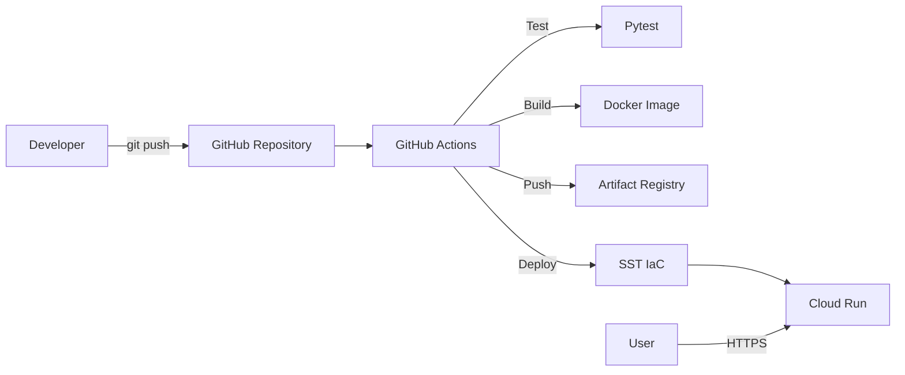

# FastAPI Demo API

**Mô tả ngắn:** Dự án triển khai FastAPI lên Google Cloud Run bằng Docker, GitHub Actions và SST.
**Phiên bản:** 1.0.0
**Trạng thái:** Hoàn thành Tuần 1 và Tuần 2
**Môi trường:** Development / Production
**Maintainer:** Khanh
**Repository:** ProjectDeploy
**Ngày cập nhật:** 24/06/2026

## 1. Giới thiệu tổng quan
Dự án cung cấp một RESTful API quản lý sản phẩm mẫu.
Mục tiêu chính là thực hành quy trình DevOps: đóng gói ứng dụng (Docker), tự động hóa CI/CD (GitHub Actions) và triển khai hạ tầng dưới dạng mã (IaC - SST) lên nền tảng Google Cloud.

## 2. Phạm vi và giới hạn
- **Nội dung thuộc phạm vi:** Đóng gói Docker, GitHub Actions CI/CD, cấu hình SST deploy lên Cloud Run, tạo mạng VPC cơ bản.
- **Nội dung ngoài phạm vi:** Cấu hình DNS domain tùy chỉnh, load balancer nâng cao.
- **Chức năng chưa hoàn thành:** [CẦN BỔ SUNG: chức năng còn thiếu]
- **Nội dung chưa được kiểm thử:** Tải trọng cao (Load testing).
- **Giới hạn development:** Dữ liệu lưu trong bộ nhớ (In-memory), sẽ mất khi container khởi động lại.
- **Giới hạn production:** Chưa kết nối cơ sở dữ liệu thực (PostgreSQL/MySQL).

## 3. Kiến trúc hệ thống và luồng hoạt động


**Luồng xử lý chính:**
1. Developer đẩy mã nguồn lên GitHub nhánh `main`.
2. GitHub Actions kích hoạt workflow CI/CD.
3. Chạy kiểm thử tự động với Pytest.
4. Đóng gói mã nguồn thành Docker image.
5. Đẩy image lên Artifact Registry.
6. SST đọc cấu hình hạ tầng và gọi API GCP để cập nhật dịch vụ Cloud Run.

| Thành phần | Trách nhiệm | Đầu vào | Đầu ra |
|---|---|---|---|
| GitHub Actions | Tự động hóa quá trình test, build và deploy. | Mã nguồn, Commit trigger | Docker Image, Lệnh Deploy |
| Artifact Registry | Lưu trữ các phiên bản Docker image. | Docker Image | Image URL cho Cloud Run |
| Cloud Run | Chạy ứng dụng web serverless. | Docker Image, Biến môi trường | HTTPS Endpoint |
| SST | Quản lý vòng đời tài nguyên GCP. | sst.config.ts | Dịch vụ trên GCP |

## 4. Lý thuyết cốt lõi và thuật ngữ

| Thuật ngữ | Giải thích ngắn gọn | Vai trò trong dự án |
|---|---|---|
| **Docker Image** | Gói phần mềm bất biến chứa mã nguồn + môi trường chạy | Đảm bảo ứng dụng chạy đồng nhất từ máy local đến Cloud Run |
| **Docker Container** | Phiên bản thực thi cô lập của một Image | Chạy FastAPI API trên mọi môi trường mà không cần cài Python thủ công |
| **Multi-stage Build** | Dockerfile dùng nhiều giai đoạn để loại bỏ file thừa khỏi image cuối | Tối ưu kích thước image, không đưa công cụ build vào production |
| **Artifact Registry** | Kho lưu trữ Docker image có phiên bản của Google Cloud | Lưu mọi bản build theo `git sha`, cho phép rollback chính xác |
| **Cloud Run** | Dịch vụ serverless của GCP chạy container, tự scale | Host ứng dụng FastAPI, tự mở rộng/thu hẹp theo lưu lượng |
| **CI** (Continuous Integration) | Tự động chạy test và build mỗi khi có commit mới | GitHub Actions chạy Pytest + build Docker image khi push lên `main` |
| **CD** (Continuous Deployment) | Tự động đẩy phiên bản mới lên server sau khi CI thành công | GitHub Actions deploy image lên Cloud Run không cần thao tác thủ công |
| **Service Account** | Tài khoản robot đại diện cho ứng dụng/quy trình, không phải người dùng | GitHub Actions dùng để xác thực với GCP và có quyền push + deploy |
| **IAM** (Identity and Access Management) | Hệ thống quản lý quyền truy cập tài nguyên GCP | Kiểm soát quyền của Service Account theo nguyên tắc Least Privilege |
| **Least Privilege** | Nguyên tắc chỉ cấp đúng quyền tối thiểu cần thiết | Service Account CI/CD chỉ có `artifactregistry.writer` + `run.admin`, không phải Owner |
| **IaC** (Infrastructure as Code) | Khai báo hạ tầng bằng code thay vì thao tác tay trên Console | SST dùng TypeScript để định nghĩa Cloud Run, VPC, tái tạo môi trường không cần click |
| **SST** | Framework IaC hỗ trợ GCP/AWS, dùng Pulumi engine | Khai báo Cloud Run service trong `sst.config.ts`, deploy bằng `npx sst deploy` |
| **Stage** | Môi trường riêng biệt trong SST (dev / staging / prod) | Tách biệt tài nguyên GCP cho từng môi trường, tránh ảnh hưởng chéo |
| **VPC** (Virtual Private Cloud) | Mạng ảo riêng tư trong GCP, cô lập tài nguyên | Tạo mạng nội bộ riêng cho Compute Engine VM, kiểm soát luồng traffic |
| **Firewall Rule** | Quy tắc cho phép hoặc chặn traffic vào/ra VPC | Chỉ cho phép SSH (port 22) và HTTP (port 80/443) đến VM |
| **Revision** | Mỗi lần deploy Cloud Run tạo ra một revision bất biến | Cho phép rollback về bất kỳ phiên bản nào mà không rebuild image |

---

### Docker & Containerization

**Docker Image — Layer Caching**
- **Nó là gì:** Mỗi lệnh trong Dockerfile tạo một layer. Layer không thay đổi sẽ được tái sử dụng khi build lại.
- **Vai trò:** Giảm thời gian build CI đáng kể — chỉ rebuild layer bị thay đổi.
- **Ví dụ thực tế:** Đặt `COPY requirements.txt` trước `COPY src/` để layer cài dependencies chỉ rebuild khi file requirements thay đổi.
- **Điểm cần lưu ý:** Thứ tự lệnh trong Dockerfile ảnh hưởng trực tiếp đến hiệu quả cache.

**Multi-stage Build**
- **Nó là gì:** Dockerfile có nhiều giai đoạn `FROM`, giai đoạn cuối chỉ copy kết quả cần thiết.
- **Vai trò:** Image production không chứa compiler, test tools → nhỏ hơn, bảo mật hơn.
- **Điểm cần lưu ý:** Chỉ áp dụng khi ngôn ngữ có bước compile (Go, Java). Python ít lợi hơn nhưng vẫn dùng được để loại dev dependencies.

---

### CI/CD với GitHub Actions

**Continuous Integration (CI)**
- **Nó là gì:** Mỗi commit được tự động kiểm thử và build ngay lập tức.
- **Vai trò:** Phát hiện lỗi sớm trước khi merge. Pipeline chạy `black --check`, `ruff`, `pytest`.
- **Ví dụ thực tế:** Trigger `on: push: branches: [main]` trong `.github/workflows/ci.yml`.
- **Điểm cần lưu ý:** CI phải pass trước khi CD được kích hoạt (job dependency).

**Continuous Deployment (CD)**
- **Nó là gì:** Tự động triển khai phiên bản mới lên môi trường sau khi CI thành công.
- **Vai trò:** Sau mỗi push lên `main`, image mới được push lên Artifact Registry và deploy lên Cloud Run tự động, không cần thao tác thủ công.
- **Điểm cần lưu ý:** Cần quản lý **Secrets** (GCP_SA_KEY, GCP_PROJECT_ID) trong GitHub Repository Settings → không bao giờ hard-code vào file.

---

### Security & IAM

**Least Privilege (Quyền tối thiểu)**
- **Nó là gì:** Chỉ cấp đúng quyền mà tài khoản cần, không thừa, không thiếu.
- **Vai trò:** Service Account `deploy-robot` chỉ có quyền `artifactregistry.writer` + `run.admin` + `iam.serviceAccountUser` — không phải `roles/owner`.
- **Điểm cần lưu ý:** Cấp quyền `roles/owner` cho CI/CD là sai nghiêm trọng về bảo mật.

**Service Account vs User Account**
- **Nó là gì:** Service Account là danh tính cho máy/quy trình; User Account là danh tính cho người.
- **Vai trò:** GitHub Actions dùng Service Account JSON Key để xác thực với GCP — không dùng tài khoản cá nhân.
- **Điểm cần lưu ý:** JSON Key bị lộ = toàn bộ quyền của Service Account bị xâm phạm. Phải lưu trong GitHub Secrets, không commit vào repository.

---

### Infrastructure as Code với SST

**SST + Pulumi Engine**
- **Nó là gì:** SST là framework IaC dùng TypeScript, chạy trên Pulumi để quản lý tài nguyên GCP/AWS.
- **Vai trò:** Thay thế hoàn toàn việc click trên GCP Console. Mọi tài nguyên (Cloud Run, VPC) được khai báo trong `sst.config.ts`.
- **Ví dụ thực tế:** `npx sst deploy --stage dev` → SST tự tạo Cloud Run service cho môi trường dev.
- **Điểm cần lưu ý:** SST quản lý **state** (trạng thái hạ tầng). Xóa tay tài nguyên trên Console mà không qua SST sẽ gây lệch state, dẫn đến lỗi khi deploy lần sau.

## 5. Technology Stack

| Công nghệ/Thư viện | Phiên bản | Vai trò | Nguồn xác định |
|---|---|---|---|
| Python | 3.11 / 3.12 | Ngôn ngữ backend | Dockerfile / ci.yml |
| FastAPI | >=0.115.0 | Web Framework | requirements.txt |
| Uvicorn | >=0.30.0 | ASGI Server | requirements.txt |
| Pytest | >=8.0.0 | Công cụ kiểm thử | requirements.txt |
| Docker | Latest | Đóng gói ứng dụng | Dockerfile |
| SST | Latest | Quản lý hạ tầng | package.json |

## 6. Cấu trúc thư mục
```text
.
├── .github/
│   └── workflows/
│       └── ci.yml
├── src/
│   ├── products/
│   │   ├── router.py
│   │   └── service.py
│   └── main.py
├── tests/
│   └── test_products.py
├── .dockerignore
├── .gitignore
├── Dockerfile
├── package.json
├── pyproject.toml
├── requirements.txt
└── sst.config.ts
```

| File/Thư mục | Chức năng |
|---|---|
| `.github/workflows/ci.yml` | Khai báo pipeline CI/CD tự động của GitHub Actions. |
| `src/main.py` | Entry point của ứng dụng FastAPI. |
| `tests/` | Chứa các kịch bản kiểm thử tự động. |
| `Dockerfile` | Chứa luồng lệnh để đóng gói Image. |
| `sst.config.ts` | File cấu hình hạ tầng IaC của SST. |

## 7. Yêu cầu hệ thống

| Công cụ | Phiên bản | Bắt buộc | Cách kiểm tra |
|---|---|---|---|
| Python | >=3.11 | Có | `python --version` |
| Docker | Mới nhất | Có | `docker --version` |
| Git | Mới nhất | Có | `git --version` |
| Node.js | >=18 | Có | `node --version` |
| Google Cloud CLI | Mới nhất | Có | `gcloud --version` |

## 8. Biến môi trường và cấu hình

| Biến | Bắt buộc | Mô tả | Giá trị mẫu an toàn |
|---|---|---|---|
| PORT | Không | Cổng mạng ứng dụng lắng nghe. Cloud Run tự cấp. | 8080 |
| GCP_CREDENTIALS | Có (trong CI) | JSON Key của Service Account. | `<YOUR_SERVICE_ACCOUNT_JSON>` |

**Nhắc rõ:**
- Không commit `.env`.
- Không hard-code secret.
- Kiểm tra `.gitignore`.
- Không ghi secret vào log.
- Không chia sẻ file credential công khai.

## 9. QUY TRÌNH THỰC HIỆN (WEEK 1 & WEEK 2)

### WEEK 1: Docker & GCP Foundations

**Bước 1: Khởi tạo Project và Cấp quyền IAM**
**Mục đích:** Khởi tạo vùng không gian trên Google Cloud và cấp quyền cho GitHub Actions Bot.
**Điều kiện trước khi thực hiện:**
- Cài đặt Google Cloud CLI.
- Đã đăng nhập `gcloud auth login`.
**Thực hiện tại:** Terminal nội bộ.
**Câu lệnh:**
```bash
gcloud projects create <PROJECT_ID> --name="Khanh FastAPI Deploy"
gcloud config set project <PROJECT_ID>
gcloud services enable run.googleapis.com artifactregistry.googleapis.com iam.googleapis.com
gcloud iam service-accounts create github-actions-bot
```
**Giải thích:** Tạo project, bật các API cần thiết để chạy dịch vụ và tạo tài khoản robot. Thay `<PROJECT_ID>` bằng mã định danh (vd: `khanh-fastapi-deploy-937`).
**Kết quả mong đợi:** Project được kích hoạt, Service account được tạo.
**Cách xác nhận:** `gcloud projects list`
**Khả năng chạy lại:** Không lũy đẳng (Tạo project trùng tên sẽ lỗi).
**Lỗi có thể xảy ra:**
- Biểu hiện: Lỗi Permission Denied hoặc Project ID already exists.
- Nguyên nhân: Chưa có quyền thanh toán hoặc tên trùng.

**Bước 2: Đóng gói Docker Image cục bộ**
**Mục đích:** Xây dựng Image từ mã nguồn để chạy thử nghiệm trên máy.
**Điều kiện trước khi thực hiện:** Có `Dockerfile` hợp lệ.
**Thực hiện tại:** Terminal nội bộ, tại thư mục gốc của dự án.
**Câu lệnh:**
```bash
docker build -t fastapi-demo-project:v1.0.0 .
docker run -d -p 8080:8080 --name fastapi-test fastapi-demo-project:v1.0.0
```
**Giải thích:** `-t` đặt tên cho image. `-d` chạy ngầm. `-p` liên kết cổng máy thực với container.
**Kết quả mong đợi:** Container khởi động thành công không crash.
**Cách xác nhận:** `docker ps`
**Khả năng chạy lại:** Không lũy đẳng với lệnh `run` (trùng tên container sẽ lỗi). Cách tránh: `docker rm -f fastapi-test` trước khi chạy lại.

**Bước 3: Lưu trữ trên Artifact Registry**
**Mục đích:** Lưu Docker Image lên đám mây bảo mật của Google.
**Thực hiện tại:** Terminal nội bộ.
**Câu lệnh:**
```bash
gcloud artifacts repositories create fastapi-repo --repository-format=docker --location=asia-southeast1
gcloud auth configure-docker asia-southeast1-docker.pkg.dev
docker tag fastapi-demo-project:v1.0.0 asia-southeast1-docker.pkg.dev/<PROJECT_ID>/fastapi-repo/fastapi-demo-project:v1.0.0
docker push asia-southeast1-docker.pkg.dev/<PROJECT_ID>/fastapi-repo/fastapi-demo-project:v1.0.0
```
**Giải thích:** Tạo repository docker trên đám mây. Gắn tag theo chuẩn đường dẫn của Google Cloud và đẩy dữ liệu lên.

**Bước 4: Triển khai thủ công lên Cloud Run (Day 4)**
**Mục đích:** Đưa ứng dụng ra Internet bằng dịch vụ Serverless.
**Thực hiện tại:** Terminal nội bộ.
**Câu lệnh:**
```bash
gcloud run deploy fastapi-demo-project \
  --image asia-southeast1-docker.pkg.dev/<PROJECT_ID>/fastapi-repo/fastapi-demo-project:v1.0.0 \
  --region asia-southeast1 \
  --platform managed \
  --allow-unauthenticated \
  --port 8080
```
**Giải thích:** Lệnh triển khai image lên Cloud Run. `--allow-unauthenticated` cho phép mọi người truy cập không cần token.
**Kết quả mong đợi:** Trả về một URL HTTPS hoạt động.

### WEEK 2: GitHub Actions CI/CD & SST IaC

**Bước 5: Cấu hình GitHub Actions CI/CD (Day 6-7)**
**Mục đích:** Tự động hóa hoàn toàn quá trình Test, Build và Deploy khi đẩy mã nguồn.
**Điều kiện trước khi thực hiện:** Khai báo biến môi trường `GCP_CREDENTIALS` trong Settings của GitHub Repository.
**Thực hiện tại:** File `.github/workflows/ci.yml`.
**Câu lệnh:** Đẩy code bằng git `git push origin main`.
**Giải thích:** GitHub Runner sẽ đọc file `ci.yml`, cấp quyền thông qua secret, chạy Pytest, build Docker và dùng gcloud CLI để deploy tự động.
**Cách xác nhận:** Kiểm tra tab "Actions" trên GitHub báo tích xanh (Passed).

**Bước 6: Khởi tạo và Deploy qua SST (Day 8-9)**
**Mục đích:** Thay thế lệnh gcloud thủ công bằng mã cấu hình hạ tầng TypeScript.
**Thực hiện tại:** Thư mục gốc, file `sst.config.ts`.
**Câu lệnh:**
```bash
npx sst install
npx sst deploy --stage dev
```
**Giải thích:** Lệnh `install` thiết lập các thư viện Pulumi. Lệnh `deploy` đọc file cấu hình và tự động khởi tạo Cloud Run service trên Google Cloud. `--stage` cho phép phân chia môi trường riêng biệt.
**Kết quả mong đợi:** Trả về URL HTTPS của ứng dụng và dòng chữ "Đang triển khai môi trường (stage): dev".
**Khả năng chạy lại:** Có (Lũy đẳng - Idempotent). SST quản lý state, nếu hạ tầng chưa thay đổi, nó sẽ không tạo mới.

## 10. CI/CD Pipeline
- **Trigger:** Khởi chạy khi có sự kiện `push` hoặc `pull_request` vào nhánh `main`.
- **Job 1 (test-python-code):** Chạy `pytest -v`.
- **Job 2 (build-and-deploy):**
  - **Authentication:** `google-github-actions/auth@v2`.
  - **Build:** `docker/build-push-action@v5`.
  - **Push Image:** Gắn tag bằng `github.sha`.
  - **Deployment:** Lệnh `gcloud run deploy`.
- **Secret yêu cầu:** `GCP_CREDENTIALS`.

## 11. API và Dữ liệu Đầu vào/Đầu ra

| Method | Endpoint | Chức năng | Authentication |
|---|---|---|---|
| GET | `/` | Kiểm tra API đang chạy | Không yêu cầu |
| GET | `/health` | Lấy trạng thái hệ thống | Không yêu cầu |
| GET | `/api/products` | Lấy danh sách sản phẩm | Không yêu cầu |
| GET | `/api/products/{id}` | Lấy chi tiết một sản phẩm | Không yêu cầu |

## 12. Troubleshooting (Xử lý sự cố)

**Lỗi: Khởi động container thất bại trên Cloud Run (Startup Failed)**
- **Biểu hiện:** Cloud Run báo lỗi không thể khởi động container, HTTP 503.
- **Nguyên nhân có thể:** Ứng dụng không lắng nghe cổng `PORT` do Cloud Run tiêm vào (mặc định FastAPI nghe cổng 8000, Cloud Run yêu cầu 8080).
- **Cách kiểm tra:**
  `gcloud logging read "resource.type=cloud_run_revision AND resource.labels.service_name=fastapi-demo-project"`
- **Cách khắc phục:**
  Sửa trong file khởi động hoặc Dockerfile để uvicorn lắng nghe đúng cổng biến môi trường:
  `CMD ["uvicorn", "src.main:app", "--host", "0.0.0.0", "--port", "8080"]`
- **Cách xác nhận:**
  Deploy lại và truy cập URL thành công.

**Lỗi: GitHub Actions Unauthorized**
- **Biểu hiện:** Job `auth` báo lỗi không có quyền hoặc token hết hạn.
- **Nguyên nhân có thể:** Key JSON của Service Account bị điền sai hoặc đã bị thu hồi trên Google Cloud.
- **Cách khắc phục:** Lấy file JSON mới, vào GitHub Settings > Secrets, xóa khóa cũ và điền mã mới vào `GCP_CREDENTIALS`.

## 13. Rollback và Cleanup An Toàn

**Rollback Cloud Run:**
- **Lệnh rollback đã sử dụng:** Chuyển 100% traffic về bản ổn định cũ.
  ```bash
  gcloud run services update-traffic fastapi-demo-project --to-revisions=<REVISION_NAME>=100
  ```
- **Rủi ro:** Mã nguồn cũ có thể không tương thích với database hiện tại (Dự án này chưa dùng DB nên rủi ro = 0).

**Cleanup (Xóa tài nguyên):**
> [!WARNING]
> Lệnh sau có thể xóa dữ liệu hoặc tài nguyên và có thể không hoàn tác được.
```bash
gcloud run services delete fastapi-demo-project --region=asia-southeast1
gcloud artifacts repositories delete fastapi-repo --location=asia-southeast1
```
- **Cách xác nhận:** Vào Google Cloud Console kiểm tra lại không còn tài nguyên phát sinh chi phí.

## 14. Bảo mật
- **Secret management:** Sử dụng GitHub Secrets.
- **Least Privilege:** Service account chỉ được cấp quyền `run.admin` và `artifactregistry.writer`.
- **Container security:** Chạy Docker với `USER appuser` (non-root) để ngăn leo thang đặc quyền.
- **Không commit credential:** `.gitignore` chứa các đuôi `.env`, `.key`, `.pem`.
