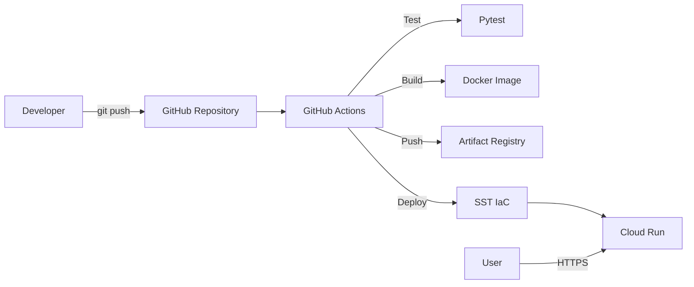

# FastAPI Demo API

**Mô tả ngắn:** Dự án triển khai FastAPI lên Google Cloud Run bằng Docker, GitHub Actions và SST.
**Phiên bản:** 1.0.0
**Trạng thái:** Hoàn thành Tuần 1 và Tuần 2
**Môi trường:** Development / Production
**Maintainer:** Khanh
**Repository:** ProjectDeploy
**Ngày cập nhật:** 24/06/2026

## 1. Giới thiệu tổng quan
Dự án cung cấp một RESTful API quản lý sản phẩm mẫu.
Mục tiêu chính là thực hành quy trình DevOps: đóng gói ứng dụng (Docker), tự động hóa CI/CD (GitHub Actions) và triển khai hạ tầng dưới dạng mã (IaC - SST) lên nền tảng Google Cloud.

## 2. Phạm vi và giới hạn
- **Nội dung thuộc phạm vi:** Đóng gói Docker, GitHub Actions CI/CD, cấu hình SST deploy lên Cloud Run, tạo mạng VPC cơ bản.
- **Nội dung ngoài phạm vi:** Cấu hình DNS domain tùy chỉnh, load balancer nâng cao.
- **Chức năng chưa hoàn thành:** [CẦN BỔ SUNG: chức năng còn thiếu]
- **Nội dung chưa được kiểm thử:** Tải trọng cao (Load testing).
- **Giới hạn development:** Dữ liệu lưu trong bộ nhớ (In-memory), sẽ mất khi container khởi động lại.
- **Giới hạn production:** Chưa kết nối cơ sở dữ liệu thực (PostgreSQL/MySQL).

## 3. Kiến trúc hệ thống và luồng hoạt động


**Luồng xử lý chính:**
1. Developer đẩy mã nguồn lên GitHub nhánh `main`.
2. GitHub Actions kích hoạt workflow CI/CD.
3. Chạy kiểm thử tự động với Pytest.
4. Đóng gói mã nguồn thành Docker image.
5. Đẩy image lên Artifact Registry.
6. SST đọc cấu hình hạ tầng và gọi API GCP để cập nhật dịch vụ Cloud Run.

| Thành phần | Trách nhiệm | Đầu vào | Đầu ra |
|---|---|---|---|
| GitHub Actions | Tự động hóa quá trình test, build và deploy. | Mã nguồn, Commit trigger | Docker Image, Lệnh Deploy |
| Artifact Registry | Lưu trữ các phiên bản Docker image. | Docker Image | Image URL cho Cloud Run |
| Cloud Run | Chạy ứng dụng web serverless. | Docker Image, Biến môi trường | HTTPS Endpoint |
| SST | Quản lý vòng đời tài nguyên GCP. | sst.config.ts | Dịch vụ trên GCP |

## 4. Lý thuyết cốt lõi và thuật ngữ

| Thuật ngữ | Giải thích ngắn gọn | Vai trò trong dự án |
|---|---|---|
| **Docker Image** | Gói phần mềm bất biến chứa mã nguồn + môi trường chạy | Đảm bảo ứng dụng chạy đồng nhất từ máy local đến Cloud Run |
| **Docker Container** | Phiên bản thực thi cô lập của một Image | Chạy FastAPI API trên mọi môi trường mà không cần cài Python thủ công |
| **Multi-stage Build** | Dockerfile dùng nhiều giai đoạn để loại bỏ file thừa khỏi image cuối | Tối ưu kích thước image, không đưa công cụ build vào production |
| **Artifact Registry** | Kho lưu trữ Docker image có phiên bản của Google Cloud | Lưu mọi bản build theo `git sha`, cho phép rollback chính xác |
| **Cloud Run** | Dịch vụ serverless của GCP chạy container, tự scale | Host ứng dụng FastAPI, tự mở rộng/thu hẹp theo lưu lượng |
| **CI** (Continuous Integration) | Tự động chạy test và build mỗi khi có commit mới | GitHub Actions chạy Pytest + build Docker image khi push lên `main` |
| **CD** (Continuous Deployment) | Tự động đẩy phiên bản mới lên server sau khi CI thành công | GitHub Actions deploy image lên Cloud Run không cần thao tác thủ công |
| **Service Account** | Tài khoản robot đại diện cho ứng dụng/quy trình, không phải người dùng | GitHub Actions dùng để xác thực với GCP và có quyền push + deploy |
| **IAM** (Identity and Access Management) | Hệ thống quản lý quyền truy cập tài nguyên GCP | Kiểm soát quyền của Service Account theo nguyên tắc Least Privilege |
| **Least Privilege** | Nguyên tắc chỉ cấp đúng quyền tối thiểu cần thiết | Service Account CI/CD chỉ có `artifactregistry.writer` + `run.admin`, không phải Owner |
| **IaC** (Infrastructure as Code) | Khai báo hạ tầng bằng code thay vì thao tác tay trên Console | SST dùng TypeScript để định nghĩa Cloud Run, VPC, tái tạo môi trường không cần click |
| **SST** | Framework IaC hỗ trợ GCP/AWS, dùng Pulumi engine | Khai báo Cloud Run service trong `sst.config.ts`, deploy bằng `npx sst deploy` |
| **Stage** | Môi trường riêng biệt trong SST (dev / staging / prod) | Tách biệt tài nguyên GCP cho từng môi trường, tránh ảnh hưởng chéo |
| **VPC** (Virtual Private Cloud) | Mạng ảo riêng tư trong GCP, cô lập tài nguyên | Tạo mạng nội bộ riêng cho Compute Engine VM, kiểm soát luồng traffic |
| **Firewall Rule** | Quy tắc cho phép hoặc chặn traffic vào/ra VPC | Chỉ cho phép SSH (port 22) và HTTP (port 80/443) đến VM |
| **Revision** | Mỗi lần deploy Cloud Run tạo ra một revision bất biến | Cho phép rollback về bất kỳ phiên bản nào mà không rebuild image |

---

### Docker & Containerization

**Docker Image — Layer Caching**
- **Nó là gì:** Mỗi lệnh trong Dockerfile tạo một layer. Layer không thay đổi sẽ được tái sử dụng khi build lại.
- **Vai trò:** Giảm thời gian build CI đáng kể — chỉ rebuild layer bị thay đổi.
- **Ví dụ thực tế:** Đặt `COPY requirements.txt` trước `COPY src/` để layer cài dependencies chỉ rebuild khi file requirements thay đổi.
- **Điểm cần lưu ý:** Thứ tự lệnh trong Dockerfile ảnh hưởng trực tiếp đến hiệu quả cache.

**Multi-stage Build**
- **Nó là gì:** Dockerfile có nhiều giai đoạn `FROM`, giai đoạn cuối chỉ copy kết quả cần thiết.
- **Vai trò:** Image production không chứa compiler, test tools → nhỏ hơn, bảo mật hơn.
- **Điểm cần lưu ý:** Chỉ áp dụng khi ngôn ngữ có bước compile (Go, Java). Python ít lợi hơn nhưng vẫn dùng được để loại dev dependencies.

---

### CI/CD với GitHub Actions

**Continuous Integration (CI)**
- **Nó là gì:** Mỗi commit được tự động kiểm thử và build ngay lập tức.
- **Vai trò:** Phát hiện lỗi sớm trước khi merge. Pipeline chạy `black --check`, `ruff`, `pytest`.
- **Ví dụ thực tế:** Trigger `on: push: branches: [main]` trong `.github/workflows/ci.yml`.
- **Điểm cần lưu ý:** CI phải pass trước khi CD được kích hoạt (job dependency).

**Continuous Deployment (CD)**
- **Nó là gì:** Tự động triển khai phiên bản mới lên môi trường sau khi CI thành công.
- **Vai trò:** Sau mỗi push lên `main`, image mới được push lên Artifact Registry và deploy lên Cloud Run tự động, không cần thao tác thủ công.
- **Điểm cần lưu ý:** Cần quản lý **Secrets** (GCP_SA_KEY, GCP_PROJECT_ID) trong GitHub Repository Settings → không bao giờ hard-code vào file.

---

### Security & IAM

**Least Privilege (Quyền tối thiểu)**
- **Nó là gì:** Chỉ cấp đúng quyền mà tài khoản cần, không thừa, không thiếu.
- **Vai trò:** Service Account `deploy-robot` chỉ có quyền `artifactregistry.writer` + `run.admin` + `iam.serviceAccountUser` — không phải `roles/owner`.
- **Điểm cần lưu ý:** Cấp quyền `roles/owner` cho CI/CD là sai nghiêm trọng về bảo mật.

**Service Account vs User Account**
- **Nó là gì:** Service Account là danh tính cho máy/quy trình; User Account là danh tính cho người.
- **Vai trò:** GitHub Actions dùng Service Account JSON Key để xác thực với GCP — không dùng tài khoản cá nhân.
- **Điểm cần lưu ý:** JSON Key bị lộ = toàn bộ quyền của Service Account bị xâm phạm. Phải lưu trong GitHub Secrets, không commit vào repository.

---

### Infrastructure as Code với SST

**SST + Pulumi Engine**
- **Nó là gì:** SST là framework IaC dùng TypeScript, chạy trên Pulumi để quản lý tài nguyên GCP/AWS.
- **Vai trò:** Thay thế hoàn toàn việc click trên GCP Console. Mọi tài nguyên (Cloud Run, VPC) được khai báo trong `sst.config.ts`.
- **Ví dụ thực tế:** `npx sst deploy --stage dev` → SST tự tạo Cloud Run service cho môi trường dev.
- **Điểm cần lưu ý:** SST quản lý **state** (trạng thái hạ tầng). Xóa tay tài nguyên trên Console mà không qua SST sẽ gây lệch state, dẫn đến lỗi khi deploy lần sau.

## 5. Technology Stack

| Công nghệ/Thư viện | Phiên bản | Vai trò | Nguồn xác định |
|---|---|---|---|
| Python | 3.11 / 3.12 | Ngôn ngữ backend | Dockerfile / ci.yml |
| FastAPI | >=0.115.0 | Web Framework | requirements.txt |
| Uvicorn | >=0.30.0 | ASGI Server | requirements.txt |
| Pytest | >=8.0.0 | Công cụ kiểm thử | requirements.txt |
| Docker | Latest | Đóng gói ứng dụng | Dockerfile |
| SST | Latest | Quản lý hạ tầng | package.json |

## 6. Cấu trúc thư mục
```text
.
├── .github/
│   └── workflows/
│       └── ci.yml
├── src/
│   ├── products/
│   │   ├── router.py
│   │   └── service.py
│   └── main.py
├── tests/
│   └── test_products.py
├── .dockerignore
├── .gitignore
├── Dockerfile
├── package.json
├── pyproject.toml
├── requirements.txt
└── sst.config.ts
```

| File/Thư mục | Chức năng |
|---|---|
| `.github/workflows/ci.yml` | Khai báo pipeline CI/CD tự động của GitHub Actions. |
| `src/main.py` | Entry point của ứng dụng FastAPI. |
| `tests/` | Chứa các kịch bản kiểm thử tự động. |
| `Dockerfile` | Chứa luồng lệnh để đóng gói Image. |
| `sst.config.ts` | File cấu hình hạ tầng IaC của SST. |

## 7. Yêu cầu hệ thống

| Công cụ | Phiên bản | Bắt buộc | Cách kiểm tra |
|---|---|---|---|
| Python | >=3.11 | Có | `python --version` |
| Docker | Mới nhất | Có | `docker --version` |
| Git | Mới nhất | Có | `git --version` |
| Node.js | >=18 | Có | `node --version` |
| Google Cloud CLI | Mới nhất | Có | `gcloud --version` |

## 8. Biến môi trường và cấu hình

| Biến | Bắt buộc | Mô tả | Giá trị mẫu an toàn |
|---|---|---|---|
| PORT | Không | Cổng mạng ứng dụng lắng nghe. Cloud Run tự cấp. | 8080 |
| GCP_CREDENTIALS | Có (trong CI) | JSON Key của Service Account. | `<YOUR_SERVICE_ACCOUNT_JSON>` |

**Nhắc rõ:**
- Không commit `.env`.
- Không hard-code secret.
- Kiểm tra `.gitignore`.
- Không ghi secret vào log.
- Không chia sẻ file credential công khai.

## 9. QUY TRÌNH THỰC HIỆN (WEEK 1 & WEEK 2)

### WEEK 1: Docker & GCP Foundations

---

#### 📅 DAY 1 — GCP Setup & IAM Basics

> **Mục tiêu:** Có một GCP project sẵn sàng triển khai với Service Account đủ quyền cho CI/CD.
> **Thực hiện:** 1 lần duy nhất khi bắt đầu dự án.

---

### Bước 1: Đăng nhập Google Cloud

**Mục đích:** Xác thực danh tính cá nhân với Google Cloud CLI trên máy local. Tất cả lệnh `gcloud` tiếp theo đều cần bước này.

**Điều kiện trước khi thực hiện:**
- Đã cài đặt [Google Cloud CLI](https://cloud.google.com/sdk/docs/install).
- Trình duyệt web khả dụng để hoàn thành OAuth.

**Thực hiện tại:** PowerShell hoặc Terminal tại bất kỳ thư mục nào.

**Câu lệnh:**
```bash
gcloud auth login
```

**Giải thích:**
- Lệnh mở trình duyệt để đăng nhập tài khoản Google.
- Sau khi xác nhận, token được lưu vào máy local để dùng cho các lệnh tiếp theo.

**Kết quả mong đợi:**
```text
You are now logged in as [your-email@gmail.com].
```

**Cách xác nhận:**
```bash
gcloud auth list
```
Tài khoản email của bạn xuất hiện với dấu `*` là đang được chọn.

**Khả năng chạy lại:** Có thể chạy lại an toàn. Nếu đã đăng nhập, lệnh sẽ cho phép chuyển tài khoản.

---

### Bước 2: Tạo GCP Project mới

**Mục đích:** Tạo không gian làm việc riêng biệt trên Google Cloud. Mọi tài nguyên (Cloud Run, Artifact Registry, VM) đều gắn với Project ID này.

**Điều kiện trước khi thực hiện:**
- Đã đăng nhập theo Bước 1.
- Tài khoản Google có quyền tạo project (cần billing account liên kết).

**Thực hiện tại:** Terminal.

**Câu lệnh:**
```bash
gcloud projects create khanh-fastapi-deploy-937 --name="Khanh FastAPI Deploy"
```

**Giải thích:**
- `khanh-fastapi-deploy-937` — **Project ID** duy nhất toàn cầu, không thể trùng với bất kỳ ai. Đây là giá trị thực tế đã dùng trong dự án.
- `--name` — Tên hiển thị thân thiện, có thể thay đổi sau. Không phải Project ID.

**Kết quả mong đợi:**
```text
Create in progress for [https://cloudresourcemanager.googleapis.com/v1/projects/khanh-fastapi-deploy-937].
...done.
```

**Cách xác nhận:**
```bash
gcloud projects describe khanh-fastapi-deploy-937
```

**Khả năng chạy lại:** ❌ **Không lũy đẳng** — Chạy lại sẽ báo lỗi `Project ID already exists`. Kiểm tra trước:
```bash
gcloud projects list
```

**Lỗi có thể xảy ra:**
- **Biểu hiện:** `ERROR: (gcloud.projects.create) Project ID already exists`
- **Nguyên nhân:** Project ID này đã được dùng trên toàn hệ thống Google Cloud.
- **Cách khắc phục:** Đặt Project ID khác, thêm số ngẫu nhiên ở cuối (vd: `my-project-38291`).

---

### Bước 3: Đặt Project làm mặc định

**Mục đích:** Tránh phải thêm `--project` vào mọi lệnh `gcloud`. Mọi lệnh tiếp theo sẽ tự động áp dụng cho project này.

**Thực hiện tại:** Terminal.

**Câu lệnh:**
```bash
gcloud config set project khanh-fastapi-deploy-937
```

**Giải thích:**
- Lưu Project ID vào cấu hình local của `gcloud`.
- Giá trị `khanh-fastapi-deploy-937` là Project ID thực tế đã tạo ở Bước 2.

**Kết quả mong đợi:**
```text
Updated property [core/project].
```

**Cách xác nhận:**
```bash
gcloud config get-value project
```
Output phải là: `khanh-fastapi-deploy-937`

**Khả năng chạy lại:** ✅ Lũy đẳng — Chạy lại chỉ ghi đè giá trị cũ, không gây hại.

---

### Bước 4: Bật các API cần thiết

**Mục đích:** GCP mặc định tắt tất cả API để tiết kiệm tài nguyên. Cần bật đúng 3 API trước khi sử dụng dịch vụ.

**Điều kiện trước khi thực hiện:**
- Project đã được chọn làm mặc định (Bước 3).
- Tài khoản đã liên kết Billing (Cloud Run và Artifact Registry yêu cầu billing).

**Thực hiện tại:** Terminal.

**Câu lệnh:**
```bash
gcloud services enable run.googleapis.com artifactregistry.googleapis.com iam.googleapis.com
```

**Giải thích:**

| API | Dùng để làm gì |
|-----|----------------|
| `run.googleapis.com` | Triển khai ứng dụng lên Cloud Run |
| `artifactregistry.googleapis.com` | Lưu trữ Docker image |
| `iam.googleapis.com` | Tạo và quản lý Service Account |

**Kết quả mong đợi:**
```text
Operation "operations/..." finished successfully.
```

**Cách xác nhận:**
```bash
gcloud services list --enabled --filter="name:(run OR artifactregistry OR iam)"
```

**Khả năng chạy lại:** ✅ Lũy đẳng — API đã bật thì lệnh bỏ qua, không báo lỗi.

**Lỗi có thể xảy ra:**
- **Biểu hiện:** `FAILED_PRECONDITION: Billing must be enabled`
- **Nguyên nhân:** Project chưa được liên kết với tài khoản thanh toán.
- **Cách khắc phục:** Vào [Google Cloud Console → Billing](https://console.cloud.google.com/billing) và liên kết billing account với project.

---

### Bước 5: Tạo Service Account cho CI/CD

**Mục đích:** Tạo một tài khoản robot chuyên dụng cho GitHub Actions. Tài khoản này thay mặt pipeline để push image và deploy — không dùng tài khoản cá nhân.

**Thực hiện tại:** Terminal.

**Câu lệnh:**
```bash
gcloud iam service-accounts create github-actions-bot \
  --display-name="GitHub Actions Bot"
```

**Giải thích:**
- `github-actions-bot` — Tên định danh của Service Account.
- `--display-name` — Tên hiển thị trên Console.
- Email đầy đủ tự động tạo ra: `github-actions-bot@khanh-fastapi-deploy-937.iam.gserviceaccount.com`

**Kết quả mong đợi:**
```text
Created service account [github-actions-bot].
```

**Cách xác nhận:**
```bash
gcloud iam service-accounts list
```

**Khả năng chạy lại:** ❌ **Không lũy đẳng** — Chạy lại sẽ báo lỗi tên đã tồn tại. Kiểm tra trước:
```bash
gcloud iam service-accounts list
```

---

### Bước 6: Cấp quyền cho Service Account

**Mục đích:** Áp dụng nguyên tắc **Least Privilege** — chỉ cấp đúng 3 quyền cần thiết cho CI/CD pipeline, không cấp thừa.

**Thực hiện tại:** Terminal.

**Câu lệnh:**
```bash
gcloud projects add-iam-policy-binding khanh-fastapi-deploy-937 \
  --member="serviceAccount:github-actions-bot@khanh-fastapi-deploy-937.iam.gserviceaccount.com" \
  --role="roles/artifactregistry.writer"

gcloud projects add-iam-policy-binding khanh-fastapi-deploy-937 \
  --member="serviceAccount:github-actions-bot@khanh-fastapi-deploy-937.iam.gserviceaccount.com" \
  --role="roles/run.admin"

gcloud projects add-iam-policy-binding khanh-fastapi-deploy-937 \
  --member="serviceAccount:github-actions-bot@khanh-fastapi-deploy-937.iam.gserviceaccount.com" \
  --role="roles/iam.serviceAccountUser"
```

**Giải thích:**

| Quyền | Cho phép làm gì |
|-------|-----------------|
| `roles/artifactregistry.writer` | Push Docker image lên Artifact Registry |
| `roles/run.admin` | Tạo và cập nhật dịch vụ Cloud Run |
| `roles/iam.serviceAccountUser` | Cho phép Cloud Run chạy với đúng danh tính |

**Kết quả mong đợi:**
```text
Updated IAM policy for project [khanh-fastapi-deploy-937].
```

**Cách xác nhận:**
```bash
gcloud projects get-iam-policy khanh-fastapi-deploy-937 \
  --flatten="bindings[].members" \
  --filter="bindings.members:github-actions-bot"
```

**Khả năng chạy lại:** ✅ Lũy đẳng — Cấp quyền đã có thì giữ nguyên, không tạo trùng.

---

### Bước 7: Tạo JSON Key và đưa vào GitHub Secrets

**Mục đích:** Tải về file chìa khóa bí mật cho Service Account. GitHub Actions dùng file này để xác thực với GCP thay cho người dùng.

**Thực hiện tại:** Terminal, tại thư mục dự án.

**Câu lệnh:**
```bash
gcloud iam service-accounts keys create gcp-key.json \
  --iam-account=github-actions-bot@khanh-fastapi-deploy-937.iam.gserviceaccount.com
```

**Giải thích:**
- `gcp-key.json` — Tên file JSON sẽ được tải xuống.
- File này chứa private key của Service Account — **cực kỳ nhạy cảm**.

**Kết quả mong đợi:**
```text
created key [...] of type [json] as [gcp-key.json] for [github-actions-bot@...]
```

**Cách xác nhận:**
```bash
dir gcp-key.json
```

**Khả năng chạy lại:** ❌ **Không lũy đẳng** — Mỗi lần tạo thêm 1 key mới. Một Service Account tối đa 10 keys. Xem danh sách key trước:
```bash
gcloud iam service-accounts keys list \
  --iam-account=github-actions-bot@khanh-fastapi-deploy-937.iam.gserviceaccount.com
```

> [!WARNING]
> File `gcp-key.json` là bí mật tuyệt đối. **Không được commit lên GitHub.** Đảm bảo tên file đã có trong `.gitignore`.

**Sau khi tạo key — Đưa vào GitHub Secrets:**
1. Mở file `gcp-key.json`, copy toàn bộ nội dung JSON.
2. Vào GitHub Repository → **Settings** → **Secrets and variables** → **Actions**.
3. Bấm **New repository secret**, đặt tên `GCP_CREDENTIALS`.
4. Dán nội dung JSON vào ô Secret → Bấm **Add secret**.

---

### ✅ Checklist xác nhận hoàn thành Day 1

```text
- [ ] gcloud auth list → hiển thị email tài khoản với dấu *
- [ ] gcloud config get-value project → in ra "khanh-fastapi-deploy-937"
- [ ] gcloud services list --enabled → có run, artifactregistry, iam
- [ ] gcloud iam service-accounts list → có "github-actions-bot"
- [ ] gcloud projects get-iam-policy → Service Account có đủ 3 roles
- [ ] GitHub Secrets → có GCP_CREDENTIALS
- [ ] .gitignore → có dòng gcp-key.json
```

---

### 🔴 Troubleshooting Day 1

**Lỗi: `PERMISSION_DENIED` khi tạo project**
- **Biểu hiện:** `The caller does not have permission`
- **Nguyên nhân:** Tài khoản Google chưa được liên kết với Billing hoặc chưa có quyền tạo project trong Organization.
- **Cách kiểm tra:** Vào [console.cloud.google.com](https://console.cloud.google.com) kiểm tra quyền trực tiếp.
- **Cách khắc phục:** Liên kết Billing Account hoặc yêu cầu admin cấp quyền `roles/resourcemanager.projectCreator`.

**Lỗi: `API not enabled` khi dùng Cloud Run**
- **Biểu hiện:** `API [run.googleapis.com] not enabled on project`
- **Nguyên nhân:** Bỏ qua Bước 4 hoặc lệnh enable chưa hoàn thành.
- **Cách khắc phục:** Chạy lại Bước 4.
- **Cách xác nhận:** `gcloud services list --enabled | Select-String "run"`

**Lỗi: GitHub Actions báo `Could not load the default credentials`**
- **Biểu hiện:** Job `auth` trong GitHub Actions thất bại.
- **Nguyên nhân:** Secret `GCP_CREDENTIALS` chưa được tạo hoặc nội dung JSON bị cắt bớt khi paste.
- **Cách khắc phục:** Xóa secret cũ trên GitHub, tạo lại và paste lại toàn bộ nội dung file `gcp-key.json`.
- **Cách xác nhận:** Xem log bước `Google Auth` trong tab Actions.

---

### 📝 Tổng hợp kết quả Day 1

**Những gì đã thực hiện:**
1. Tạo dự án GCP thực tế `khanh-fastapi-deploy-937`.
2. Bật 3 API nền tảng: Cloud Run, Artifact Registry, IAM.
3. Tạo và cấp đúng 3 quyền tối thiểu (Least Privilege) cho tài khoản robot `github-actions-bot`.
4. Xuất file JSON credential an toàn, bỏ qua git và đưa vào GitHub Secrets.

**Kết quả đạt được (Output):**
Một vùng không gian **GCP Project an toàn, sạch sẽ** đã sẵn sàng. Bạn đã có trong tay một **Service Account đủ quyền lực** để CI/CD tự động deploy ở các ngày sau mà không cần dùng đến tài khoản cá nhân của bạn nữa.

---

#### 📅 DAY 2 — Docker Fundamentals & Containerization

> **Mục tiêu:** Đóng gói ứng dụng FastAPI thành Docker Image tối ưu và chạy thử thành công trên máy local.
> **Thực hiện:** Mỗi khi có thay đổi code lớn hoặc cập nhật thư viện.

---

### Bước 1: Viết cấu trúc `.dockerignore`

**Mục đích:** Loại bỏ các file rác, file ẩn của OS, IDE và môi trường ảo (venv) khỏi quá trình build Image.

**Thực hiện tại:** File `.dockerignore` ở thư mục gốc.

**Nội dung cốt lõi:**
```text
__pycache__/
.venv/
.pytest_cache/
.env
.git/
node_modules/
```

**Giải thích:**
- Tránh build image mang theo biến môi trường `.env` gây lộ lọt bảo mật.
- Giảm dung lượng image bằng cách bỏ đi `node_modules` hoặc thư mục `.git`.

**Kết quả mong đợi:** File `.dockerignore` lưu thành công.
**Khả năng chạy lại:** ✅ Lũy đẳng. Sửa file nhiều lần không ảnh hưởng hệ thống.

---

### Bước 2: Xây dựng Dockerfile (Multi-stage Build)

**Mục đích:** Khai báo từng lớp (layer) để tạo ra một Image an toàn, gọn nhẹ chạy FastAPI.

**Thực hiện tại:** File `Dockerfile`.

**Câu lệnh chính trong file:**
```dockerfile
# STAGE 1: Builder
FROM python:3.11-slim AS builder
WORKDIR /app
COPY requirements.txt .
RUN python -m venv /app/venv && /app/venv/bin/pip install -r requirements.txt

# STAGE 2: Runtime
FROM python:3.11-slim AS runtime
WORKDIR /app
COPY --from=builder /app/venv /app/venv
COPY src/ ./src/
USER appuser
CMD ["/app/venv/bin/uvicorn", "src.main:app", "--host", "0.0.0.0", "--port", "8080"]
```

**Giải thích:**
- **Layer Caching:** `COPY requirements.txt` đứng trước `COPY src/`. Lớp cài thư viện sẽ không phải chạy lại nếu bạn chỉ sửa mã nguồn.
- **Multi-stage:** Tách stage `builder` (cài gói) và `runtime` (chạy app). Stage cuối chỉ lấy `venv`, không lấy các công cụ build.
- **Non-root User:** Lệnh `USER appuser` ngăn chặn rủi ro bảo mật nếu container bị chiếm quyền điều khiển.

**Khả năng chạy lại:** ✅ Lũy đẳng. Tái sử dụng cache nếu không có thay đổi.

---

### Bước 3: Build Docker Image cục bộ

**Mục đích:** Dịch file `Dockerfile` thành một Image hoàn chỉnh nằm trong máy tính.

**Thực hiện tại:** Terminal nội bộ, tại thư mục gốc.

**Câu lệnh:**
```bash
docker build -t fastapi-demo-project:v1.0.0 .
```

**Giải thích:**
- `-t`: Gắn thẻ (tag) tên cho Image là `fastapi-demo-project` phiên bản `v1.0.0`.
- `.`: Chỉ định thư mục build (hiện tại) để Docker tìm file `Dockerfile`.

**Kết quả mong đợi:**
```text
=> => exporting to image
=> => naming to docker.io/library/fastapi-demo-project:v1.0.0
```

**Cách xác nhận:**
```bash
docker images | Select-String "fastapi"
```

**Khả năng chạy lại:** ✅ Lũy đẳng. Build lại sẽ rất nhanh do sử dụng layer caching.

---

### Bước 4: Chạy thử Container (Run & Debug)

**Mục đích:** Tạo một phiên bản chạy (Container) từ Image vừa build để kiểm tra thực tế.

**Thực hiện tại:** Terminal nội bộ.

**Câu lệnh:**
```bash
docker run -d -p 8080:8080 --name fastapi-test fastapi-demo-project:v1.0.0
```

**Giải thích:**
- `-d`: Chạy ngầm (detached mode).
- `-p 8080:8080`: Trỏ cổng 8080 trên máy thật vào cổng 8080 bên trong container.
- `--name`: Đặt tên dễ nhớ cho container là `fastapi-test`.

**Kết quả mong đợi:** In ra một chuỗi ID dài (Container ID).

**Cách xác nhận:**
Truy cập trình duyệt: `http://localhost:8080/docs`
```bash
docker ps
```

**Khả năng chạy lại:** ❌ **Không lũy đẳng**. Chạy lại lệnh trên sẽ báo lỗi trùng tên `fastapi-test` hoặc trùng cổng `8080`.
**Cách làm sạch (Cleanup) trước khi chạy lại:**
```bash
docker rm -f fastapi-test
```

---

### 🔴 Troubleshooting Day 2 (Common Pitfalls)

**Lỗi: Address already in use (Trùng cổng)**
- **Biểu hiện:** `Bind for 0.0.0.0:8080 failed: port is already allocated.`
- **Nguyên nhân:** Có một ứng dụng khác (hoặc container cũ) đang chiếm cổng 8080 trên máy bạn.
- **Cách khắc phục:** 
  1. Dừng container cũ: `docker rm -f fastapi-test`
  2. Hoặc đổi cổng ở máy local: `docker run -d -p 9090:8080 ...` (Truy cập `localhost:9090`).

**Lỗi: Không tìm thấy thư viện khi chạy container**
- **Biểu hiện:** `ModuleNotFoundError: No module named 'fastapi'`
- **Nguyên nhân:** Có thể do `.dockerignore` vô tình loại bỏ file cần thiết, hoặc requirements.txt bị sai.
- **Cách debug:** Đi sâu vào bên trong container để xem thư mục có gì:
  ```bash
  docker exec -it fastapi-test /bin/bash
  ```

---

### 📝 Tổng hợp kết quả Day 2

**Những gì đã thực hiện:**
1. Định cấu hình loại bỏ rác qua `.dockerignore`.
2. Tạo kiến trúc `Dockerfile` Multi-stage, tận dụng Layer Caching và bảo mật Non-root User.
3. Build thành công Docker Image.
4. Triển khai và debug Container chạy ngầm trên máy local.

**Kết quả đạt được (Output):**
Ứng dụng API đã được **đóng gói độc lập** và đang **chạy thành công trên localhost thông qua Docker**, sẵn sàng cho việc đưa lên Cloud ở các ngày tiếp theo. Không còn phụ thuộc vào môi trường Python local của máy.

---

#### 📅 DAY 3 — Advanced Docker & Artifact Registry

> **Mục tiêu:** Lưu trữ an toàn Docker Image lên Google Cloud (Artifact Registry) với chiến lược quản lý phiên bản (versioning) rõ ràng.
> **Thực hiện:** Cần Artifact Registry để CI/CD có thể lấy Image deploy lên Cloud Run.

---

### Bước 1: Tạo kho lưu trữ Artifact Registry

**Mục đích:** Tạo một vùng chứa (Repository) riêng biệt trên đám mây của GCP để lưu các phiên bản Docker Image.

**Thực hiện tại:** Terminal nội bộ.

**Câu lệnh:**
```bash
gcloud artifacts repositories create fastapi-demo \
    --repository-format=docker \
    --location=asia-southeast1 \
    --description="FastAPI Demo images"
```

**Giải thích:**
- `fastapi-demo`: Tên kho lưu trữ.
- `--repository-format=docker`: Xác định đây là kho chứa Docker Image (không phải kho chứa npm, maven, v.v.).
- `--location=asia-southeast1`: Đặt máy chủ tại Singapore để tối ưu tốc độ mạng.

**Kết quả mong đợi:**
```text
Created repository [fastapi-demo].
```

**Cách xác nhận:**
```bash
gcloud artifacts repositories list
```

**Khả năng chạy lại:** ❌ **Không lũy đẳng**. Nếu kho lưu trữ đã tồn tại, lệnh sẽ báo lỗi `ALREADY_EXISTS`.

---

### Bước 2: Cấu hình Docker Authentication với GCP

**Mục đích:** Cấp quyền cho lệnh `docker` local được phép đẩy (push) dữ liệu lên máy chủ của Google Cloud.

**Thực hiện tại:** Terminal nội bộ.

**Câu lệnh:**
```bash
gcloud auth configure-docker asia-southeast1-docker.pkg.dev
```

**Giải thích:**
- GCP tạo một credential trợ giúp (`credential-helper`) cho Docker. Mỗi khi Docker kết nối tới vùng `asia-southeast1`, nó sẽ tự động dùng quyền của tài khoản Google đã đăng nhập.

**Kết quả mong đợi:** Cập nhật thành công file `~/.docker/config.json`.
**Khả năng chạy lại:** ✅ Lũy đẳng. Cấu hình lại không gây ra lỗi.

---

### Bước 3: Gắn thẻ phiên bản (Tagging Strategy)

**Mục đích:** Đổi tên (Tag) Image từ tên ngắn ở máy local thành đường dẫn dài chuẩn của GCP để push lên đúng kho.

**Thực hiện tại:** Terminal nội bộ.

**Câu lệnh:**
```bash
docker tag fastapi-demo-project:v1.0.0 asia-southeast1-docker.pkg.dev/khanh-fastapi-deploy-937/fastapi-demo/fastapi-demo-project:v1.0.0

# Gắn thêm tag latest
docker tag fastapi-demo-project:v1.0.0 asia-southeast1-docker.pkg.dev/khanh-fastapi-deploy-937/fastapi-demo/fastapi-demo-project:latest
```

**Chiến lược Versioning (Phiên bản):**
- Định dạng đường dẫn GCP: `<REGION>-docker.pkg.dev/<PROJECT_ID>/<REPO_NAME>/<IMAGE_NAME>:<TAG>`
- Dùng `v1.0.0`, `v1.0.1` cho các đợt phát hành chính thức (Release).
- Dùng `latest` cho phiên bản mới nhất.
- Trong CI/CD, tự động dùng `git sha` (vd: `4bcf108`) để tag, đảm bảo mỗi commit là một phiên bản Image duy nhất, dễ dàng rollback.

**Kết quả mong đợi:** Không báo lỗi.
**Khả năng chạy lại:** ✅ Lũy đẳng. Ghi đè tag nếu đã có.

---

### Bước 4: Push Image lên Artifact Registry

**Mục đích:** Tải Image từ máy tính của bạn lên kho lưu trữ đám mây.

**Thực hiện tại:** Terminal nội bộ.

**Câu lệnh:**
```bash
docker push asia-southeast1-docker.pkg.dev/khanh-fastapi-deploy-937/fastapi-demo/fastapi-demo-project:v1.0.0
docker push asia-southeast1-docker.pkg.dev/khanh-fastapi-deploy-937/fastapi-demo/fastapi-demo-project:latest
```

**Giải thích:** Chỉ những Layer mới hoặc bị thay đổi mới được đẩy lên (tiết kiệm băng thông nhờ Layer Caching).

**Kết quả mong đợi:**
```text
The push refers to repository [...]
v1.0.0: digest: sha256:... size: 1989
```

**Cách xác nhận:** Vào Google Cloud Console -> Artifact Registry -> `fastapi-demo` để xem Image. Hoặc dùng lệnh:
```bash
gcloud artifacts docker images list asia-southeast1-docker.pkg.dev/khanh-fastapi-deploy-937/fastapi-demo/fastapi-demo-project
```

**Khả năng chạy lại:** ✅ Lũy đẳng. Push lại bản không đổi sẽ báo `Layer already exists`.

---

### Bước 5: Pull Image để kiểm tra (Tùy chọn)

**Mục đích:** Xóa thử Image ở máy local và tải về từ đám mây để đảm bảo quá trình đẩy lên đã thành công mỹ mãn.

**Câu lệnh:**
```bash
# Xóa bản copy ở local
docker rmi asia-southeast1-docker.pkg.dev/khanh-fastapi-deploy-937/fastapi-demo/fastapi-demo-project:latest

# Tải về lại từ GCP
docker pull asia-southeast1-docker.pkg.dev/khanh-fastapi-deploy-937/fastapi-demo/fastapi-demo-project:latest
```

---

### 🔴 Troubleshooting Day 3

**Lỗi: Xác thực thất bại khi push (Registry Authentication Issues)**
- **Biểu hiện:** `denied: Permission "artifactregistry.repositories.uploadArtifacts" denied on resource` hoặc `unauthorized: authentication required`.
- **Nguyên nhân:** Chưa chạy lệnh `configure-docker` ở Bước 2, hoặc tài khoản GCP của bạn/Service Account không có quyền `roles/artifactregistry.writer`.
- **Cách khắc phục:** 
  1. Chạy lại: `gcloud auth configure-docker asia-southeast1-docker.pkg.dev`
  2. Đảm bảo bạn đang ở đúng tài khoản: `gcloud auth list`.

**Lỗi: Sai đường dẫn Push (Invalid Reference Format)**
- **Biểu hiện:** `invalid reference format` hoặc đẩy nhầm lên Docker Hub.
- **Nguyên nhân:** Sai cú pháp URL của Google Cloud (thiếu `.pkg.dev`, sai vùng, viết hoa sai quy định).
- **Cách khắc phục:** Đảm bảo toàn bộ chữ trong tag đều là chữ thường (lowercase) và đúng form: `<REGION>-docker.pkg.dev/...`

---

### 📝 Tổng hợp kết quả Day 3

**Những gì đã thực hiện:**
1. Khởi tạo kho lưu trữ Docker Image bảo mật trên Google Cloud (Artifact Registry).
2. Định nghĩa cấu trúc phiên bản (Versioning) rõ ràng giữa `latest` và các bản tag cụ thể.
3. Liên kết xác thực giữa Docker local và GCP.
4. Đẩy Image từ máy nội bộ lên đám mây thành công.

**Kết quả đạt được (Output):**
Ứng dụng của bạn giờ đã có **những phiên bản Docker Image được lưu trữ an toàn trên Artifact Registry**. Mỗi lần bạn cần triển khai (Deploy) hay quay ngược (Rollback) phiên bản, Server sẽ lấy trực tiếp từ kho chứa tốc độ cao này mà không cần build lại. Mảnh ghép chuẩn bị cuối cùng trước khi đưa web ra Internet!

---

#### 📅 DAY 4 — Deploying Containers to Cloud Run

> **Mục tiêu:** Khởi chạy Container đã lưu trữ ở Artifact Registry thành một dịch vụ web công khai (Public API) trên Cloud Run.
> **Thực hiện:** Khi muốn đưa sản phẩm ra Internet lần đầu tiên (triển khai thủ công).

---

### Bước 1: Triển khai thủ công lên Cloud Run

**Mục đích:** Đưa ứng dụng ra Internet bằng dịch vụ Serverless của Google Cloud. Quá trình này sẽ tạo ra một Endpoint (URL) HTTPS cho API của bạn.

**Thực hiện tại:** Terminal nội bộ.

**Câu lệnh:**
```bash
gcloud run deploy fastapi-demo-project \
  --image asia-southeast1-docker.pkg.dev/khanh-fastapi-deploy-937/fastapi-demo/fastapi-demo-project:latest \
  --region asia-southeast1 \
  --platform managed \
  --allow-unauthenticated \
  --port 8080
```

**Giải thích:**
- `fastapi-demo-project`: Tên dịch vụ hiển thị trên Cloud Run.
- `--image`: Đường dẫn đến Docker Image đã push lên ở Day 3.
- `--allow-unauthenticated`: Cho phép bất kỳ ai trên Internet truy cập API mà không cần mã token xác thực (Public API).
- `--port 8080`: Chỉ định Cloud Run dẫn luồng traffic (routing) vào đúng cổng 8080 mà uvicorn đang mở bên trong Container.

**Kết quả mong đợi:**
```text
Deploying container to Cloud Run service [fastapi-demo-project] in project [khanh-fastapi-deploy-937] region [asia-southeast1]
...
Service [fastapi-demo-project] revision [fastapi-demo-project-00001-abc] has been deployed and is serving 100 percent of traffic.
Service URL: https://fastapi-demo-project-xxx-as.a.run.app
```

**Cách xác nhận:**
1. Mở URL vừa được trả về trong trình duyệt, thêm đuôi `/docs` (ví dụ: `https://.../docs`) để xem giao diện Swagger UI.
2. Dùng lệnh CLI để lấy lại URL nếu quên:
```bash
gcloud run services describe fastapi-demo-project --region asia-southeast1 --format="value(status.url)"
```

**Khả năng chạy lại:** ✅ Lũy đẳng. Cloud Run sẽ tạo một **Revision (Bản sửa đổi)** mới nếu Image hoặc cấu hình thay đổi. Nếu giống hệt, nó sẽ giữ nguyên.

---

### Bước 2: Quản lý Biến môi trường (Environment Variables)

**Mục đích:** Truyền cấu hình (vd: Môi trường chạy, Database URL, Secrets) vào Container lúc runtime mà không cần hard-code vào trong mã nguồn.

**Câu lệnh mẫu (nếu cần cập nhật biến môi trường):**
```bash
gcloud run services update fastapi-demo-project \
  --region asia-southeast1 \
  --update-env-vars ENV=production,DEBUG=False
```

**Mô hình hoạt động (Execution Model) & Scaling:**
- **Revisions:** Mỗi lần bạn update biến môi trường hoặc deploy image mới, Cloud Run tự động tạo một "Revision" bất biến. Bạn có thể chia phần trăm traffic (vd: 90% bản cũ, 10% bản mới) để test an toàn.
- **Auto-scaling:** Cloud Run tự động tăng số lượng container (scale up) khi có nhiều request, và giảm về 0 (scale to zero) khi không ai truy cập để tiết kiệm chi phí.

---

### 🔴 Troubleshooting Day 4

**Lỗi: Cloud Run không khởi động được (Startup Failed / HTTP 503)**
- **Biểu hiện:** Giao diện Cloud Run báo `The user-provided container failed to start and listen on the port defined provided by the PORT=8080 environment variable.`
- **Nguyên nhân:** Ứng dụng bên trong container đang lắng nghe sai cổng (FastAPI hay mặc định cổng 8000), trong khi Cloud Run mặc định yêu cầu nghe ở cổng 8080.
- **Cách khắc phục:**
  1. Mở file `Dockerfile` kiểm tra dòng cuối cùng `CMD ["uvicorn", "src.main:app", "--host", "0.0.0.0", "--port", "8080"]`.
  2. Bắt buộc dùng `0.0.0.0` thay vì `127.0.0.1`.
- **Cách kiểm tra log chi tiết:**
  ```bash
  gcloud logging read "resource.type=cloud_run_revision AND resource.labels.service_name=fastapi-demo-project" --limit 10
  ```

**Lỗi: Truy cập bị từ chối (HTTP 403 Forbidden)**
- **Biểu hiện:** Dịch vụ Cloud Run chạy xanh nhưng vào URL thì báo `Error: Forbidden`.
- **Nguyên nhân:** Quên thêm cờ `--allow-unauthenticated` lúc deploy. Dịch vụ đang đóng kín.
- **Cách khắc phục:** 
  ```bash
  gcloud run services add-iam-policy-binding fastapi-demo-project \
    --region="asia-southeast1" \
    --member="allUsers" \
    --role="roles/run.invoker"
  ```

---

### 📝 Tổng hợp kết quả Day 4

**Những gì đã thực hiện:**
1. Kéo Image thực tế từ Artifact Registry và khởi chạy trên môi trường Serverless của Google.
2. Thiết lập ánh xạ đúng cổng mạng (`PORT=8080`) và mở quyền truy cập cho tất cả người dùng (Public API).
3. Đọc và hiểu được cách thiết lập biến môi trường, cơ chế Revisions, và Auto-scaling của Cloud Run.

**Kết quả đạt được (Output):**
Một dịch vụ **Cloud Run API công khai, hoạt động 100% trên Internet**. Bạn có thể gửi Endpoint URL cho bất kỳ ai trên thế giới để họ test thử trang Swagger UI của API ứng dụng. 
*(Đây là thành quả quan trọng khép lại phần triển khai thủ công trước khi chuyển sang tự động hóa CI/CD ở Tuần 2).*

---

#### 📅 DAY 5 — Networking Basics & Compute Engine

> **Mục tiêu:** Tạo hệ thống mạng ảo (VPC) tự quản lý, thiết lập tường lửa (Firewall) an toàn và chạy máy chủ ảo (Compute Engine VM) để phân biệt với Serverless.
> **Thực hiện:** Khi cần chạy các hệ thống không phù hợp với Serverless (ví dụ: database truyền thống, máy chủ VPN).

---

### Bước 1: Tạo Virtual Private Cloud (VPC) tùy chỉnh

**Mục đích:** Xây dựng một không gian mạng nội bộ hoàn toàn cô lập thay vì dùng mạng `default` của Google.

**Thực hiện tại:** Terminal nội bộ.

**Câu lệnh:**
```bash
gcloud compute networks create custom-vpc \
    --subnet-mode=custom \
    --bgp-routing-mode=regional

gcloud compute networks subnets create custom-subnet-asia \
    --network=custom-vpc \
    --region=asia-southeast1 \
    --range=10.0.1.0/24
```

**Giải thích:**
- `custom-vpc`: Tên mạng ảo. Chế độ `--subnet-mode=custom` yêu cầu bạn tự cấu hình dải IP (tốt cho bảo mật), không tạo tự động trên toàn thế giới.
- `custom-subnet-asia`: Tạo một mạng con (Subnet) tại Singapore với dải IP `10.0.1.0` đến `10.0.1.255`. Mọi máy chủ trong subnet này sẽ có IP nội bộ nằm trong dải này.

**Kết quả mong đợi:** Tạo thành công Mạng và Subnet.
**Khả năng chạy lại:** ❌ **Không lũy đẳng**. Mạng đã tạo không thể tạo đè.

---

### Bước 2: Thiết lập Firewall Rules (Quy tắc tường lửa)

**Mục đích:** Mở cửa cho phép các luồng dữ liệu (traffic) hợp lệ đi vào mạng ảo. Mặc định VPC tùy chỉnh sẽ chặn toàn bộ các kết nối từ Internet (Zero Trust).

**Câu lệnh:**
```bash
# Cho phép SSH (Port 22) để điều khiển máy chủ
gcloud compute firewall-rules create allow-ssh-custom \
    --network=custom-vpc \
    --allow=tcp:22 \
    --source-ranges=0.0.0.0/0 \
    --target-tags=allow-ssh

# Cho phép HTTP (Port 80) để vào web
gcloud compute firewall-rules create allow-http-custom \
    --network=custom-vpc \
    --allow=tcp:80 \
    --source-ranges=0.0.0.0/0 \
    --target-tags=allow-http
```

**Giải thích:**
- `--source-ranges=0.0.0.0/0`: Cho phép kết nối từ mọi IP trên thế giới (Internet).
- `--target-tags`: Dùng thẻ tag để gán rule này cho những máy chủ ảo cụ thể, không mở bừa bãi cho toàn bộ mạng.

**Khả năng chạy lại:** ❌ **Không lũy đẳng**. Trùng tên rule sẽ báo lỗi.

---

### Bước 3: Triển khai Máy chủ ảo (Compute Engine VM)

**Mục đích:** Thuê một máy chủ ảo chạy hệ điều hành Ubuntu bên trong mạng nội bộ vừa tạo. Đây là kiến trúc máy chủ truyền thống (IaaS) khác với Cloud Run (PaaS/Serverless).

**Câu lệnh:**
```bash
gcloud compute instances create demo-vm \
    --zone=asia-southeast1-a \
    --machine-type=e2-micro \
    --network=custom-vpc \
    --subnet=custom-subnet-asia \
    --tags=allow-ssh,allow-http \
    --image-family=ubuntu-2204-lts \
    --image-project=ubuntu-os-cloud
```

**Giải thích:**
- `--machine-type=e2-micro`: Loại máy chủ cấu hình nhỏ (vừa đủ test, rẻ/miễn phí).
- `--network / --subnet`: Đặt máy chủ vào đúng mạng VPC nội bộ đã tạo.
- `--tags=allow-ssh,allow-http`: Áp dụng 2 lớp tường lửa đã cấu hình ở Bước 2. Máy này sẽ được phép nhận tín hiệu ở cổng 22 và 80.

**Cách xác nhận:**
```bash
gcloud compute instances list
```
Lấy địa chỉ **EXTERNAL_IP** (IP công khai) của máy tính để chạy web hoặc SSH.

---

### Bước 4: So sánh Cloud Run Networking vs VM Networking

| Tiêu chí | Cloud Run (Serverless) | Compute Engine (VM) |
|---|---|---|
| **Mạng mặc định** | Chạy trên hạ tầng đóng kín của Google, không thấy được Switch / Router vật lý. | Chạy trực tiếp trong VPC của bạn. Bạn toàn quyền cấu hình IP nội bộ, Subnet. |
| **IP Công khai** | Giao tiếp qua 1 URL HTTPS chung do GCP cấp (Routing động). | Mỗi máy có 1 IP tĩnh (External IP) riêng biệt truy cập thẳng vào máy. |
| **Bảo mật** | Chủ yếu bằng IAM và mã token OAuth. | Tường lửa mạng tĩnh (Chặn IP, chặn TCP/UDP Port). |
| **Bảo trì HĐH**| Google tự lo toàn bộ bản vá lỗi hệ điều hành. | Bạn phải tự SSH vào, tự gõ lệnh update Ubuntu. |

---

### 🔴 Troubleshooting Day 5

**Lỗi: Không thể kết nối SSH vào máy ảo**
- **Biểu hiện:** Gõ lệnh `gcloud compute ssh demo-vm` bị treo (timeout) hoặc Connection refused.
- **Nguyên nhân:** Có thể bạn quên tạo Firewall rule `allow-ssh-custom` (cổng 22) hoặc quên gắn cờ `--tags=allow-ssh` lúc tạo máy ảo.
- **Cách khắc phục:** 
  Kiểm tra tag của máy ảo: `gcloud compute instances describe demo-vm --zone=asia-southeast1-a --format="value(tags.items)"`
  Nếu thiếu tag, dùng lệnh: `gcloud compute instances add-tags demo-vm --zone=asia-southeast1-a --tags=allow-ssh`

---

### 📝 Tổng hợp kết quả Day 5

**Những gì đã thực hiện:**
1. Rời khỏi hệ thống mạng mặc định (Default Network) của Google.
2. Xây dựng một mạng VPC tùy chỉnh `custom-vpc` an toàn với Subnet khu vực Châu Á.
3. Lập ra ranh giới bảo mật bằng các quy tắc Tường lửa (Firewall Rules).
4. Khởi chạy một hệ thống máy chủ thật chạy Ubuntu, gắn chặt vào mạng và tường lửa vừa tạo.

**Kết quả đạt được (Output):**
Một máy ảo (VM) **Compute Engine đang chạy ổn định trong mạng nội bộ do chính bạn làm chủ**. Máy này đã mở đúng 2 cánh cửa (port 22 cho quản trị và port 80 cho web), chặn toàn bộ những kết nối ngoại lai khác. Thông qua ngày này, bạn đã hiểu rõ ranh giới khác biệt giữa việc "thuê phần cứng" (VM Networking) và "thuê không gian chạy code" (Cloud Run Serverless Networking).

---

## 🏆 TỔNG KẾT WEEK 1: Thành quả & Bước đệm

Chỉ trong **Tuần 1**, bạn đã đi từ một thư mục mã nguồn trống trơn đến việc làm chủ được các dịch vụ cốt lõi nhất của Google Cloud Platform:

### 📌 Bạn đã làm được gì?
1. **Nền tảng Đám mây (GCP & IAM):** Khởi tạo thành công một Project an toàn, biết cách cấp phát quyền hạn (IAM) bằng nguyên tắc "Đặc quyền tối thiểu" qua Service Account.
2. **Đóng gói Ứng dụng (Docker):** Biết cách cô lập ứng dụng bằng Dockerfile đa bước (multi-stage), tối ưu Layer caching, và hiểu rõ lý do phải dùng `.dockerignore`.
3. **Lưu trữ Image (Artifact Registry):** Tự xây dựng kho chứa Docker tư nhân trên mây, thiết lập tag phiên bản gọn gàng và push image thành công.
4. **Triển khai Serverless (Cloud Run):** Đưa thành công API ra Internet với HTTPS tự động, hiểu về cơ chế Revision và Auto-scaling.
5. **Mạng cơ bản (VPC & VM):** Xây dựng mạng riêng ảo, cấu hình Firewall chặn/mở port chủ động và chạy máy chủ Compute Engine thực tế.

### 🎯 Giá trị đạt được (Output toàn Tuần 1)
Bạn không chỉ "biết gõ lệnh", mà đã hiểu rõ **luồng đi của một ứng dụng**: Từ máy cá nhân (Local) -> Đóng gói (Docker) -> Đưa lên Kho chứa (Artifact Registry) -> Chạy thực tế (Cloud Run / Compute Engine). 

**Đây chính là cách triển khai thủ công (Manual Deployment).** Nó là nền tảng tối quan trọng. Giờ đây, khi đã hiểu rõ từng dòng lệnh `gcloud` và `docker`, bạn đã hoàn toàn sẵn sàng bước sang **WEEK 2: Tự động hóa hoàn toàn với CI/CD (GitHub Actions) và Infrastructure as Code**.

---

### WEEK 2: Automation (CI/CD) & Infrastructure as Code (IaC)

#### 📅 DAY 6 — GitHub Actions Fundamentals (CI)

> **Mục tiêu:** Tự động hóa quá trình kiểm thử (Test) và đóng gói (Build Docker Image) mỗi khi có code mới được đẩy lên GitHub.
> **Thực hiện:** Thiết lập file YAML cấu hình CI/CD trên repository GitHub.

---

### Bước 1: Khái niệm CI/CD & Pipeline Flow

**Mục đích:** Hiểu luồng đi của một tự động hóa CI.
- **CI (Continuous Integration):** Tích hợp liên tục. Đảm bảo code mới không làm hỏng code cũ bằng cách tự động chạy Test và Build.
- **Trigger:** Sự kiện "bóp cò" để Pipeline chạy (ví dụ: lệnh `git push` lên nhánh `main`).
- **Runner:** Một máy chủ ảo (Ubuntu/Windows) do GitHub cung cấp miễn phí để chạy các lệnh của bạn.

---

### Bước 2: Thiết lập GitHub Secrets

**Mục đích:** Khai báo biến bí mật (ví dụ: `GCP_CREDENTIALS`) để GitHub Runner có quyền gọi Google Cloud API mà không làm lộ mã JSON ra mã nguồn mở.

**Thực hiện tại:** Trình duyệt web (GitHub).

**Các bước thao tác:**
1. Vào trang GitHub Repository của dự án > **Settings** > **Secrets and variables** > **Actions**.
2. Nhấn **New repository secret**.
3. **Name:** `GCP_CREDENTIALS`
4. **Secret:** Copy và Paste toàn bộ nội dung file `gcp-key.json` đã tạo ở Day 1 vào đây.
5. Nhấn **Add secret**.

**Khả năng chạy lại:** ✅ Lũy đẳng. Bạn có thể xóa đi tạo lại secret bất cứ lúc nào.

---

### Bước 3: Khai báo Workflow (.github/workflows/ci.yml)

**Mục đích:** Hướng dẫn máy chủ GitHub Runner các bước cần làm.

**Thực hiện tại:** File `.github/workflows/ci.yml`

**Nội dung cốt lõi của Job `test-python-code`:**
```yaml
on:
  push:
    branches: [ "main" ]

jobs:
  test-python-code:
    runs-on: ubuntu-latest
    steps:
      - uses: actions/checkout@v4
      - uses: actions/setup-python@v5
        with:
          python-version: '3.12'
          cache: 'pip' # Bộ nhớ đệm giúp cài thư viện siêu tốc
      - run: |
          pip install -r requirements.txt
          pytest -v
```

**Giải thích:**
- `actions/checkout`: Lấy source code từ GitHub về máy Runner.
- `cache: 'pip'`: Kỹ thuật tối ưu (Caching) giúp các lần chạy sau không phải tải lại các gói thư viện từ đầu.
- `pytest -v`: Chạy script kiểm thử để rà soát lỗi.

**Kết quả mong đợi:** Nếu code đúng, GitHub hiển thị dấu tick xanh (✅). Nếu code lỗi, nó sẽ hiển thị dấu X đỏ (❌) và ngăn chặn quá trình Deploy.

---

### Bước 4: Đóng gói Docker Image trên CI

**Mục đích:** Tự động hóa hoàn toàn các lệnh gõ tay ở Day 3.

**Nội dung cốt lõi của Job `build-and-deploy` (Phần CI):**
```yaml
      - name: Build and Push Docker Image
        uses: docker/build-push-action@v5
        with:
          context: .
          push: true
          tags: asia-southeast1-docker.pkg.dev/<PROJECT_ID>/fastapi-demo/fastapi-demo-project:${{ github.sha }}
          cache-from: type=gha
          cache-to: type=gha,mode=max
```

**Giải thích:**
- `${{ github.sha }}`: Dùng mã băm của commit làm thẻ đánh dấu phiên bản tự động. Rất hữu ích để truy vết lỗi.
- `cache-from / cache-to`: Dùng GitHub Actions cache (`type=gha`) để tái sử dụng Docker Layer đã build từ trước, tăng tốc độ build.

**Cách xác nhận:**
Gõ lệnh để commit và đẩy code lên:
```bash
git add .
git commit -m "feat: setup CI pipeline"
git push origin main
```
Sau đó mở tab **Actions** trên GitHub để theo dõi quá trình chạy thực tế.

---

### 🔴 Troubleshooting Day 6

**Lỗi: Workflow không chạy khi push code**
- **Biểu hiện:** Đã push code lên nhưng tab Actions trống trơn.
- **Nguyên nhân:** Có thể file chưa được đặt đúng đường dẫn `.github/workflows/` (thiếu chữ 's' hoặc đặt sai thư mục gốc).

**Lỗi: Job Auth báo Unauthorized**
- **Biểu hiện:** Bước Google Auth báo lỗi xác thực credentials.
- **Nguyên nhân:** Tên Secret khai báo trong file YAML (`${{ secrets.GCP_CREDENTIALS }}`) khác với tên bạn đã đặt trong Setting của GitHub, hoặc nội dung bị thiếu dấu ngoặc.
- **Cách khắc phục:** Kiểm tra kỹ lại Bước 2.

---

### 📝 Tổng hợp kết quả Day 6

**Những gì đã thực hiện:**
1. Khám phá các khái niệm cốt lõi của CI/CD (Pipeline, Jobs, Steps, Runners, Triggers).
2. Xử lý bài toán bảo mật thông tin nhạy cảm qua GitHub Secrets.
3. Thiết lập Job tự động kéo code, tạo môi trường Python ảo, cài đặt thư viện và chạy unit test.
4. Tích hợp Docker Buildx để build tự động trên máy chủ GitHub thay vì máy cá nhân, sử dụng mã Git SHA làm version tag.

**Kết quả đạt được (Output):**
Bạn đã có một **CI Pipeline tự động (Continuous Integration) kiểm thử và đóng gói Docker Image**. Giờ đây, thay vì ngồi chờ máy tính tự gõ lệnh build/push, bạn chỉ cần gõ đúng một lệnh `git push`, toàn bộ quá trình xác minh chất lượng và build Image sẽ được hệ thống máy chủ tự động làm hộ một cách an toàn và chính xác tuyệt đối.

---

#### 📅 DAY 7 — Continuous Deployment (CD) with GitHub Actions

> **Mục tiêu:** Tự động hóa hoàn toàn bước đưa ứng dụng lên máy chủ (Cloud Run) sau khi quá trình Test và Build (Day 6) thành công.
> **Thực hiện:** Nối tiếp vào file `ci.yml`. Mỗi khi push code lên nhánh `main`, hệ thống tự update website mà không cần gõ lệnh tay.

---

### Bước 1: Xác thực GitHub Actions với GCP (Authentication)

**Mục đích:** Báo cho Google Cloud biết rằng máy chủ của GitHub đang yêu cầu kết nối dưới danh nghĩa của Service Account.

**Nội dung cốt lõi:**
```yaml
      - name: Google Auth
        id: auth
        uses: google-github-actions/auth@v2
        with:
          credentials_json: '${{ secrets.GCP_CREDENTIALS }}'

      - name: Setup Google Cloud SDK
        uses: google-github-actions/setup-gcloud@v2
```

**Giải thích:**
- Action `auth@v2` là công cụ chính chủ của Google để đọc file JSON trong biến Secret và lấy mã Token tạm thời (mã này tồn tại trong 1 giờ).
- Action `setup-gcloud` cài đặt công cụ dòng lệnh `gcloud` lên máy Runner để chuẩn bị gõ các lệnh như ở Day 4.

**Kết quả mong đợi:** Báo `Login Succeeded`.
**Khả năng chạy lại:** ✅ Lũy đẳng. Đăng nhập bao nhiêu lần cũng không ảnh hưởng hệ thống.

---

### Bước 2: Hoàn thiện luồng Build → Push → Deploy

**Mục đích:** Kích hoạt lệnh Deploy ngay sau khi Docker Image được đẩy lên Artifact Registry. Dùng chung một phiên bản (Tag) để đảm bảo không râu ông nọ cắm cằm bà kia.

**Nội dung cốt lõi:**
```yaml
      - name: Deploy to Cloud Run
        run: |
          gcloud run deploy fastapi-demo-project \
            --image asia-southeast1-docker.pkg.dev/khanh-fastapi-deploy-937/fastapi-demo/fastapi-demo-project:${{ github.sha }} \
            --platform managed \
            --region asia-southeast1 \
            --allow-unauthenticated \
            --port 8080
```

**Giải thích:**
- Ở Day 6, ta tag image là `${{ github.sha }}`. Ở bước này, ta trỏ `--image` đúng vào SHA đó. Khi một mã băm mới xuất hiện, Cloud Run sẽ tạo một **Revision (Bản sửa đổi)** mới và chuyển toàn bộ người dùng (100% traffic) sang bản mới đó.

---

### Bước 3: Document Rollback Flow (Quy trình quay lui)

**Mục đích:** Nếu đoạn code vừa được GitHub Actions deploy lên bị lỗi (Crash) trên production, cần chuyển ngay người dùng về phiên bản (Revision) an toàn trước đó.

**Thực hiện tại:** Có 2 cách:
1. **Dùng Giao diện (Console):** Vào trang Cloud Run > Revisions > Nhấn vào Revision cũ đang hoạt động tốt > Manage Traffic > Gắn 100% về nó.
2. **Dùng Dòng lệnh:**
```bash
gcloud run services update-traffic fastapi-demo-project --to-revisions=fastapi-demo-project-00001-xxx=100
```
3. **Dùng Git Revert (Khuyên dùng trong CI/CD):**
Gõ `git revert <commit-id-bị-lỗi>` rồi push lên. GitHub Actions sẽ tự build một Image lùi lại phiên bản cũ và deploy nó thành một Revision mới tinh nhưng mang nội dung cũ.

---

### 🔴 Troubleshooting Day 7 (Deploy Failures)

**Lỗi: Thiếu quyền Artifact Registry**
- **Biểu hiện:** Job báo lỗi `Permission 'artifactregistry.repositories.downloadArtifacts' denied`.
- **Nguyên nhân:** Service Account bị mất quyền hoặc Image URL chỉ định sai.
- **Cách khắc phục:** Cấp lại quyền `Artifact Registry Reader` hoặc kiểm tra lại đường dẫn tag trong `ci.yml`.

**Lỗi: Deploy thất bại vì Application Crash**
- **Biểu hiện:** GitHub Actions báo lỗi lệnh `gcloud run deploy...` kèm dòng `The user-provided container failed to start...`
- **Nguyên nhân:** Lỗi code lọt qua bài Test nhưng chết lúc khởi động (ví dụ: mất kết nối Database, sai Port).
- **Cách khắc phục:** Phải vào GCP Console > Cloud Run > Logs để đọc thông báo lỗi chi tiết của ứng dụng. Cập nhật sửa lỗi cục bộ, commit rồi đẩy lên lại.

---

### 📝 Tổng hợp kết quả Day 7

**Những gì đã thực hiện:**
1. Mở khóa cầu nối an toàn giữa hai gã khổng lồ GitHub và Google Cloud thông qua mã JSON.
2. Tái hiện lại lệnh triển khai thủ công của Day 4 thành tự động hóa.
3. Đóng gói luồng Pipeline hoàn chỉnh: Code được Push -> Chạy PyTest -> Build Image & Tag bằng mã SHA -> Đẩy lên Artifact Registry -> Triển khai lên Cloud Run.
4. Lên tài liệu hướng dẫn kỹ năng Rollback bằng Traffic Routing khi gặp sự cố Production.

**Kết quả đạt được (Output):**
**Hệ thống Automated Deployment (Triển khai hoàn toàn tự động) đã hoàn thành xuất sắc**. Bạn không cần dùng Terminal hay Cloud Shell nữa. Bạn chỉ cần tập trung làm việc trên Visual Studio Code, nhấn Git Push, và 2 phút sau sản phẩm của bạn xuất hiện trên Internet, sẵn sàng phục vụ người dùng.

---

#### 📅 DAY 8 — sst.dev Core Concepts & IaC

> **Mục tiêu:** Sử dụng mã nguồn (TypeScript) để khai báo, quản lý và khởi tạo máy chủ Cloud Run thay vì dùng lệnh CLI hoặc click chuột trên Web Console.
> **Thực hiện:** Khi dự án lớn lên, cần quản lý nhiều môi trường (dev, staging, prod) một cách đồng nhất và không sai sót.

---

### Bước 1: Nguyên lý Infrastructure as Code (IaC)

**Mục đích:** Hiểu tại sao chúng ta cần viết code để tạo hạ tầng.
- **IaC là gì?** Cơ sở hạ tầng dưới dạng mã nguồn. Thay vì gõ `gcloud run deploy...`, bạn viết một file TypeScript mô tả "Tôi muốn 1 Cloud Run ở châu Á với Port 8080".
- **Lợi ích:** Có thể lưu hạ tầng vào Git. Ai cũng có thể review hạ tầng. Dễ dàng nhân bản 1 hệ thống y hệt chỉ bằng 1 nút bấm. Triển khai có tính **lũy đẳng (Idempotent)** tuyệt đối.

---

### Bước 2: Khởi tạo dự án SST (SST Project Structure)

**Mục đích:** Thiết lập công cụ SST (Serverless Stack) vào trong thư mục dự án FastAPI. SST là công cụ bọc ngoài Pulumi/Terraform giúp viết IaC cực nhanh bằng TypeScript.

**Thực hiện tại:** Terminal nội bộ thư mục dự án.

**Câu lệnh:**
```bash
npx sst init
npm install
```

**Cấu trúc thư mục mới:**
- `sst.config.ts`: Trái tim của hạ tầng, nơi bạn khai báo các máy chủ, database, API.
- `.sst/`: Thư mục nội bộ của công cụ (được đưa vào `.gitignore`).
- `package.json`: Quản lý các thư viện Node.js cần thiết cho SST.

---

### Bước 3: Định nghĩa Hạ tầng trong `sst.config.ts`

**Mục đích:** Viết code khai báo dịch vụ Cloud Run.

**Nội dung cốt lõi của file `sst.config.ts`:**
```typescript
import * as gcp from "@pulumi/gcp";

export default $config({
  app(input) {
    return {
      name: "fastapi-demo",
      removal: input?.stage === "production" ? "retain" : "remove",
      home: "aws",
    };
  },
  async run() {
    console.log(`Đang triển khai môi trường (stage): ${$app.stage}`);

    // Khai báo dịch vụ Cloud Run
    const service = new gcp.cloudrun.Service(`fastapi-service-${$app.stage}`, {
      location: "asia-southeast1",
      template: {
        spec: {
          containers: [{
            image: "asia-southeast1-docker.pkg.dev/.../fastapi-demo-project:latest",
            ports: [{ containerPort: 8080 }],
          }],
        },
      },
    });

    // Mở quyền public
    new gcp.cloudrun.IamMember(`public-access-${$app.stage}`, {
      service: service.name,
      location: service.location,
      role: "roles/run.invoker",
      member: "allUsers",
    });

    return { WebsiteURL: service.statuses[0].url };
  },
});
```

**Giải thích:**
- `app(input)`: Cấu hình chung. `removal` định nghĩa: Nếu xóa project ở môi trường `production` thì giữ lại tài nguyên (`retain`), còn môi trường khác thì xóa sạch (`remove`).
- `async run()`: Nơi khai báo tài nguyên thực tế qua thư viện `@pulumi/gcp`.
- Các biến có chứa `${$app.stage}` giúp **linh hoạt hóa tên gọi**. Nếu deploy ở "dev", tên dịch vụ sẽ là `fastapi-service-dev`.

---

### Bước 4: Chiến lược quản lý Đa môi trường (Environment Strategy)

**Mục đích:** Tách biệt nơi code đang phát triển (dev) với nơi code đang cho khách hàng thật dùng (prod).

**Thực thi các lệnh Deploy theo môi trường:**
```bash
# Triển khai hệ thống nháp cho lập trình viên test
npx sst deploy --stage dev

# Triển khai hệ thống cho QA / Tester kiểm tra
npx sst deploy --stage staging

# Triển khai hệ thống thật cho Khách hàng sử dụng
npx sst deploy --stage production
```

**Chiến lược Stages:**
SST quản lý trạng thái (state) riêng biệt cho từng stage. Điều này có nghĩa là khi bạn gõ `npx sst deploy --stage dev`, nó tạo ra một Cloud Run hoàn toàn riêng rẽ, không dính dáng hay ảnh hưởng đến môi trường `production`.

---

### 📝 Tổng hợp kết quả Day 8

**Những gì đã thực hiện:**
1. Thấu hiểu sức mạnh của Infrastructure as Code: Khả năng lặp lại và lưu trữ phiên bản cho hạ tầng mạng.
2. Tích hợp SST Framework vào dự án gốc.
3. Chuyển đổi lệnh `gcloud` thủ công ở Day 4 thành khối code TypeScript khai báo gọn gàng, có tính ràng buộc cao.
4. Lập tài liệu về chiến lược phân mảnh môi trường (Stages/Environments).

**Kết quả đạt được (Output):**
**Dự án SST đã được cấu trúc và khởi tạo hoàn chỉnh**. Toàn bộ cấu hình Cloud Run giờ đây nằm trên một file TypeScript. Với kiến trúc này, bạn chỉ cần 1 giây để nhân bản ra 100 môi trường ảo khác nhau cho 100 nhân sự làm việc song song mà không sợ đụng độ. Đây là đẳng cấp của Kỹ sư Đám mây thực thụ.

---

#### 📅 DAY 9 — sst.dev + Cloud Run Infrastructure

> **Mục tiêu:** Áp dụng mã nguồn SST đã viết để thực sự triển khai (Deploy) hạ tầng lên Google Cloud mà không cần click chuột trên giao diện (Console Click-ops).
> **Thực hiện:** Khi bạn muốn đưa code hạ tầng từ file `sst.config.ts` ra ngoài đời thực.

---

### Bước 1: Khái niệm Mapping SST Constructs to GCP Services

**Mục đích:** Hiểu cách SST biên dịch TypeScript thành các dịch vụ của Google Cloud.
- Trong SST, mỗi đoạn code (gọi là Construct) sẽ tương ứng 1-1 với một dịch vụ thực tế.
- Ví dụ: `new gcp.cloudrun.Service(...)` sẽ tạo ra dịch vụ Cloud Run.
- Ví dụ: `new gcp.cloudrun.IamMember(...)` sẽ tạo ra một Policy (Quyền) trên IAM của GCP.
SST sử dụng lõi của Pulumi để giao tiếp thẳng với API của Google, tự động tính toán những thay đổi cần thiết (Diff) mà không cần bạn phải ra lệnh xóa cái cũ tạo cái mới.

---

### Bước 2: Deploy Infrastructure via SST (Triển khai Hạ tầng)

**Mục đích:** Kích hoạt quá trình tạo tài nguyên trên GCP dựa theo code bạn đã định nghĩa.

**Thực hiện tại:** Terminal nội bộ.

**Câu lệnh:**
```bash
npx sst deploy --stage dev
```

**Quá trình hoạt động (SST Pipeline):**
1. **Phân tích:** SST đọc file `sst.config.ts`.
2. **Lên kế hoạch (Preview):** Tính toán xem dịch vụ Cloud Run tên `fastapi-service-dev` đã tồn tại chưa. Nếu chưa -> Báo tạo mới. Nếu có rồi -> Báo cập nhật.
3. **Thực thi:** Gửi yêu cầu qua GCP API để khởi tạo. Trạng thái (State) được lưu trữ an toàn để dùng cho các lần cập nhật sau.

**Kết quả mong đợi:**
```text
Deploying fastapi-demo (dev)
...
✓  fastapi-service-dev    Deployed
WebsiteURL: https://fastapi-service-dev-xxx-as.a.run.app
```
**Khả năng chạy lại:** ✅ Lũy đẳng tuyệt đối. Nếu code không đổi, chạy 10 lần SST cũng sẽ báo `No changes` (Không có thay đổi).

---

### Bước 3: Document Architecture & SST Outputs (Tài liệu hóa)

**Mục đích:** Trích xuất kết quả sau khi triển khai để hệ thống khác (hoặc lập trình viên Front-end) có thể tự động lấy URL và sử dụng.

**Nội dung cốt lõi:**
Đoạn code trong file cấu hình:
```typescript
    return {
      WebsiteURL: service.statuses[0].url,
    };
```
SST sẽ In ra (Export) các biến quan trọng sau khi Deploy xong. Giả sử sau này bạn có thêm Database, bạn sẽ trả về thêm `DatabaseConnectionURL` để bảo mật.

---

### 🔴 Troubleshooting Day 9 (Lỗi hạ tầng)

**Lỗi: Triển khai SST thất bại (Deploy Failed / Rollback)**
- **Biểu hiện:** SST đang chạy nhưng báo lỗi đỏ và tự động Undo (quay lui hạ tầng).
- **Nguyên nhân:**
  - Tài khoản GCP của bạn (hoặc Service Account) chưa đủ quyền tạo tài nguyên tương ứng (Vd: thiếu quyền `roles/run.admin`).
  - Image Docker điền trong file cấu hình không tồn tại hoặc sai URL.
- **Cách khắc phục:** 
  1. Đọc kỹ dòng log màu đỏ của SST.
  2. Bổ sung quyền (IAM) hoặc sửa lại biến `imageUrl` cho chính xác.
  3. Chạy lại lệnh `deploy` (SST sẽ tự biết khôi phục lại phần bị đứt gãy).

**Lỗi: Khác biệt State (State mismatch)**
- **Biểu hiện:** SST báo lỗi không đồng bộ trạng thái.
- **Nguyên nhân:** Đang dùng SST nhưng ai đó lại lên giao diện GCP Console tự ý bấm nút xóa hoặc sửa Cloud Run bằng tay (Click-ops).
- **Cách khắc phục:** Quy tắc tối thượng của IaC là: **Đã dùng code thì CẤM đụng vào giao diện (No Click-ops)**. Mọi thay đổi đều phải sửa trong code và deploy lại.

---

### 📝 Tổng hợp kết quả Day 9

**Những gì đã thực hiện:**
1. Ánh xạ thành công mã nguồn (Constructs) vào các hệ thống thực trên GCP.
2. Khởi chạy thành công ứng dụng bằng dòng lệnh duy nhất `npx sst deploy`.
3. Nhận về Endpoint URL (Output) thông qua biến động.
4. Hiểu được rủi ro tối kỵ của IaC là can thiệp thủ công (Click-ops) lên giao diện.

**Kết quả đạt được (Output):**
**Hệ thống máy chủ đã được vận hành 100% bằng code (Reproducible Infrastructure)**. Không còn khái niệm "tài liệu bị lỗi thời" hay "bạn mới vào công ty không biết bấm nút nào trên Google Cloud". Nếu server bị lỗi, bạn chỉ mất đúng 1 phút gõ `npx sst deploy` để GCP tạo lại toàn bộ hệ thống y như cũ.

