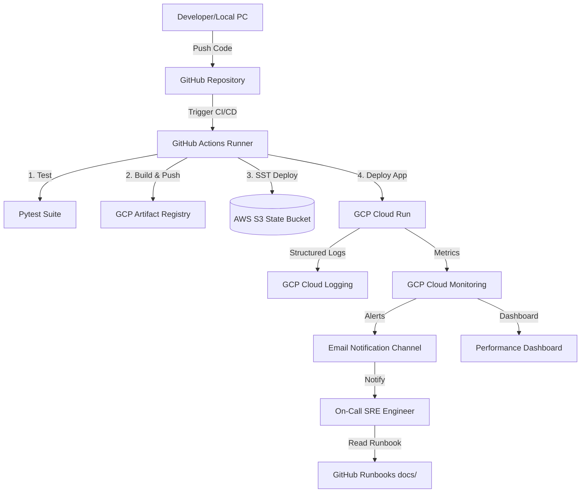

# Báo cáo bàn giao dự án: FastAPI Cloud Deployment & Observability

**Dự án:** FastAPI Demo Project  
**Thời gian thực hiện:** 20 ngày Thực tập DevOps/SRE  
**Người thực hiện bàn giao:** Huy (DevOps Engineer)  
**Người nhận bàn giao:** Đội ngũ Vận hành & Phát triển dự án  
**Trạng thái hệ thống:** Đạt chuẩn Production Ready (100% Green Pipeline)  

---

## 1. Tổng quan kiến trúc hệ thống (Architecture Overview)

Dự án sử dụng mô hình kiến trúc serverless hiện đại trên nền tảng **Google Cloud Platform (GCP)** kết hợp **Amazon Web Services (AWS)** để quản lý trạng thái hạ tầng (IaC State).



### Các thành phần chính:
* **Backend API:** Viết bằng **FastAPI (Python 3.12)**, đóng gói Docker container.
* **Hosting:** **GCP Cloud Run** (Serverless, tự động co giãn, phân quyền qua Custom Service Account).
* **Infrastructure as Code (IaC):** Quản lý hạ tầng bằng **SST v4** kết hợp Pulumi GCP Provider.
* **State Storage Backend:** Lưu trữ file trạng thái hạ tầng tập trung tại **AWS S3** để đảm bảo tính đồng bộ khi deploy từ nhiều nơi.
* **CI/CD:** Tự động hóa qua **GitHub Actions**, xác thực không dùng khóa tĩnh qua **Google Workload Identity Federation (WIF)**.

---

## 2. Hệ thống Giám sát & Vận hành (Observability & SRE)

Hạ tầng giám sát đã được code hóa hoàn toàn (IaC-driven Observability), bao gồm:

### 2.1. Quản lý Logs
* Log ứng dụng được định dạng JSON chuẩn cấu trúc GCP thông qua middleware trong `src/main.py`.
* Tự động trích xuất và gắn thẻ **Trace ID** (`x-cloud-trace-context`) vào từng dòng log để theo vết yêu cầu (Request Tracing).

### 2.2. Hệ thống Cảnh báo (Alerting)
* **Cảnh báo lỗi nghiêm trọng (HTTP 5xx):** Kích hoạt khi phát hiện có lỗi 5xx trong chu kỳ 1 phút. Email cảnh báo gửi về hòm thư tự động đính kèm liên kết tới **Operations Runbook** để hỗ trợ kỹ sư xử lý sự cố tức thì.
* **Cảnh báo hiệu năng chậm (Latency p95):** Kích hoạt khi độ trễ phân vị p95 vượt quá 2 giây liên tục trong 5 phút.

### 2.3. Bảng điều khiển (Dashboard)
* Tự động dựng Dashboard trên GCP Monitoring hiển thị 2 biểu đồ quan trọng:
  * **Traffic (Lượng truy cập):** Số lượng request thành công/thất bại theo thời gian.
  * **Performance (Độ trễ):** Biểu đồ độ trễ phân vị p95 để theo dõi nghẽn hệ thống.

---

## 3. Quy trình CI/CD tự động (Automation Workflow)

Khi nhà phát triển push code lên nhánh `main`, pipeline GitHub Actions tự động thực thi:
1. **Job 1 (Test):** Chạy kiểm thử tự động với `pytest` để đảm bảo code python không bị lỗi logic.
2. **Job 2 (Build & Deploy):**
   * Đăng nhập an toàn vào GCP thông qua cơ chế OIDC/WIF (không dùng file Key JSON).
   * Build Docker image và gắn thẻ tag bất biến bằng mã Git Commit SHA (`${{ github.sha }}`).
   * Đẩy ảnh lên Artifact Registry.
   * Chạy lệnh `npx sst deploy --stage dev` kết nối tới AWS S3 lấy State và triển khai toàn bộ hạ tầng (Service, Alert, Dashboard) lên Google Cloud.

---

## 4. Hướng dẫn thiết lập dành cho kỹ sư tiếp quản (Onboarding Guide)

### 4.1. Các thông tin cấu hình cần thiết (Secrets & Environment)
Kỹ sư tiếp quản cần chuẩn bị các thông tin sau để chạy dự án:

#### File cấu hình `.env` dưới local:
```env
GOOGLE_PROJECT=khanh-fastapi-deploy-937
GOOGLE_CLOUD_PROJECT=khanh-fastapi-deploy-937
AWS_ACCESS_KEY_ID=YOUR_AWS_ACCESS_KEY
AWS_SECRET_ACCESS_KEY=YOUR_AWS_SECRET_KEY
```

#### GitHub Secrets (Cấu hình trên GitHub Settings):
* `AWS_ACCESS_KEY_ID`: Access Key của tài khoản AWS quản lý file State.
* `AWS_SECRET_ACCESS_KEY`: Secret Key của tài khoản AWS quản lý file State.

### 4.2. Lệnh vận hành thường dùng

* **Kiểm tra sự thay đổi hạ tầng so với Cloud (Dry-run):**
  ```powershell
  npx sst diff --stage dev
  ```
* **Triển khai hạ tầng và ứng dụng:**
  ```powershell
  npx sst deploy --stage dev
  ```
* **Hủy toàn bộ tài nguyên (khi dọn dẹp môi trường thử nghiệm):**
  ```powershell
  npx sst remove --stage dev
  ```

---

## 5. Khuyến nghị cải tiến tương lai (Future Recommendations)
1. **Chuyển đổi hoàn toàn sang OIDC trên AWS:** Thay thế việc dùng cặp Access Key tĩnh của AWS trong GitHub Secrets bằng cơ chế OIDC role tương tự như WIF bên GCP.
2. **Phân quyền IAM chặt chẽ hơn:** Thu hẹp vai trò `roles/run.admin` và `roles/monitoring.admin` của robot CI thành các Custom Role chứa danh sách các quyền tối thiểu phục vụ deploy.
3. **Cấu hình Auto-scaling nâng cao:** Thiết lập ngưỡng CPU/Memory cụ thể và giới hạn số lượng instances tối đa trên môi trường Production để tối ưu chi phí.
